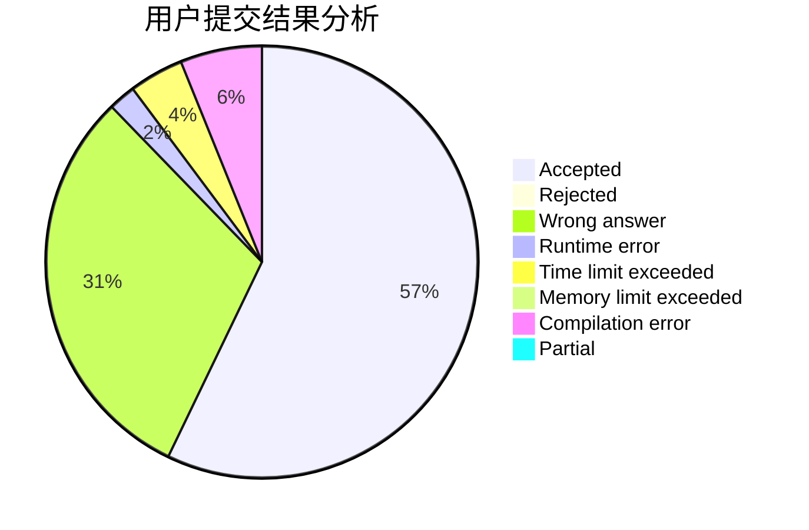
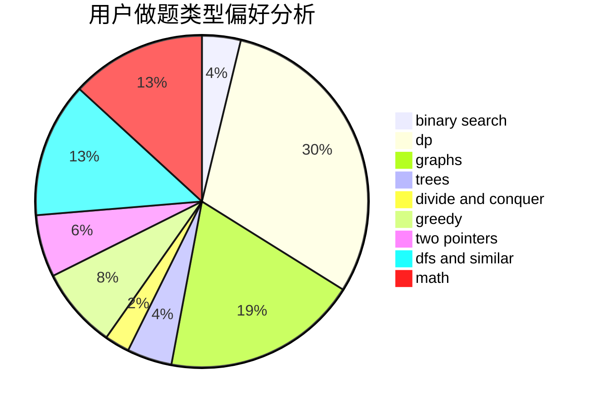

# hello

<!-- tabs:start -->

#### **用户提交结果分析**

#### **用户做题类型偏好分析**

<!-- tabs:end -->
# 推荐题目
[1428B](https://codeforces.com/contest/1428/problem/B)
[985E](https://codeforces.com/contest/985/problem/E)
[1093B](https://codeforces.com/contest/1093/problem/B)
[2C](https://codeforces.com/contest/2/problem/C)
[482A](https://codeforces.com/contest/482/problem/A)
[380A](https://codeforces.com/contest/380/problem/A)
[117D](https://codeforces.com/contest/117/problem/D)
[1279F](https://codeforces.com/contest/1279/problem/F)
[1031C](https://codeforces.com/contest/1031/problem/C)
[1167B](https://codeforces.com/contest/1167/problem/B)
