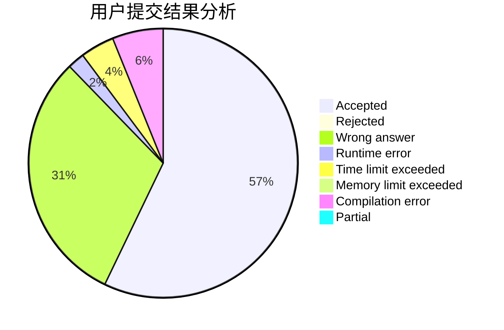
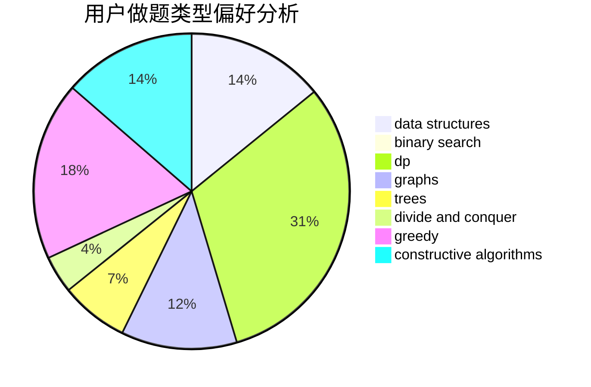
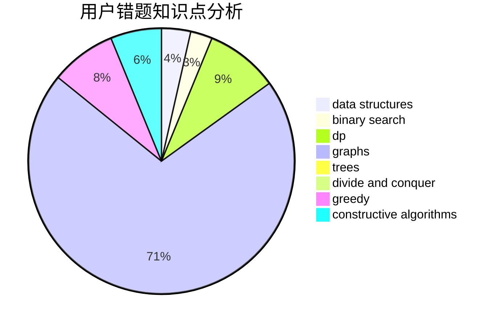

# hello

<!-- tabs:start -->

#### **用户提交结果分析**

#### **用户做题类型偏好分析**

#### **用户错题知识点分析**

<!-- tabs:end -->
# 推荐题目
[1428B](https://codeforces.com/contest/1428/problem/B)		graphs,
                        implementation		  
[985E](https://codeforces.com/contest/985/problem/E)		binary search,
                        data structures,
                        dp,
                        greedy,
                        two pointers		  
[1093B](https://codeforces.com/contest/1093/problem/B)		constructive algorithms,
                        greedy,
                        sortings,
                        strings		  
[2C](https://codeforces.com/contest/2/problem/C)		geometry		  
[482A](https://codeforces.com/contest/482/problem/A)		constructive algorithms,
                        greedy		  
[380A](https://codeforces.com/contest/380/problem/A)		binary search,
                        brute force		  
[117D](https://codeforces.com/contest/117/problem/D)		divide and conquer,
                        math		  
[1279F](https://codeforces.com/contest/1279/problem/F)		binary search,
                        dp		  
[1031C](https://codeforces.com/contest/1031/problem/C)		greedy		  
[1167B](https://codeforces.com/contest/1167/problem/B)		brute force,
                        divide and conquer,
                        interactive,
                        math		  
