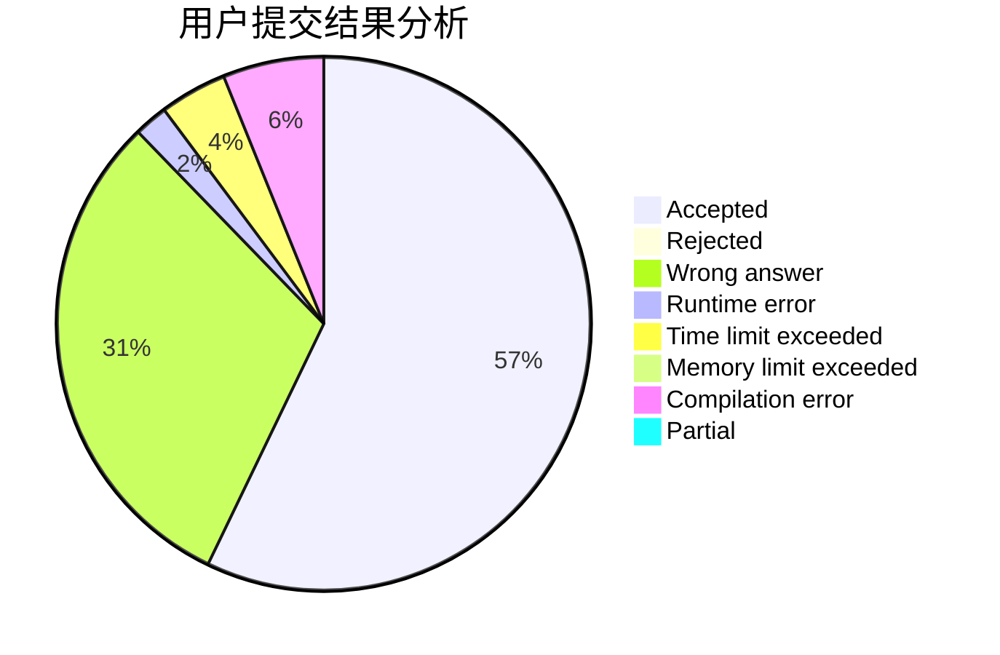
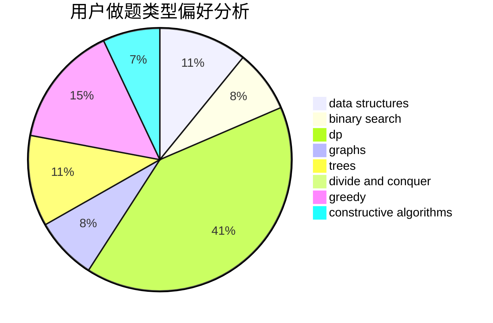
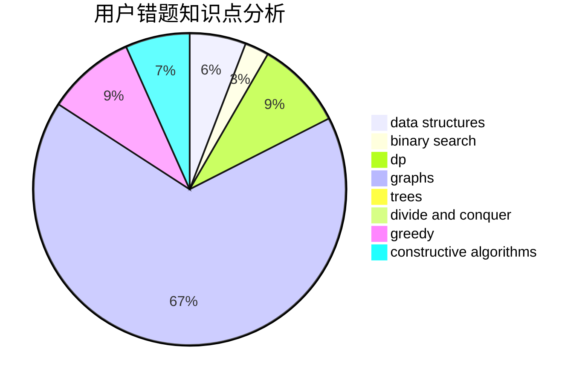

# hello

<!-- tabs:start -->

#### **用户提交结果分析**

#### **用户做题类型偏好分析**

#### **用户错题知识点分析**

<!-- tabs:end -->
# 推荐题目
[1420D](https://codeforces.com/contest/1420/problem/D)		combinatorics,
                        data structures,
                        sortings		  
[962G](https://codeforces.com/contest/962/problem/G)		data structures,
                        dsu,
                        geometry,
                        trees		  
[1092E](https://codeforces.com/contest/1092/problem/E)		constructive algorithms,
                        dfs and similar,
                        greedy,
                        trees		  
[285A](https://codeforces.com/contest/285/problem/A)		greedy,
                        implementation		  
[462A](https://codeforces.com/contest/462/problem/A)		brute force,
                        implementation		  
[354B](https://codeforces.com/contest/354/problem/B)		bitmasks,
                        dp,
                        games		  
[1176F](https://codeforces.com/contest/1176/problem/F)		dp,
                        implementation,
                        sortings		  
[1270F](https://codeforces.com/contest/1270/problem/F)		math,
                        strings		  
[1030G](https://codeforces.com/contest/1030/problem/G)		number theory		  
[1164S](https://codeforces.com/contest/1164/problem/S)		dsu,graphs,sortings,trees		  
