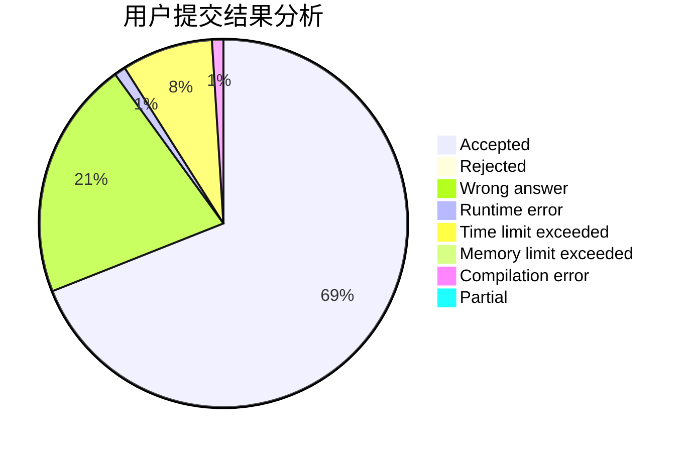
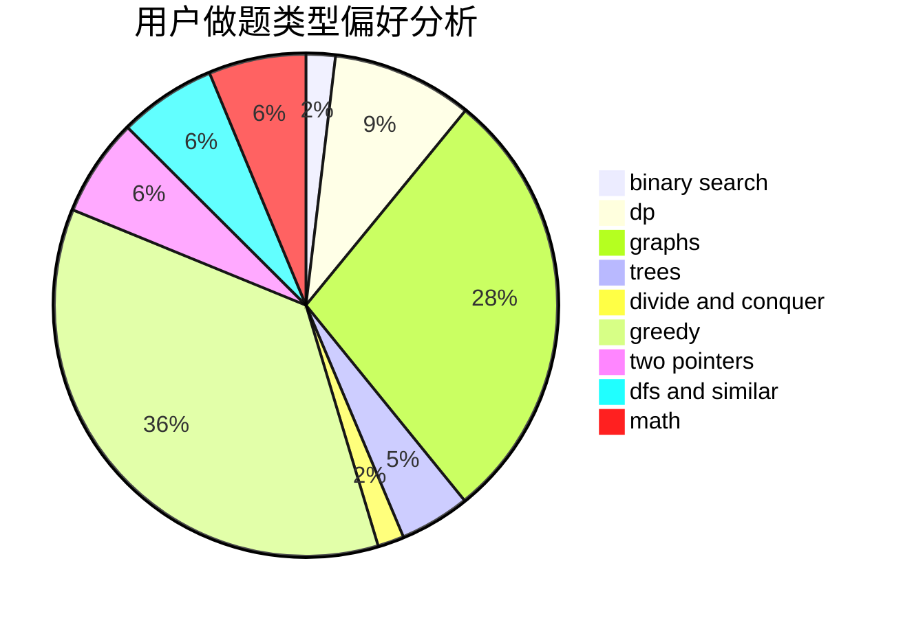

# hello_codeforces

<!-- tabs:start -->

#### **用户提交结果分析**

#### **用户做题类型偏好分析**

<!-- tabs:end -->
# 推荐题目
[1491G](https://codeforces.com/contest/1491/problem/G)
[1423I](https://codeforces.com/contest/1423/problem/I)
[763D](https://codeforces.com/contest/763/problem/D)
[1399F](https://codeforces.com/contest/1399/problem/F)
[61A](https://codeforces.com/contest/61/problem/A)
[732E](https://codeforces.com/contest/732/problem/E)
[724C](https://codeforces.com/contest/724/problem/C)
[463C](https://codeforces.com/contest/463/problem/C)
[398A](https://codeforces.com/contest/398/problem/A)
[653A](https://codeforces.com/contest/653/problem/A)
