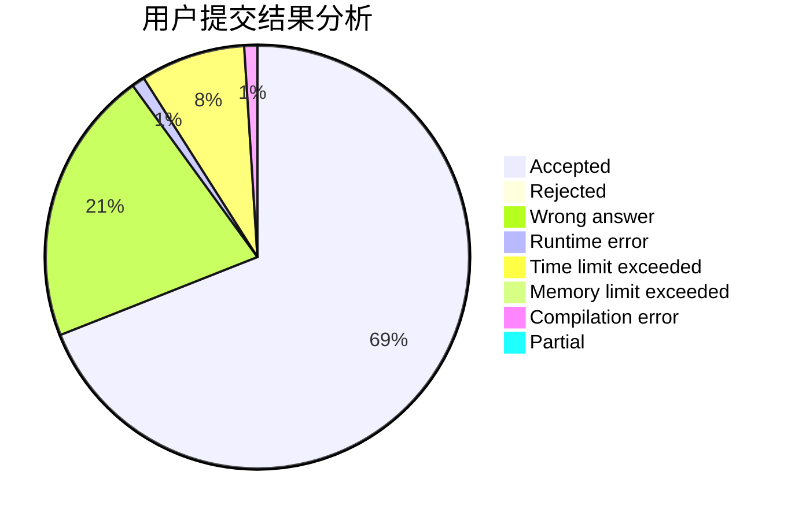
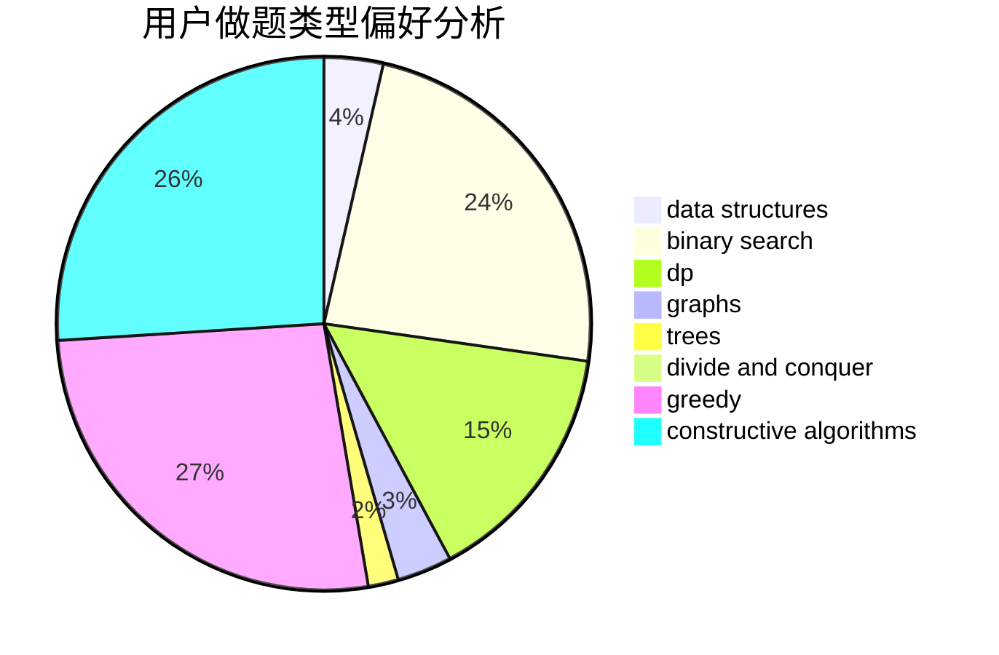
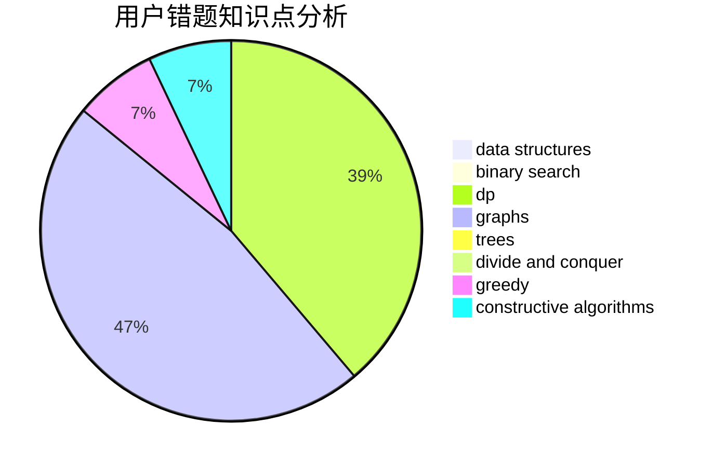

# hello_codeforces
<!-- tabs:start -->
#### **用户提交结果分析**

#### **用户做题类型偏好分析**

#### **用户错题知识点分析**

<!-- tabs:end -->
# 推荐题目
[Anu Has a Function](https://codeforces.com/contest/1300/problem/C)		brute force,
                        greedy,
                        math		  
[Boboniu Chats with Du](http://codeforces.com/problemset/problem/1394/A)		dp,
                        greedy,
                        sortings,
                        two pointers		  
[Queries about less or equal elements](http://codeforces.com/problemset/problem/600/B)		binary search,
                        data structures,
                        sortings,
                        two pointers		  
[Sonya Partymaker](http://codeforces.com/problemset/problem/713/E)		binary search,
                        dp		  
[Antipalindrome](http://codeforces.com/problemset/problem/981/A)		brute force,
                        implementation,
                        strings		  
[Mahmoud and Ehab and the xor-MST](http://codeforces.com/problemset/problem/959/E)		bitmasks,
                        dp,
                        graphs,
                        implementation,
                        math		  
[Vladik and fractions](http://codeforces.com/problemset/problem/743/C)		brute force,
                        constructive algorithms,
                        math,
                        number theory		  
[Gena and Second Distance](http://codeforces.com/problemset/problem/442/E)		geometry		  
[DZY Loves Chemistry](http://codeforces.com/problemset/problem/445/B)		dfs and similar,
                        dsu,
                        greedy		  
[Lorry](http://codeforces.com/problemset/problem/3/B)		greedy,
                        sortings		  
<!-- tabs:start -->
#### **data structures**
[Anu Has a Function](http://codeforces.com/problemset/problem/600/B)		binary search,
                        data structures,
                        sortings,
                        two pointers		  
[Boboniu Chats with Du](https://codeforces.com/contest/705/problem/C)		brute force,
                        data structures,
                        implementation		  
[Queries about less or equal elements](http://codeforces.com/problemset/problem/1010/E)		data structures		  
[Sonya Partymaker](https://codeforces.com/contest/831/problem/E)		data structures,
                        implementation,
                        sortings		  
[Antipalindrome](http://codeforces.com/problemset/problem/455/D)		data structures		  
[Mahmoud and Ehab and the xor-MST](http://codeforces.com/problemset/problem/367/B)		binary search,
                        data structures		  
[Vladik and fractions](http://codeforces.com/problemset/problem/70/D)		data structures,
                        geometry		  
[Gena and Second Distance](http://codeforces.com/problemset/problem/1492/C)		binary search,
                        data structures,
                        dp,
                        greedy,
                        two pointers		  
[DZY Loves Chemistry](http://codeforces.com/problemset/problem/1490/G)		binary search,
                        data structures,
                        math		  
[Lorry](http://codeforces.com/problemset/problem/1479/D)		binary search,
                        bitmasks,
                        brute force,
                        data structures,
                        probabilities,
                        trees		  
#### **binary search**
[Anu Has a Function](http://codeforces.com/problemset/problem/600/B)		binary search,
                        data structures,
                        sortings,
                        two pointers		  
[Boboniu Chats with Du](http://codeforces.com/problemset/problem/713/E)		binary search,
                        dp		  
[Queries about less or equal elements](http://codeforces.com/problemset/problem/1165/F2)		binary search,
                        greedy,
                        implementation		  
[Sonya Partymaker](http://codeforces.com/problemset/problem/804/D)		binary search,
                        brute force,
                        dfs and similar,
                        dp,
                        sortings,
                        trees		  
[Antipalindrome](http://codeforces.com/problemset/problem/367/B)		binary search,
                        data structures		  
[Mahmoud and Ehab and the xor-MST](http://codeforces.com/problemset/problem/1326/D2)		binary search,
                        greedy,
                        hashing,
                        string suffix structures,
                        strings		  
[Vladik and fractions](http://codeforces.com/problemset/problem/1492/C)		binary search,
                        data structures,
                        dp,
                        greedy,
                        two pointers		  
[Gena and Second Distance](http://codeforces.com/problemset/problem/1463/D)		binary search,
                        constructive algorithms,
                        greedy,
                        two pointers		  
[DZY Loves Chemistry](http://codeforces.com/problemset/problem/1490/G)		binary search,
                        data structures,
                        math		  
[Lorry](http://codeforces.com/problemset/problem/1479/D)		binary search,
                        bitmasks,
                        brute force,
                        data structures,
                        probabilities,
                        trees		  
#### **dp**
[Anu Has a Function](http://codeforces.com/problemset/problem/1394/A)		dp,
                        greedy,
                        sortings,
                        two pointers		  
[Boboniu Chats with Du](http://codeforces.com/problemset/problem/713/E)		binary search,
                        dp		  
[Queries about less or equal elements](http://codeforces.com/problemset/problem/959/E)		bitmasks,
                        dp,
                        graphs,
                        implementation,
                        math		  
[Sonya Partymaker](http://codeforces.com/problemset/problem/626/F)		dp		  
[Antipalindrome](http://codeforces.com/problemset/problem/87/C)		dp,
                        games,
                        math		  
[Mahmoud and Ehab and the xor-MST](http://codeforces.com/problemset/problem/360/C)		combinatorics,
                        dp		  
[Vladik and fractions](http://codeforces.com/problemset/problem/1030/E)		bitmasks,
                        dp		  
[Gena and Second Distance](http://codeforces.com/problemset/problem/497/E)		dp,
                        matrices		  
[DZY Loves Chemistry](https://codeforces.com/contest/686/problem/C)		brute force,
                        combinatorics,
                        dp,
                        math		  
[Lorry](https://codeforces.com/contest/674/problem/F)		dp,
                        math,
                        meet-in-the-middle		  
#### **graph**
[Anu Has a Function](http://codeforces.com/problemset/problem/959/E)		bitmasks,
                        dp,
                        graphs,
                        implementation,
                        math		  
[Boboniu Chats with Du](https://codeforces.com/contest/1350/problem/E)		dfs and similar,
                        graphs,
                        implementation,
                        shortest paths		  
[Queries about less or equal elements](http://codeforces.com/problemset/problem/1506/F)		constructive algorithms,
                        graphs,
                        math,
                        shortest paths,
                        sortings		  
[Sonya Partymaker](http://codeforces.com/problemset/problem/1498/D)		dfs and similar,
                        dp,
                        graphs,
                        implementation		  
[Antipalindrome](http://codeforces.com/problemset/problem/1487/C)		brute force,
                        constructive algorithms,
                        dfs and similar,
                        graphs,
                        greedy,
                        implementation,
                        math		  
[Mahmoud and Ehab and the xor-MST](http://codeforces.com/problemset/problem/1437/C)		dp,
                        flows,
                        graph matchings,
                        greedy,
                        math,
                        sortings		  
[Vladik and fractions](http://codeforces.com/problemset/problem/1470/D)		constructive algorithms,
                        dfs and similar,
                        graph matchings,
                        graphs,
                        greedy		  
[Gena and Second Distance](http://codeforces.com/problemset/problem/1476/C)		dp,
                        graphs,
                        greedy		  
[DZY Loves Chemistry](http://codeforces.com/problemset/problem/1304/D)		constructive algorithms,
                        graphs,
                        greedy,
                        two pointers		  
[Lorry](http://codeforces.com/problemset/problem/1475/C)		combinatorics,
                        graphs,
                        math		  
#### **trees**
[Anu Has a Function](http://codeforces.com/problemset/problem/804/D)		binary search,
                        brute force,
                        dfs and similar,
                        dp,
                        sortings,
                        trees		  
[Boboniu Chats with Du](http://codeforces.com/problemset/problem/1479/D)		binary search,
                        bitmasks,
                        brute force,
                        data structures,
                        probabilities,
                        trees		  
[Queries about less or equal elements](http://codeforces.com/problemset/problem/1511/C)		brute force,
                        data structures,
                        implementation,
                        trees		  
[Sonya Partymaker](http://codeforces.com/problemset/problem/1499/F)		combinatorics,
                        dfs and similar,
                        dp,
                        trees		  
[Antipalindrome](http://codeforces.com/problemset/problem/1491/E)		brute force,
                        dfs and similar,
                        divide and conquer,
                        number theory,
                        trees		  
[Mahmoud and Ehab and the xor-MST](http://codeforces.com/problemset/problem/1466/D)		data structures,
                        greedy,
                        sortings,
                        trees		  
[Vladik and fractions](http://codeforces.com/problemset/problem/1495/D)		combinatorics,
                        dfs and similar,
                        graphs,
                        math,
                        shortest paths,
                        trees		  
[Gena and Second Distance](http://codeforces.com/problemset/problem/1303/G)		data structures,
                        divide and conquer,
                        geometry,
                        trees		  
[DZY Loves Chemistry](http://codeforces.com/problemset/problem/1454/E)		combinatorics,
                        dfs and similar,
                        graphs,
                        trees		  
[Lorry](http://codeforces.com/problemset/problem/1494/D)		constructive algorithms,
                        data structures,
                        dfs and similar,
                        divide and conquer,
                        dsu,
                        greedy,
                        sortings,
                        trees		  
#### **divide and conquer**
[Anu Has a Function](http://codeforces.com/problemset/problem/1461/D)		binary search,
                        brute force,
                        data structures,
                        divide and conquer,
                        implementation,
                        sortings		  
[Boboniu Chats with Du](http://codeforces.com/problemset/problem/1466/G)		combinatorics,
                        divide and conquer,
                        hashing,
                        math,
                        string suffix structures,
                        strings		  
[Queries about less or equal elements](http://codeforces.com/problemset/problem/1490/D)		dfs and similar,
                        divide and conquer,
                        implementation		  
[Sonya Partymaker](https://codeforces.com/contest/1483/problem/C)		data structures,
                        divide and conquer,
                        dp		  
[Antipalindrome](http://codeforces.com/problemset/problem/1491/E)		brute force,
                        dfs and similar,
                        divide and conquer,
                        number theory,
                        trees		  
[Mahmoud and Ehab and the xor-MST](http://codeforces.com/problemset/problem/1303/G)		data structures,
                        divide and conquer,
                        geometry,
                        trees		  
[Vladik and fractions](http://codeforces.com/problemset/problem/1494/D)		constructive algorithms,
                        data structures,
                        dfs and similar,
                        divide and conquer,
                        dsu,
                        greedy,
                        sortings,
                        trees		  
[Gena and Second Distance](http://codeforces.com/problemset/problem/1482/E)		data structures,
                        divide and conquer,
                        dp		  
[DZY Loves Chemistry](http://codeforces.com/problemset/problem/566/C)		dfs and similar,
                        divide and conquer,
                        trees		  
[Lorry](http://codeforces.com/problemset/problem/1428/F)		binary search,
                        data structures,
                        divide and conquer,
                        dp,
                        two pointers		  
#### **greedy**
[Anu Has a Function](https://codeforces.com/contest/1300/problem/C)		brute force,
                        greedy,
                        math		  
[Boboniu Chats with Du](http://codeforces.com/problemset/problem/1394/A)		dp,
                        greedy,
                        sortings,
                        two pointers		  
[Queries about less or equal elements](http://codeforces.com/problemset/problem/445/B)		dfs and similar,
                        dsu,
                        greedy		  
[Sonya Partymaker](http://codeforces.com/problemset/problem/3/B)		greedy,
                        sortings		  
[Antipalindrome](http://codeforces.com/problemset/problem/1415/E)		constructive algorithms,
                        greedy,
                        math		  
[Mahmoud and Ehab and the xor-MST](http://codeforces.com/problemset/problem/1144/D)		constructive algorithms,
                        greedy		  
[Vladik and fractions](http://codeforces.com/problemset/problem/27/C)		constructive algorithms,
                        greedy		  
[Gena and Second Distance](http://codeforces.com/problemset/problem/1165/F2)		binary search,
                        greedy,
                        implementation		  
[DZY Loves Chemistry](http://codeforces.com/problemset/problem/333/B)		greedy		  
[Lorry](http://codeforces.com/problemset/problem/1391/B)		brute force,
                        greedy,
                        implementation		  
#### **constructive algorithms**
[Anu Has a Function](http://codeforces.com/problemset/problem/743/C)		brute force,
                        constructive algorithms,
                        math,
                        number theory		  
[Boboniu Chats with Du](http://codeforces.com/problemset/problem/1415/E)		constructive algorithms,
                        greedy,
                        math		  
[Queries about less or equal elements](http://codeforces.com/problemset/problem/1144/D)		constructive algorithms,
                        greedy		  
[Sonya Partymaker](http://codeforces.com/problemset/problem/27/C)		constructive algorithms,
                        greedy		  
[Antipalindrome](http://codeforces.com/problemset/problem/803/B)		constructive algorithms		  
[Mahmoud and Ehab and the xor-MST](https://codeforces.com/contest/816/problem/D)		brute force,
                        combinatorics,
                        constructive algorithms,
                        math		  
[Vladik and fractions](http://codeforces.com/problemset/problem/286/E)		constructive algorithms,
                        fft,
                        math		  
[Gena and Second Distance](http://codeforces.com/problemset/problem/1012/D)		constructive algorithms,
                        strings		  
[DZY Loves Chemistry](http://codeforces.com/problemset/problem/711/B)		constructive algorithms,
                        implementation		  
[Lorry](http://codeforces.com/problemset/problem/1506/F)		constructive algorithms,
                        graphs,
                        math,
                        shortest paths,
                        sortings		  
#### **sortings**
[Anu Has a Function](http://codeforces.com/problemset/problem/1394/A)		dp,
                        greedy,
                        sortings,
                        two pointers		  
[Boboniu Chats with Du](http://codeforces.com/problemset/problem/600/B)		binary search,
                        data structures,
                        sortings,
                        two pointers		  
[Queries about less or equal elements](http://codeforces.com/problemset/problem/3/B)		greedy,
                        sortings		  
[Sonya Partymaker](https://codeforces.com/contest/831/problem/E)		data structures,
                        implementation,
                        sortings		  
[Antipalindrome](http://codeforces.com/problemset/problem/804/D)		binary search,
                        brute force,
                        dfs and similar,
                        dp,
                        sortings,
                        trees		  
[Mahmoud and Ehab and the xor-MST](http://codeforces.com/problemset/problem/1506/F)		constructive algorithms,
                        graphs,
                        math,
                        shortest paths,
                        sortings		  
[Vladik and fractions](http://codeforces.com/problemset/problem/1445/A)		greedy,
                        sortings		  
[Gena and Second Distance](https://codeforces.com/contest/1496/problem/C)		geometry,
                        greedy,
                        math,
                        sortings		  
[DZY Loves Chemistry](http://codeforces.com/problemset/problem/1495/A)		geometry,
                        greedy,
                        math,
                        sortings		  
[Lorry](http://codeforces.com/problemset/problem/1497/A)		brute force,
                        data structures,
                        greedy,
                        sortings		  
<!-- tabs:end -->
