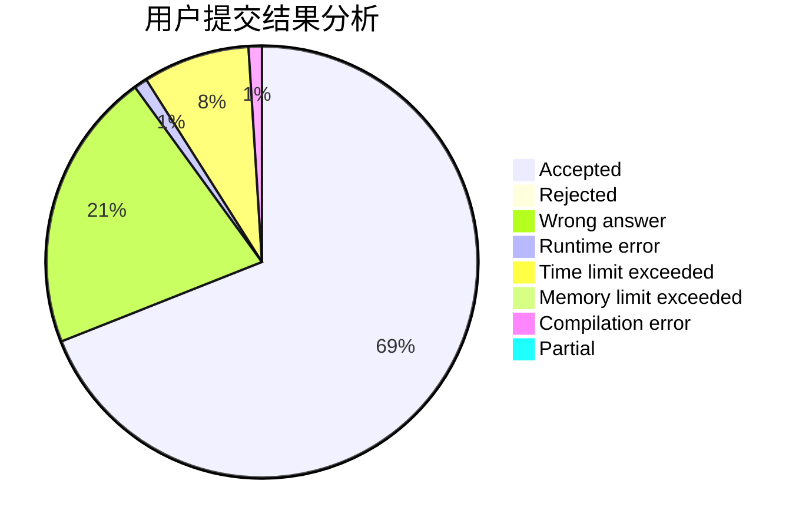
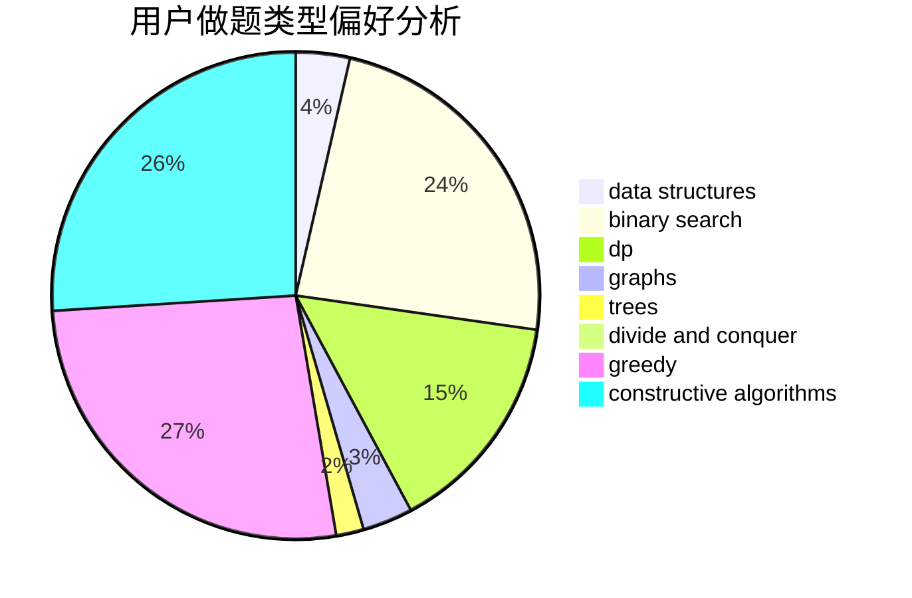
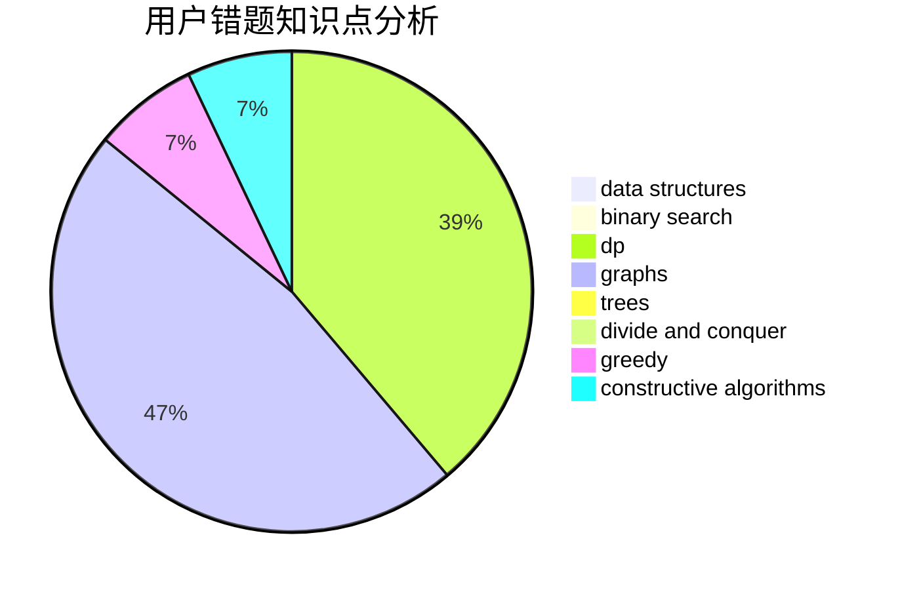

# hello_codeforces

<!-- tabs:start -->

#### **用户提交结果分析**

#### **用户做题类型偏好分析**

#### **用户错题知识点分析**

<!-- tabs:end -->
# 推荐题目
[1484C](https://codeforces.com/contest/1484/problem/C)		dsu,graphs,sortings,trees		  
[1415E](https://codeforces.com/contest/1415/problem/E)		constructive algorithms,
                        greedy,
                        math		  
[743C](https://codeforces.com/contest/743/problem/C)		brute force,
                        constructive algorithms,
                        math,
                        number theory		  
[1391B](https://codeforces.com/contest/1391/problem/B)		brute force,
                        greedy,
                        implementation		  
[600B](https://codeforces.com/contest/600/problem/B)		binary search,
                        data structures,
                        sortings,
                        two pointers		  
[713E](https://codeforces.com/contest/713/problem/E)		binary search,
                        dp		  
[705B](https://codeforces.com/contest/705/problem/B)		games,
                        math		  
[442E](https://codeforces.com/contest/442/problem/E)		geometry		  
[367B](https://codeforces.com/contest/367/problem/B)		binary search,
                        data structures		  
[626F](https://codeforces.com/contest/626/problem/F)		dp		  
