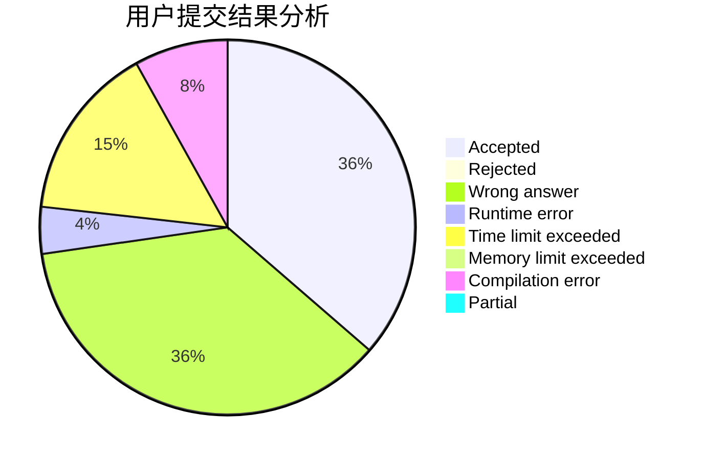
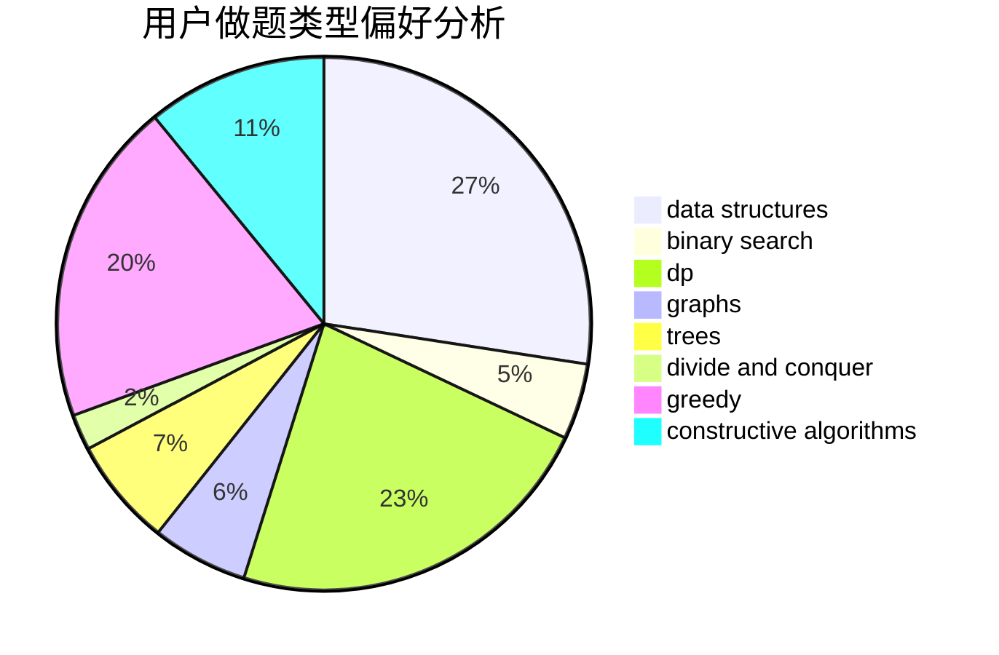
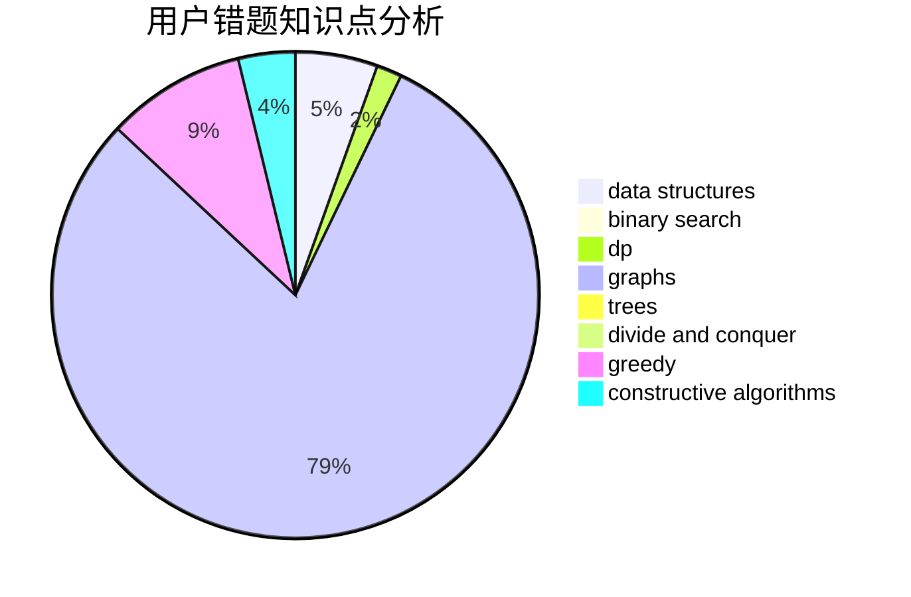

# hellojim

<!-- tabs:start -->

#### **用户提交结果分析**

#### **用户做题类型偏好分析**

#### **用户错题知识点分析**

<!-- tabs:end -->
# 推荐题目
[1771](https://codeforces.com/contest/177/problem/1)		dsu,graphs,sortings,trees		  
[913G](https://codeforces.com/contest/913/problem/G)		math,
                        number theory		  
[883D](https://codeforces.com/contest/883/problem/D)		binary search,
                        dp,
                        math		  
[1113D](https://codeforces.com/contest/1113/problem/D)		dsu,graphs,sortings,trees		  
[1082C](https://codeforces.com/contest/1082/problem/C)		greedy,
                        sortings		  
[886A](https://codeforces.com/contest/886/problem/A)		brute force		  
[276E](https://codeforces.com/contest/276/problem/E)		data structures,
                        graphs,
                        trees		  
[341C](https://codeforces.com/contest/341/problem/C)		dsu,graphs,sortings,trees		  
[125A](https://codeforces.com/contest/125/problem/A)		math		  
[131D](https://codeforces.com/contest/131/problem/D)		dfs and similar,
                        graphs		  
