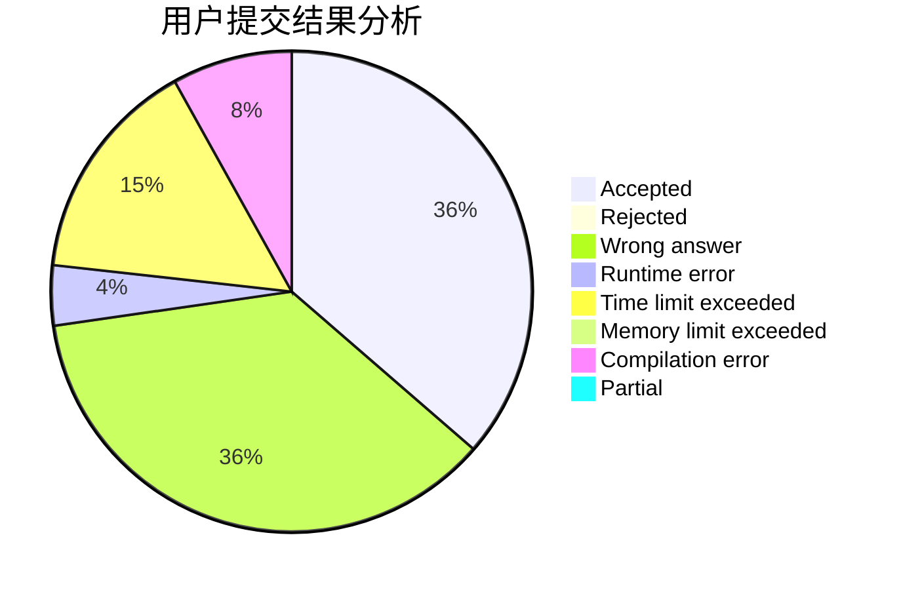
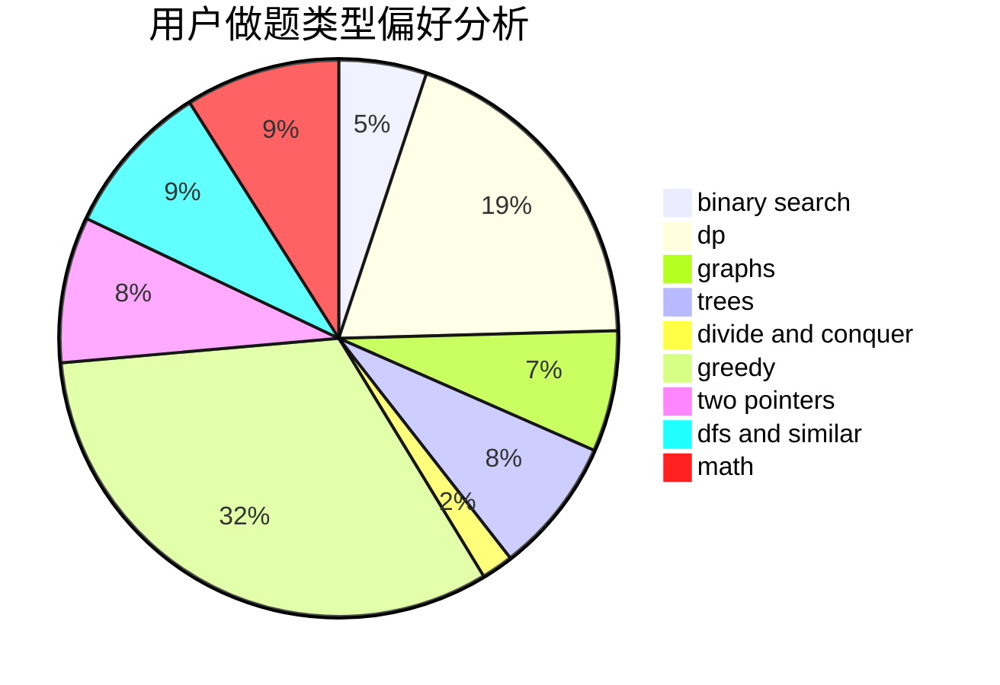

# hellojim

<!-- tabs:start -->

#### **用户提交结果分析**

#### **用户做题类型偏好分析**

<!-- tabs:end -->
# 推荐题目
[1771](https://codeforces.com/contest/177/problem/1)
[913G](https://codeforces.com/contest/913/problem/G)
[883D](https://codeforces.com/contest/883/problem/D)
[1113D](https://codeforces.com/contest/1113/problem/D)
[1082C](https://codeforces.com/contest/1082/problem/C)
[886A](https://codeforces.com/contest/886/problem/A)
[276E](https://codeforces.com/contest/276/problem/E)
[341C](https://codeforces.com/contest/341/problem/C)
[125A](https://codeforces.com/contest/125/problem/A)
[131D](https://codeforces.com/contest/131/problem/D)
