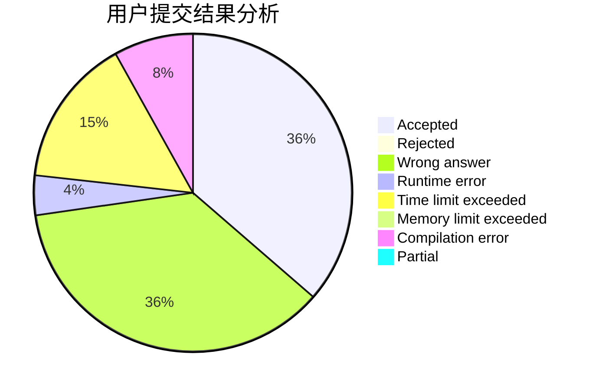
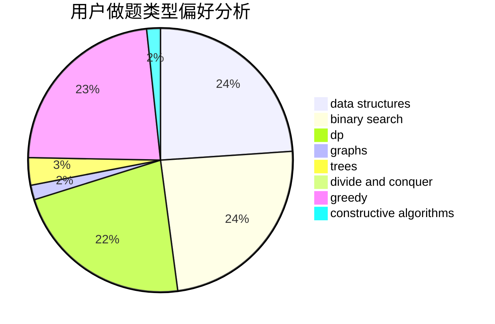
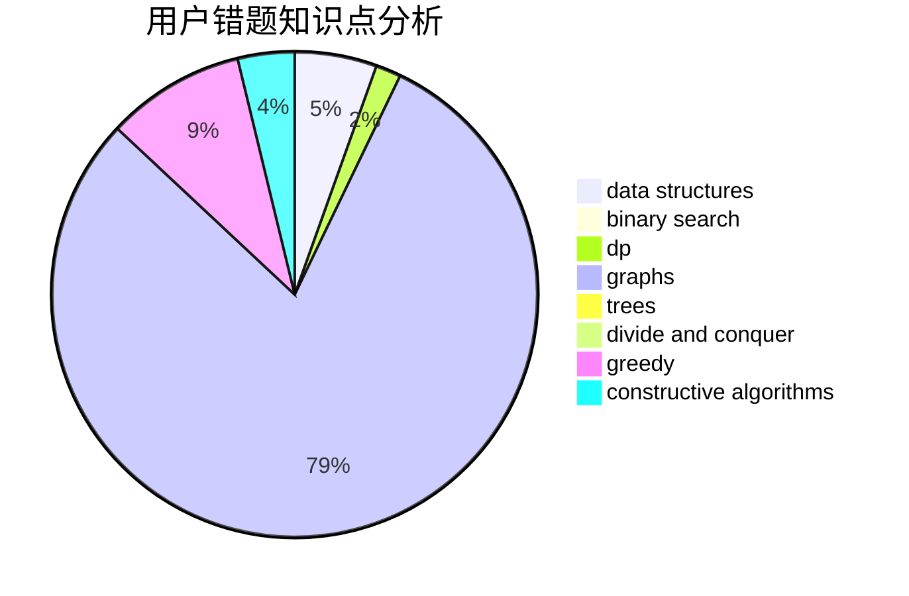

# hellojim

<!-- tabs:start -->

#### **用户提交结果分析**

#### **用户做题类型偏好分析**

#### **用户错题知识点分析**

<!-- tabs:end -->
# 推荐题目
[156C](https://codeforces.com/contest/156/problem/C)		combinatorics,
                        dp		  
[896D](https://codeforces.com/contest/896/problem/D)		chinese remainder theorem,
                        combinatorics,
                        math,
                        number theory		  
[863B](https://codeforces.com/contest/863/problem/B)		brute force,
                        greedy,
                        sortings		  
[1113A](https://codeforces.com/contest/1113/problem/A)		dp,
                        greedy,
                        math		  
[1081G](https://codeforces.com/contest/1081/problem/G)		math,
                        probabilities		  
[865D](https://codeforces.com/contest/865/problem/D)		constructive algorithms,
                        data structures,
                        greedy		  
[259D](https://codeforces.com/contest/259/problem/D)		dsu,graphs,sortings,trees		  
[316C2](https://codeforces.com/contest/316C/problem/2)		flows,
                        graph matchings		  
[1252G](https://codeforces.com/contest/1252/problem/G)		data structures		  
[1310E](https://codeforces.com/contest/1310/problem/E)		dp		  
