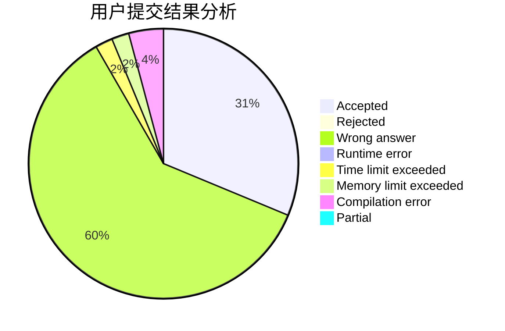
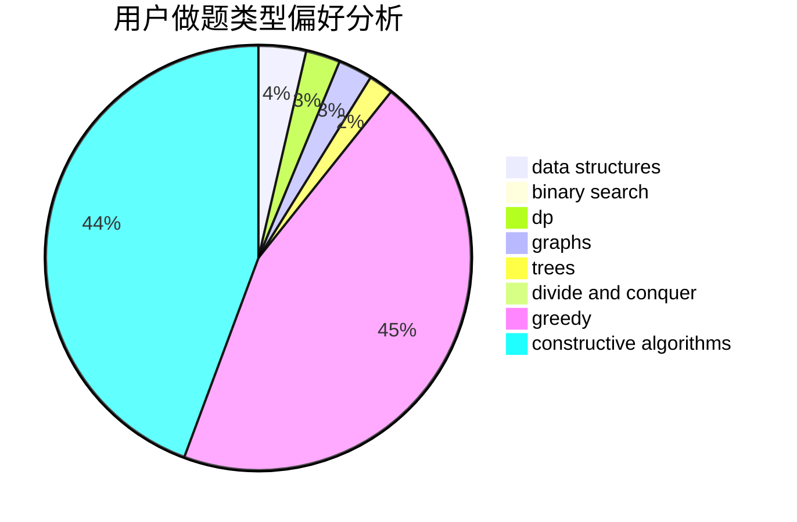
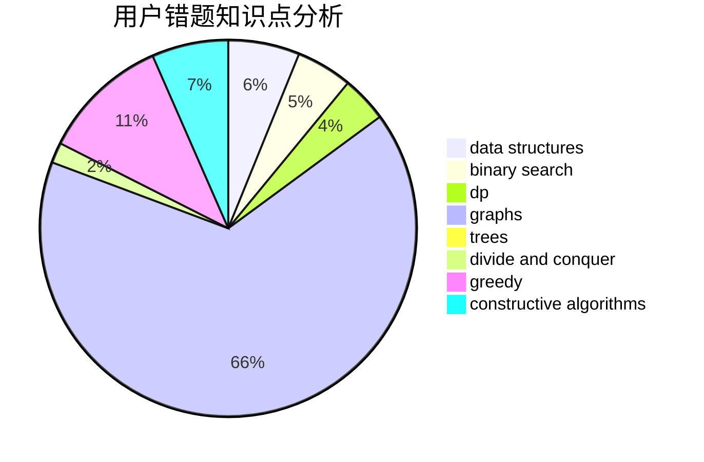

# hellojimOwO

<!-- tabs:start -->

#### **用户提交结果分析**

#### **用户做题类型偏好分析**

#### **用户错题知识点分析**

<!-- tabs:end -->
# 推荐题目
[113C](https://codeforces.com/contest/113/problem/C)		brute force,
                        math,
                        number theory		  
[778D](https://codeforces.com/contest/778/problem/D)		constructive algorithms		  
[1131B](https://codeforces.com/contest/1131/problem/B)		greedy,
                        implementation		  
[402A](https://codeforces.com/contest/402/problem/A)		greedy,
                        math		  
[859B](https://codeforces.com/contest/859/problem/B)		brute force,
                        geometry,
                        math		  
[1315F](https://codeforces.com/contest/1315/problem/F)		dsu,graphs,sortings,trees		  
[38E](https://codeforces.com/contest/38/problem/E)		dp,
                        sortings		  
[97C](https://codeforces.com/contest/97/problem/C)		binary search,
                        graphs,
                        math,
                        shortest paths		  
[381A](https://codeforces.com/contest/381/problem/A)		greedy,
                        implementation,
                        two pointers		  
[1474A](https://codeforces.com/contest/1474/problem/A)		greedy		  
