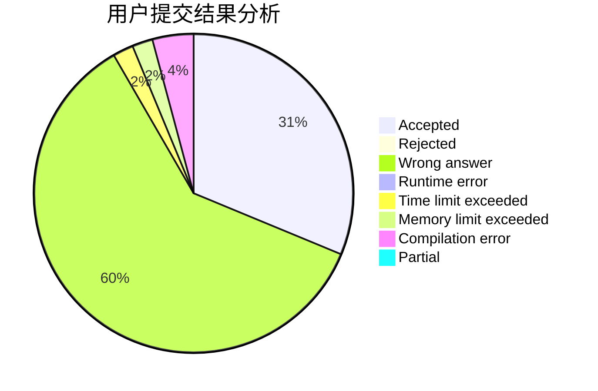
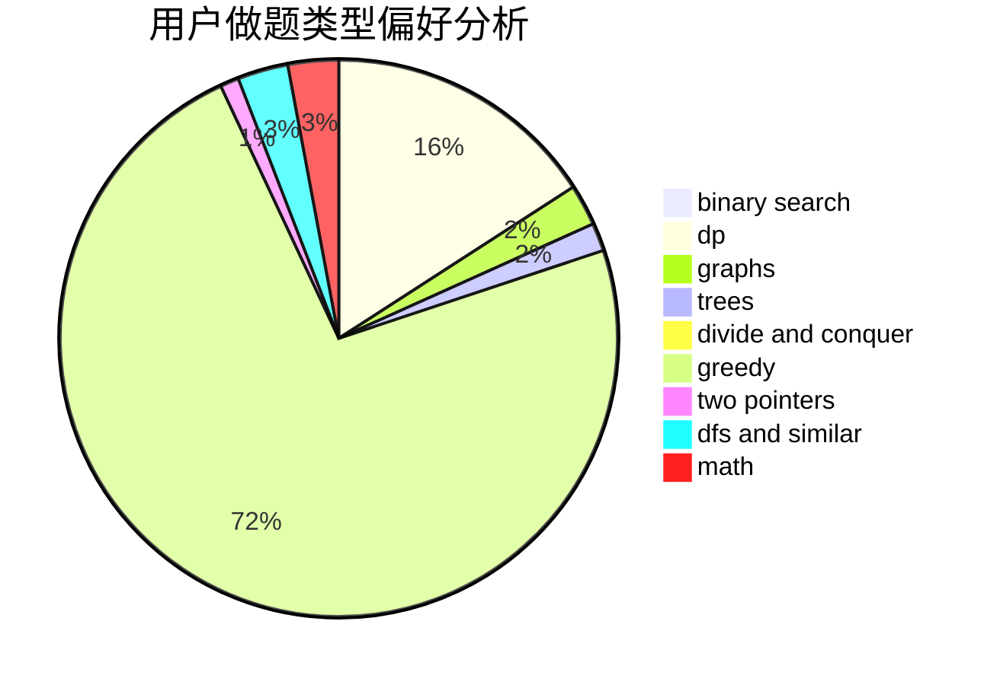

# hellojimOwO

<!-- tabs:start -->

#### **用户提交结果分析**

#### **用户做题类型偏好分析**

<!-- tabs:end -->
# 推荐题目
[113C](https://codeforces.com/contest/113/problem/C)
[778D](https://codeforces.com/contest/778/problem/D)
[1131B](https://codeforces.com/contest/1131/problem/B)
[402A](https://codeforces.com/contest/402/problem/A)
[859B](https://codeforces.com/contest/859/problem/B)
[1315F](https://codeforces.com/contest/1315/problem/F)
[38E](https://codeforces.com/contest/38/problem/E)
[97C](https://codeforces.com/contest/97/problem/C)
[381A](https://codeforces.com/contest/381/problem/A)
[1474A](https://codeforces.com/contest/1474/problem/A)
