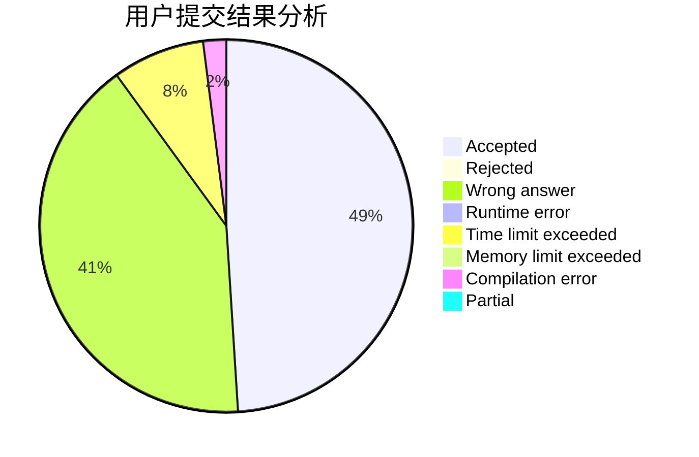
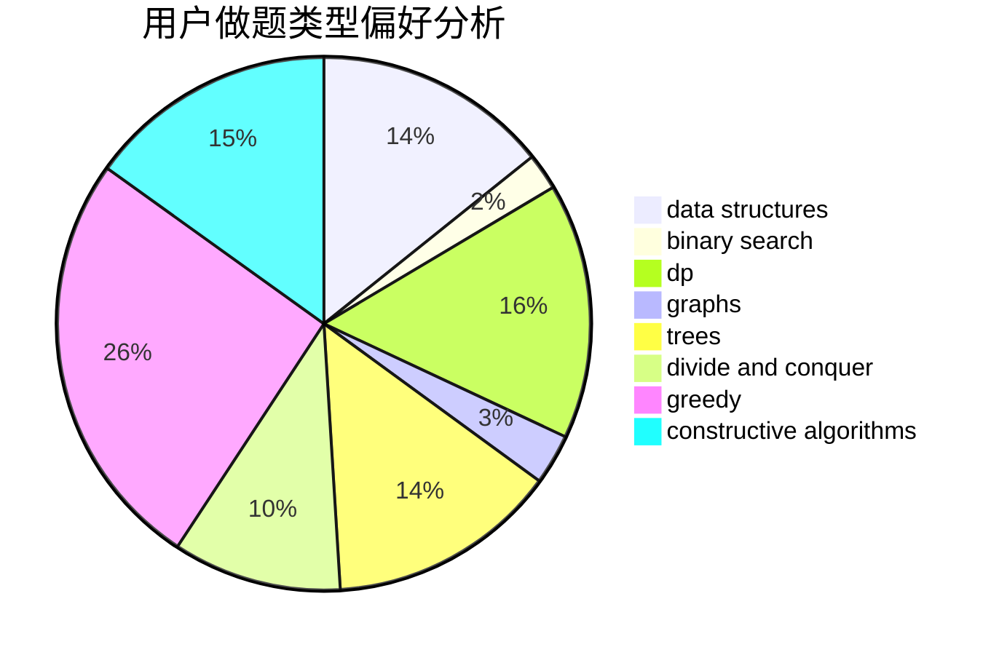
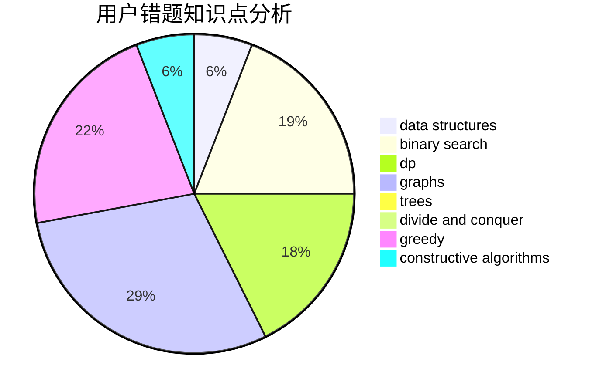

# henry-tb
<!-- tabs:start -->
#### **用户提交结果分析**

#### **用户做题类型偏好分析**

#### **用户错题知识点分析**

<!-- tabs:end -->
# 推荐题目
[Almost Identity Permutations](http://codeforces.com/problemset/problem/888/D)		combinatorics,
                        dp,
                        math		  
[Rational Resistance](http://codeforces.com/problemset/problem/343/A)		math,
                        number theory		  
[Substrings Sort](https://codeforces.com/contest/1489/problem/D)		sortings,
                        strings		  
[Parallelepiped](http://codeforces.com/problemset/problem/224/A)		brute force,
                        geometry,
                        math		  
[Friends and Presents](http://codeforces.com/problemset/problem/483/B)		binary search,
                        math		  
["Is the bit string balanced?" oracle](http://codeforces.com/problemset/problem/1357/B1)		nan		  
[Arrangement](http://codeforces.com/problemset/problem/107/C)		bitmasks,
                        dp		  
[Mystical Mosaic](http://codeforces.com/problemset/problem/924/A)		greedy,
                        implementation		  
[Color the Carpet](http://codeforces.com/problemset/problem/297/D)		constructive algorithms		  
[New Year and the Acquaintance Estimation](http://codeforces.com/problemset/problem/1091/E)		binary search,
                        data structures,
                        graphs,
                        greedy,
                        implementation,
                        math,
                        sortings		  
<!-- tabs:start -->
#### **data structures**
[Almost Identity Permutations](http://codeforces.com/problemset/problem/1091/E)		binary search,
                        data structures,
                        graphs,
                        greedy,
                        implementation,
                        math,
                        sortings		  
[Rational Resistance](http://codeforces.com/problemset/problem/1066/E)		data structures,
                        implementation,
                        math		  
[Substrings Sort](http://codeforces.com/problemset/problem/733/F)		data structures,
                        dsu,
                        graphs,
                        trees		  
[Parallelepiped](http://codeforces.com/problemset/problem/413/E)		data structures,
                        divide and conquer		  
[Friends and Presents](https://codeforces.com/contest/447/problem/E)		data structures,
                        math,
                        number theory		  
["Is the bit string balanced?" oracle](http://codeforces.com/problemset/problem/746/F)		data structures,
                        greedy,
                        two pointers		  
[Arrangement](https://codeforces.com/contest/634/problem/D)		data structures,
                        divide and conquer,
                        greedy		  
[Mystical Mosaic](http://codeforces.com/problemset/problem/568/E)		data structures,
                        dp		  
[Color the Carpet](http://codeforces.com/problemset/problem/258/E)		data structures,
                        dfs and similar,
                        trees		  
[New Year and the Acquaintance Estimation](http://codeforces.com/problemset/problem/786/D)		data structures,
                        dfs and similar,
                        hashing,
                        strings,
                        trees		  
#### **binary search**
[Almost Identity Permutations](http://codeforces.com/problemset/problem/483/B)		binary search,
                        math		  
[Rational Resistance](http://codeforces.com/problemset/problem/1091/E)		binary search,
                        data structures,
                        graphs,
                        greedy,
                        implementation,
                        math,
                        sortings		  
[Substrings Sort](http://codeforces.com/problemset/problem/553/D)		binary search,
                        graphs,
                        greedy		  
[Parallelepiped](http://codeforces.com/problemset/problem/1221/C)		binary search,
                        math		  
[Friends and Presents](http://codeforces.com/problemset/problem/767/D)		binary search,
                        data structures,
                        greedy,
                        sortings,
                        two pointers		  
["Is the bit string balanced?" oracle](http://codeforces.com/problemset/problem/1439/C)		binary search,
                        data structures,
                        divide and conquer,
                        greedy,
                        implementation		  
[Arrangement](http://codeforces.com/problemset/problem/1131/C)		binary search,
                        greedy,
                        sortings		  
[Mystical Mosaic](http://codeforces.com/problemset/problem/1492/C)		binary search,
                        data structures,
                        dp,
                        greedy,
                        two pointers		  
[Color the Carpet](http://codeforces.com/problemset/problem/1463/D)		binary search,
                        constructive algorithms,
                        greedy,
                        two pointers		  
[New Year and the Acquaintance Estimation](http://codeforces.com/problemset/problem/1490/G)		binary search,
                        data structures,
                        math		  
#### **dp**
[Almost Identity Permutations](http://codeforces.com/problemset/problem/888/D)		combinatorics,
                        dp,
                        math		  
[Rational Resistance](http://codeforces.com/problemset/problem/107/C)		bitmasks,
                        dp		  
[Substrings Sort](http://codeforces.com/problemset/problem/174/B)		dp,
                        greedy,
                        implementation		  
[Parallelepiped](http://codeforces.com/problemset/problem/348/D)		dp,
                        matrices		  
[Friends and Presents](http://codeforces.com/problemset/problem/1107/E)		dp		  
["Is the bit string balanced?" oracle](https://codeforces.com/contest/1281/problem/F)		dp,
                        greedy,
                        trees		  
[Arrangement](http://codeforces.com/problemset/problem/1398/D)		dp,
                        greedy,
                        sortings		  
[Mystical Mosaic](http://codeforces.com/problemset/problem/234/C)		dp,
                        implementation		  
[Color the Carpet](http://codeforces.com/problemset/problem/264/C)		dp		  
[New Year and the Acquaintance Estimation](http://codeforces.com/problemset/problem/568/E)		data structures,
                        dp		  
#### **graph**
[Almost Identity Permutations](http://codeforces.com/problemset/problem/1091/E)		binary search,
                        data structures,
                        graphs,
                        greedy,
                        implementation,
                        math,
                        sortings		  
[Rational Resistance](http://codeforces.com/problemset/problem/733/F)		data structures,
                        dsu,
                        graphs,
                        trees		  
[Substrings Sort](https://codeforces.com/contest/1071/problem/D)		brute force,
                        graphs,
                        math		  
[Parallelepiped](http://codeforces.com/problemset/problem/553/D)		binary search,
                        graphs,
                        greedy		  
[Friends and Presents](http://codeforces.com/problemset/problem/491/C)		flows,
                        graph matchings		  
["Is the bit string balanced?" oracle](http://codeforces.com/problemset/problem/25/C)		graphs,
                        shortest paths		  
[Arrangement](http://codeforces.com/problemset/problem/698/B)		constructive algorithms,
                        dfs and similar,
                        dsu,
                        graphs,
                        trees		  
[Mystical Mosaic](http://codeforces.com/problemset/problem/76/A)		dsu,
                        graphs,
                        sortings,
                        trees		  
[Color the Carpet](http://codeforces.com/problemset/problem/1487/C)		brute force,
                        constructive algorithms,
                        dfs and similar,
                        graphs,
                        greedy,
                        implementation,
                        math		  
[New Year and the Acquaintance Estimation](http://codeforces.com/problemset/problem/1437/C)		dp,
                        flows,
                        graph matchings,
                        greedy,
                        math,
                        sortings		  
#### **trees**
[Almost Identity Permutations](http://codeforces.com/problemset/problem/733/F)		data structures,
                        dsu,
                        graphs,
                        trees		  
[Rational Resistance](https://codeforces.com/contest/1281/problem/F)		dp,
                        greedy,
                        trees		  
[Substrings Sort](http://codeforces.com/problemset/problem/258/E)		data structures,
                        dfs and similar,
                        trees		  
[Parallelepiped](http://codeforces.com/problemset/problem/786/D)		data structures,
                        dfs and similar,
                        hashing,
                        strings,
                        trees		  
[Friends and Presents](http://codeforces.com/problemset/problem/698/B)		constructive algorithms,
                        dfs and similar,
                        dsu,
                        graphs,
                        trees		  
["Is the bit string balanced?" oracle](http://codeforces.com/problemset/problem/76/A)		dsu,
                        graphs,
                        sortings,
                        trees		  
[Arrangement](http://codeforces.com/problemset/problem/1479/D)		binary search,
                        bitmasks,
                        brute force,
                        data structures,
                        probabilities,
                        trees		  
[Mystical Mosaic](http://codeforces.com/problemset/problem/1511/C)		brute force,
                        data structures,
                        implementation,
                        trees		  
[Color the Carpet](http://codeforces.com/problemset/problem/1499/F)		combinatorics,
                        dfs and similar,
                        dp,
                        trees		  
[New Year and the Acquaintance Estimation](http://codeforces.com/problemset/problem/1491/E)		brute force,
                        dfs and similar,
                        divide and conquer,
                        number theory,
                        trees		  
#### **divide and conquer**
[Almost Identity Permutations](http://codeforces.com/problemset/problem/413/E)		data structures,
                        divide and conquer		  
[Rational Resistance](https://codeforces.com/contest/634/problem/D)		data structures,
                        divide and conquer,
                        greedy		  
[Substrings Sort](http://codeforces.com/problemset/problem/1439/C)		binary search,
                        data structures,
                        divide and conquer,
                        greedy,
                        implementation		  
[Parallelepiped](http://codeforces.com/problemset/problem/1461/D)		binary search,
                        brute force,
                        data structures,
                        divide and conquer,
                        implementation,
                        sortings		  
[Friends and Presents](http://codeforces.com/problemset/problem/1466/G)		combinatorics,
                        divide and conquer,
                        hashing,
                        math,
                        string suffix structures,
                        strings		  
["Is the bit string balanced?" oracle](http://codeforces.com/problemset/problem/1490/D)		dfs and similar,
                        divide and conquer,
                        implementation		  
[Arrangement](https://codeforces.com/contest/1483/problem/C)		data structures,
                        divide and conquer,
                        dp		  
[Mystical Mosaic](http://codeforces.com/problemset/problem/1491/E)		brute force,
                        dfs and similar,
                        divide and conquer,
                        number theory,
                        trees		  
[Color the Carpet](http://codeforces.com/problemset/problem/1303/G)		data structures,
                        divide and conquer,
                        geometry,
                        trees		  
[New Year and the Acquaintance Estimation](http://codeforces.com/problemset/problem/1494/D)		constructive algorithms,
                        data structures,
                        dfs and similar,
                        divide and conquer,
                        dsu,
                        greedy,
                        sortings,
                        trees		  
#### **greedy**
[Almost Identity Permutations](http://codeforces.com/problemset/problem/924/A)		greedy,
                        implementation		  
[Rational Resistance](http://codeforces.com/problemset/problem/1091/E)		binary search,
                        data structures,
                        graphs,
                        greedy,
                        implementation,
                        math,
                        sortings		  
[Substrings Sort](http://codeforces.com/problemset/problem/174/B)		dp,
                        greedy,
                        implementation		  
[Parallelepiped](https://codeforces.com/contest/1159/problem/F)		constructive algorithms,
                        geometry,
                        greedy,
                        math		  
[Friends and Presents](http://codeforces.com/problemset/problem/1040/A)		greedy		  
["Is the bit string balanced?" oracle](http://codeforces.com/problemset/problem/1249/C1)		brute force,
                        greedy,
                        implementation		  
[Arrangement](https://codeforces.com/contest/1281/problem/F)		dp,
                        greedy,
                        trees		  
[Mystical Mosaic](http://codeforces.com/problemset/problem/746/F)		data structures,
                        greedy,
                        two pointers		  
[Color the Carpet](http://codeforces.com/problemset/problem/1398/D)		dp,
                        greedy,
                        sortings		  
[New Year and the Acquaintance Estimation](http://codeforces.com/problemset/problem/553/D)		binary search,
                        graphs,
                        greedy		  
#### **constructive algorithms**
[Almost Identity Permutations](http://codeforces.com/problemset/problem/297/D)		constructive algorithms		  
[Rational Resistance](https://codeforces.com/contest/1159/problem/F)		constructive algorithms,
                        geometry,
                        greedy,
                        math		  
[Substrings Sort](https://codeforces.com/contest/902/problem/D)		constructive algorithms,
                        math		  
[Parallelepiped](http://codeforces.com/problemset/problem/710/C)		constructive algorithms,
                        math		  
[Friends and Presents](http://codeforces.com/problemset/problem/698/B)		constructive algorithms,
                        dfs and similar,
                        dsu,
                        graphs,
                        trees		  
["Is the bit string balanced?" oracle](http://codeforces.com/problemset/problem/804/A)		constructive algorithms,
                        greedy,
                        math		  
[Arrangement](http://codeforces.com/problemset/problem/1493/A)		constructive algorithms,
                        greedy		  
[Mystical Mosaic](http://codeforces.com/problemset/problem/1463/D)		binary search,
                        constructive algorithms,
                        greedy,
                        two pointers		  
[Color the Carpet](https://codeforces.com/contest/1456/problem/B)		bitmasks,
                        brute force,
                        constructive algorithms		  
[New Year and the Acquaintance Estimation](http://codeforces.com/problemset/problem/1492/D)		bitmasks,
                        constructive algorithms,
                        greedy,
                        math		  
#### **sortings**
[Almost Identity Permutations](https://codeforces.com/contest/1489/problem/D)		sortings,
                        strings		  
[Rational Resistance](http://codeforces.com/problemset/problem/1091/E)		binary search,
                        data structures,
                        graphs,
                        greedy,
                        implementation,
                        math,
                        sortings		  
[Substrings Sort](http://codeforces.com/problemset/problem/1398/D)		dp,
                        greedy,
                        sortings		  
[Parallelepiped](http://codeforces.com/problemset/problem/1443/B)		dp,
                        greedy,
                        math,
                        sortings		  
[Friends and Presents](http://codeforces.com/problemset/problem/767/D)		binary search,
                        data structures,
                        greedy,
                        sortings,
                        two pointers		  
["Is the bit string balanced?" oracle](http://codeforces.com/problemset/problem/76/A)		dsu,
                        graphs,
                        sortings,
                        trees		  
[Arrangement](http://codeforces.com/problemset/problem/1131/C)		binary search,
                        greedy,
                        sortings		  
[Mystical Mosaic](https://codeforces.com/contest/1496/problem/C)		geometry,
                        greedy,
                        math,
                        sortings		  
[Color the Carpet](http://codeforces.com/problemset/problem/1495/A)		geometry,
                        greedy,
                        math,
                        sortings		  
[New Year and the Acquaintance Estimation](http://codeforces.com/problemset/problem/1497/A)		brute force,
                        data structures,
                        greedy,
                        sortings		  
<!-- tabs:end -->
