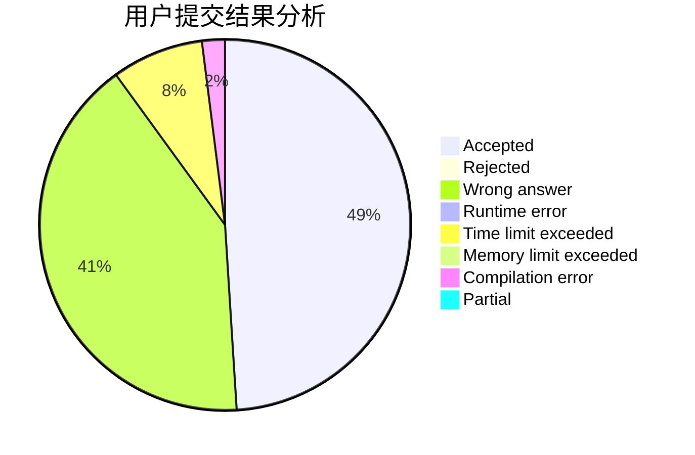
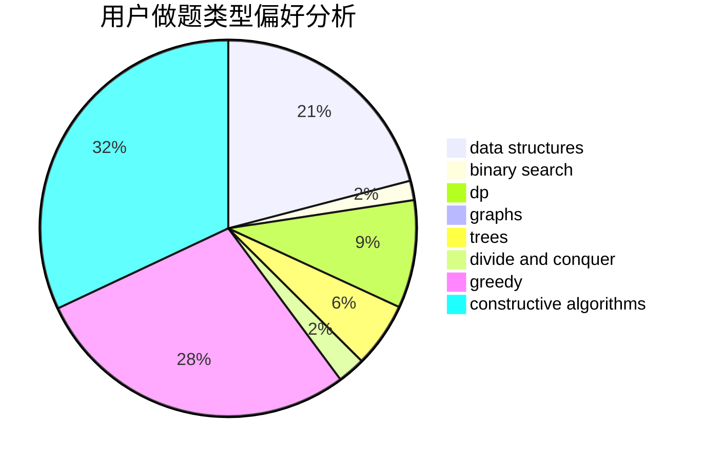
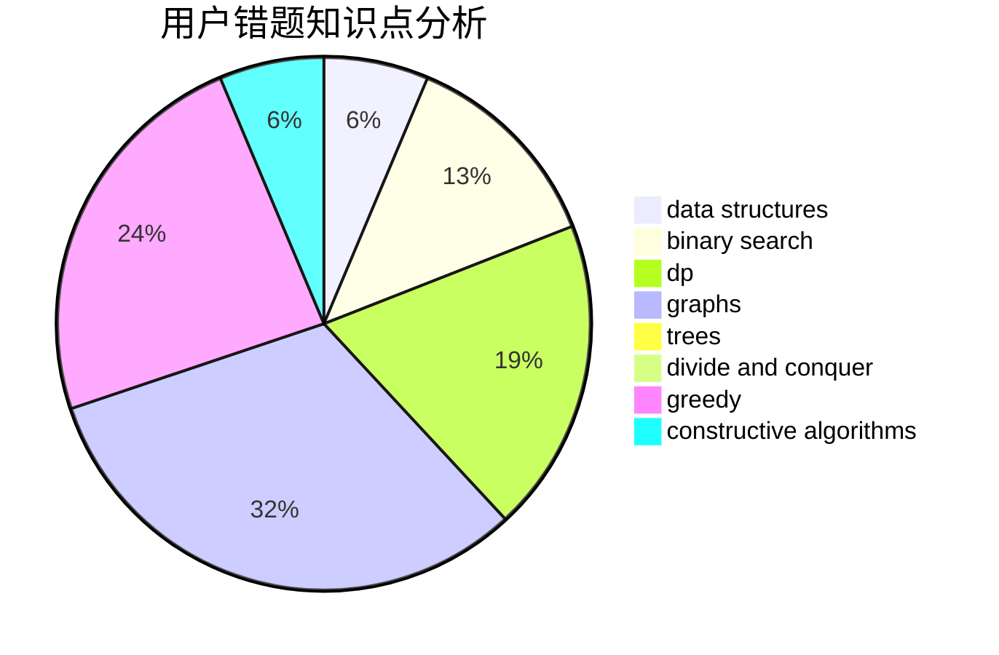

# henry-tb

<!-- tabs:start -->

#### **用户提交结果分析**

#### **用户做题类型偏好分析**

#### **用户错题知识点分析**

<!-- tabs:end -->
# 推荐题目
[1497B](https://codeforces.com/contest/1497/problem/B)		constructive algorithms,
                        greedy,
                        math		  
[908B](https://codeforces.com/contest/908/problem/B)		brute force,
                        implementation		  
[314C](https://codeforces.com/contest/314/problem/C)		data structures,
                        dp		  
[1067B](https://codeforces.com/contest/1067/problem/B)		dfs and similar,
                        graphs,
                        shortest paths		  
[36B](https://codeforces.com/contest/36/problem/B)		implementation		  
[243A](https://codeforces.com/contest/243/problem/A)		bitmasks		  
[11082](https://codeforces.com/contest/1108/problem/2)		dsu,graphs,sortings,trees		  
[1091H](https://codeforces.com/contest/1091/problem/H)		games		  
[484A](https://codeforces.com/contest/484/problem/A)		bitmasks,
                        constructive algorithms		  
[1364D](https://codeforces.com/contest/1364/problem/D)		constructive algorithms,
                        dfs and similar,
                        graphs,
                        greedy,
                        implementation,
                        trees		  
