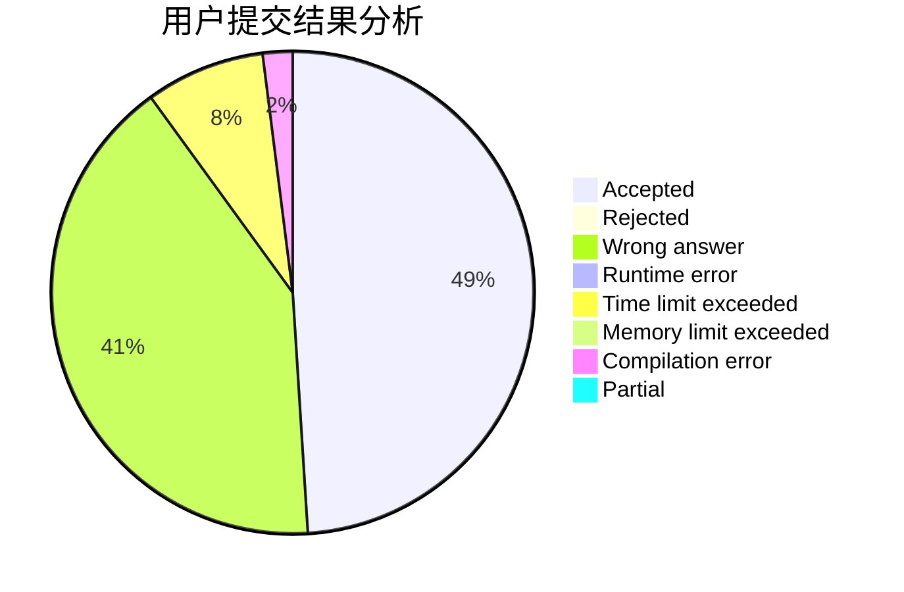
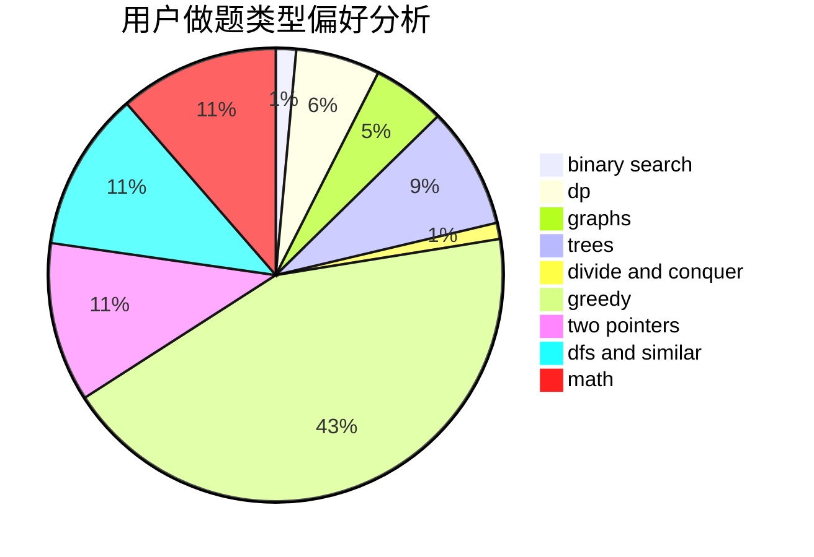

# henry-tb

<!-- tabs:start -->

#### **用户提交结果分析**

#### **用户做题类型偏好分析**

<!-- tabs:end -->
# 推荐题目
[1497B](https://codeforces.com/contest/1497/problem/B)
[908B](https://codeforces.com/contest/908/problem/B)
[314C](https://codeforces.com/contest/314/problem/C)
[1067B](https://codeforces.com/contest/1067/problem/B)
[36B](https://codeforces.com/contest/36/problem/B)
[243A](https://codeforces.com/contest/243/problem/A)
[11082](https://codeforces.com/contest/1108/problem/2)
[1091H](https://codeforces.com/contest/1091/problem/H)
[484A](https://codeforces.com/contest/484/problem/A)
[1364D](https://codeforces.com/contest/1364/problem/D)
