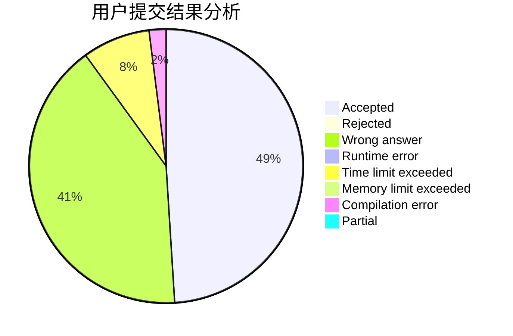
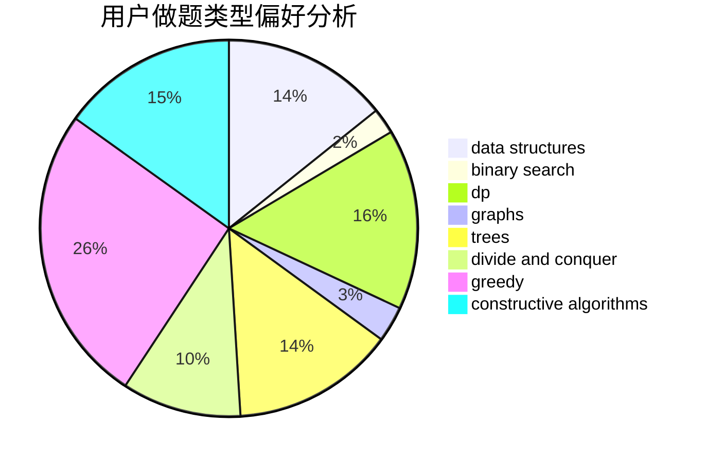
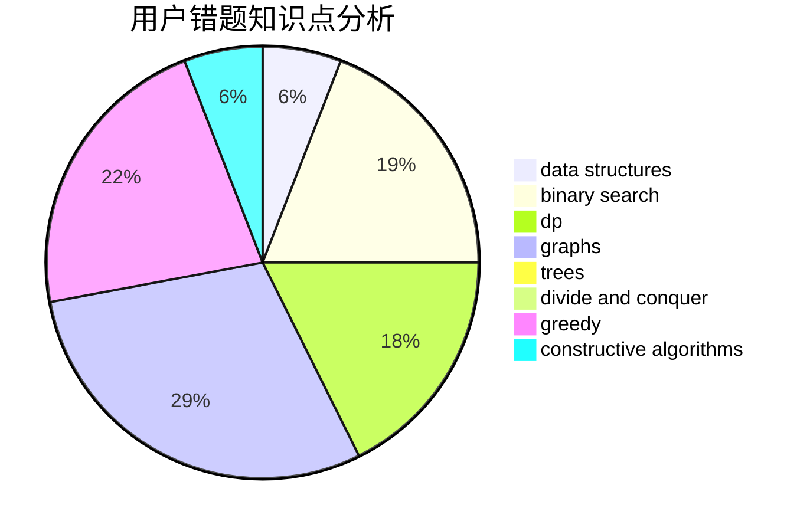

# henry-tb

<!-- tabs:start -->

#### **用户提交结果分析**

#### **用户做题类型偏好分析**

#### **用户错题知识点分析**

<!-- tabs:end -->
# 推荐题目
[1489D](https://codeforces.com/contest/1489/problem/D)		dsu,graphs,sortings,trees		  
[888D](https://codeforces.com/contest/888/problem/D)		combinatorics,
                        dp,
                        math		  
[297D](https://codeforces.com/contest/297/problem/D)		constructive algorithms		  
[1066E](https://codeforces.com/contest/1066/problem/E)		data structures,
                        implementation,
                        math		  
[343A](https://codeforces.com/contest/343/problem/A)		math,
                        number theory		  
[224A](https://codeforces.com/contest/224/problem/A)		brute force,
                        geometry,
                        math		  
[1107E](https://codeforces.com/contest/1107/problem/E)		dp		  
[1091E](https://codeforces.com/contest/1091/problem/E)		binary search,
                        data structures,
                        graphs,
                        greedy,
                        implementation,
                        math,
                        sortings		  
[464B](https://codeforces.com/contest/464/problem/B)		brute force,
                        geometry		  
[1357B1](https://codeforces.com/contest/1357B/problem/1)		nan		  
