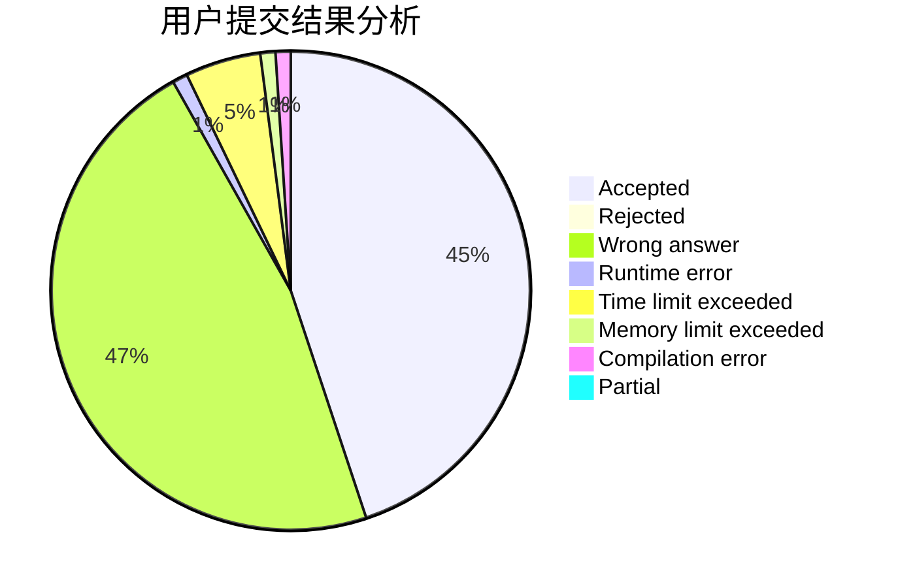
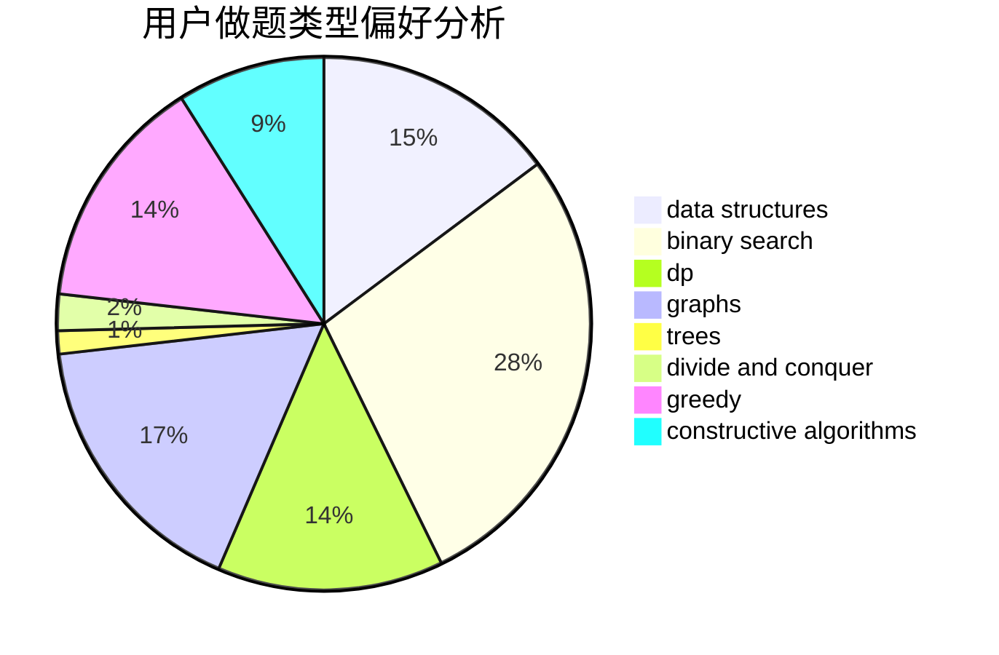

# henuzxy
<!-- tabs:start -->
#### **用户提交结果分析**

#### **用户做题类型偏好分析**

#### **用户错题知识点分析**

<!-- tabs:end -->
# 推荐题目
[Review Site](http://codeforces.com/problemset/problem/1511/A)		greedy		  
[Nastya Is Transposing Matrices](http://codeforces.com/problemset/problem/1136/C)		constructive algorithms,
                        sortings		  
[Primal Sport](https://codeforces.com/contest/947/problem/A)		math,
                        number theory		  
[Deduction Queries](http://codeforces.com/problemset/problem/1044/D)		data structures,
                        dsu		  
[New Year and Domino](http://codeforces.com/problemset/problem/611/C)		dp,
                        implementation		  
[Delete a Segment](http://codeforces.com/problemset/problem/1285/E)		brute force,
                        constructive algorithms,
                        data structures,
                        dp,
                        graphs,
                        sortings,
                        trees,
                        two pointers		  
[Company Income Growth](http://codeforces.com/problemset/problem/39/B)		greedy		  
[DZY Loves Chemistry](http://codeforces.com/problemset/problem/445/B)		dfs and similar,
                        dsu,
                        greedy		  
[Pashmak and Parmida's problem](http://codeforces.com/problemset/problem/459/D)		data structures,
                        divide and conquer,
                        sortings		  
[Plus and Square Root](http://codeforces.com/problemset/problem/715/A)		constructive algorithms,
                        math		  
<!-- tabs:start -->
#### **data structures**
[Review Site](http://codeforces.com/problemset/problem/1044/D)		data structures,
                        dsu		  
[Nastya Is Transposing Matrices](http://codeforces.com/problemset/problem/1285/E)		brute force,
                        constructive algorithms,
                        data structures,
                        dp,
                        graphs,
                        sortings,
                        trees,
                        two pointers		  
[Primal Sport](http://codeforces.com/problemset/problem/459/D)		data structures,
                        divide and conquer,
                        sortings		  
[Deduction Queries](http://codeforces.com/problemset/problem/1165/B)		data structures,
                        greedy,
                        sortings		  
[New Year and Domino](https://codeforces.com/contest/831/problem/F)		brute force,
                        data structures,
                        implementation,
                        math,
                        number theory,
                        sortings,
                        two pointers		  
[Delete a Segment](http://codeforces.com/problemset/problem/848/B)		constructive algorithms,
                        data structures,
                        geometry,
                        implementation,
                        sortings,
                        two pointers		  
[Company Income Growth](http://codeforces.com/problemset/problem/587/E)		data structures		  
[DZY Loves Chemistry](http://codeforces.com/problemset/problem/1492/C)		binary search,
                        data structures,
                        dp,
                        greedy,
                        two pointers		  
[Pashmak and Parmida's problem](http://codeforces.com/problemset/problem/1490/G)		binary search,
                        data structures,
                        math		  
[Plus and Square Root](http://codeforces.com/problemset/problem/1479/D)		binary search,
                        bitmasks,
                        brute force,
                        data structures,
                        probabilities,
                        trees		  
#### **binary search**
[Review Site](https://codeforces.com/contest/897/problem/C)		binary search,
                        dfs and similar		  
[Nastya Is Transposing Matrices](https://codeforces.com/contest/807/problem/E)		binary search,
                        constructive algorithms,
                        greedy,
                        math		  
[Primal Sport](http://codeforces.com/problemset/problem/1354/G)		binary search,
                        interactive,
                        probabilities		  
[Deduction Queries](http://codeforces.com/problemset/problem/1066/D)		binary search,
                        implementation		  
[New Year and Domino](http://codeforces.com/problemset/problem/955/C)		binary search,
                        math,
                        number theory		  
[Delete a Segment](http://codeforces.com/problemset/problem/1492/C)		binary search,
                        data structures,
                        dp,
                        greedy,
                        two pointers		  
[Company Income Growth](http://codeforces.com/problemset/problem/1463/D)		binary search,
                        constructive algorithms,
                        greedy,
                        two pointers		  
[DZY Loves Chemistry](http://codeforces.com/problemset/problem/1490/G)		binary search,
                        data structures,
                        math		  
[Pashmak and Parmida's problem](http://codeforces.com/problemset/problem/1479/D)		binary search,
                        bitmasks,
                        brute force,
                        data structures,
                        probabilities,
                        trees		  
[Plus and Square Root](http://codeforces.com/problemset/problem/1436/E)		binary search,
                        data structures,
                        two pointers		  
#### **dp**
[Review Site](http://codeforces.com/problemset/problem/611/C)		dp,
                        implementation		  
[Nastya Is Transposing Matrices](http://codeforces.com/problemset/problem/1285/E)		brute force,
                        constructive algorithms,
                        data structures,
                        dp,
                        graphs,
                        sortings,
                        trees,
                        two pointers		  
[Primal Sport](http://codeforces.com/problemset/problem/386/C)		dp,
                        strings,
                        two pointers		  
[Deduction Queries](https://codeforces.com/contest/512/problem/B)		bitmasks,
                        brute force,
                        dp,
                        math		  
[New Year and Domino](http://codeforces.com/problemset/problem/274/B)		dfs and similar,
                        dp,
                        greedy,
                        trees		  
[Delete a Segment](http://codeforces.com/problemset/problem/868/F)		divide and conquer,
                        dp		  
[Company Income Growth](http://codeforces.com/problemset/problem/868/D)		bitmasks,
                        brute force,
                        dp,
                        implementation,
                        strings		  
[DZY Loves Chemistry](http://codeforces.com/problemset/problem/1093/F)		dp		  
[Pashmak and Parmida's problem](http://codeforces.com/problemset/problem/464/D)		dp,
                        probabilities		  
[Plus and Square Root](http://codeforces.com/problemset/problem/414/B)		combinatorics,
                        dp,
                        number theory		  
#### **graph**
[Review Site](http://codeforces.com/problemset/problem/1285/E)		brute force,
                        constructive algorithms,
                        data structures,
                        dp,
                        graphs,
                        sortings,
                        trees,
                        two pointers		  
[Nastya Is Transposing Matrices](http://codeforces.com/problemset/problem/1291/F)		graphs,
                        interactive		  
[Primal Sport](http://codeforces.com/problemset/problem/94/B)		graphs,
                        implementation,
                        math		  
[Deduction Queries](https://codeforces.com/contest/1471/problem/F)		constructive algorithms,
                        dfs and similar,
                        graph matchings,
                        graphs,
                        greedy		  
[New Year and Domino](http://codeforces.com/problemset/problem/1051/F)		graphs,
                        shortest paths,
                        trees		  
[Delete a Segment](http://codeforces.com/problemset/problem/1422/D)		graphs,
                        shortest paths,
                        sortings		  
[Company Income Growth](http://codeforces.com/problemset/problem/1487/C)		brute force,
                        constructive algorithms,
                        dfs and similar,
                        graphs,
                        greedy,
                        implementation,
                        math		  
[DZY Loves Chemistry](http://codeforces.com/problemset/problem/1437/C)		dp,
                        flows,
                        graph matchings,
                        greedy,
                        math,
                        sortings		  
[Pashmak and Parmida's problem](http://codeforces.com/problemset/problem/1470/D)		constructive algorithms,
                        dfs and similar,
                        graph matchings,
                        graphs,
                        greedy		  
[Plus and Square Root](http://codeforces.com/problemset/problem/1476/C)		dp,
                        graphs,
                        greedy		  
#### **trees**
[Review Site](http://codeforces.com/problemset/problem/1285/E)		brute force,
                        constructive algorithms,
                        data structures,
                        dp,
                        graphs,
                        sortings,
                        trees,
                        two pointers		  
[Nastya Is Transposing Matrices](http://codeforces.com/problemset/problem/274/B)		dfs and similar,
                        dp,
                        greedy,
                        trees		  
[Primal Sport](http://codeforces.com/problemset/problem/1051/F)		graphs,
                        shortest paths,
                        trees		  
[Deduction Queries](http://codeforces.com/problemset/problem/1363/C)		games,
                        trees		  
[New Year and Domino](http://codeforces.com/problemset/problem/1479/D)		binary search,
                        bitmasks,
                        brute force,
                        data structures,
                        probabilities,
                        trees		  
[Delete a Segment](http://codeforces.com/problemset/problem/1511/C)		brute force,
                        data structures,
                        implementation,
                        trees		  
[Company Income Growth](http://codeforces.com/problemset/problem/1499/F)		combinatorics,
                        dfs and similar,
                        dp,
                        trees		  
[DZY Loves Chemistry](http://codeforces.com/problemset/problem/1491/E)		brute force,
                        dfs and similar,
                        divide and conquer,
                        number theory,
                        trees		  
[Pashmak and Parmida's problem](http://codeforces.com/problemset/problem/1466/D)		data structures,
                        greedy,
                        sortings,
                        trees		  
[Plus and Square Root](http://codeforces.com/problemset/problem/1495/D)		combinatorics,
                        dfs and similar,
                        graphs,
                        math,
                        shortest paths,
                        trees		  
#### **divide and conquer**
[Review Site](http://codeforces.com/problemset/problem/459/D)		data structures,
                        divide and conquer,
                        sortings		  
[Nastya Is Transposing Matrices](http://codeforces.com/problemset/problem/868/F)		divide and conquer,
                        dp		  
[Primal Sport](http://codeforces.com/problemset/problem/1461/D)		binary search,
                        brute force,
                        data structures,
                        divide and conquer,
                        implementation,
                        sortings		  
[Deduction Queries](http://codeforces.com/problemset/problem/1466/G)		combinatorics,
                        divide and conquer,
                        hashing,
                        math,
                        string suffix structures,
                        strings		  
[New Year and Domino](http://codeforces.com/problemset/problem/1490/D)		dfs and similar,
                        divide and conquer,
                        implementation		  
[Delete a Segment](https://codeforces.com/contest/1483/problem/C)		data structures,
                        divide and conquer,
                        dp		  
[Company Income Growth](http://codeforces.com/problemset/problem/1491/E)		brute force,
                        dfs and similar,
                        divide and conquer,
                        number theory,
                        trees		  
[DZY Loves Chemistry](http://codeforces.com/problemset/problem/1303/G)		data structures,
                        divide and conquer,
                        geometry,
                        trees		  
[Pashmak and Parmida's problem](http://codeforces.com/problemset/problem/1494/D)		constructive algorithms,
                        data structures,
                        dfs and similar,
                        divide and conquer,
                        dsu,
                        greedy,
                        sortings,
                        trees		  
[Plus and Square Root](http://codeforces.com/problemset/problem/1482/E)		data structures,
                        divide and conquer,
                        dp		  
#### **greedy**
[Review Site](http://codeforces.com/problemset/problem/1511/A)		greedy		  
[Nastya Is Transposing Matrices](http://codeforces.com/problemset/problem/39/B)		greedy		  
[Primal Sport](http://codeforces.com/problemset/problem/445/B)		dfs and similar,
                        dsu,
                        greedy		  
[Deduction Queries](http://codeforces.com/problemset/problem/92/B)		greedy		  
[New Year and Domino](https://codeforces.com/contest/807/problem/E)		binary search,
                        constructive algorithms,
                        greedy,
                        math		  
[Delete a Segment](http://codeforces.com/problemset/problem/1165/B)		data structures,
                        greedy,
                        sortings		  
[Company Income Growth](https://codeforces.com/contest/1471/problem/F)		constructive algorithms,
                        dfs and similar,
                        graph matchings,
                        graphs,
                        greedy		  
[DZY Loves Chemistry](http://codeforces.com/problemset/problem/844/A)		greedy,
                        implementation,
                        strings		  
[Pashmak and Parmida's problem](http://codeforces.com/problemset/problem/1249/D1)		greedy		  
[Plus and Square Root](http://codeforces.com/problemset/problem/730/D)		greedy,
                        implementation,
                        math		  
#### **constructive algorithms**
[Review Site](http://codeforces.com/problemset/problem/1136/C)		constructive algorithms,
                        sortings		  
[Nastya Is Transposing Matrices](http://codeforces.com/problemset/problem/1285/E)		brute force,
                        constructive algorithms,
                        data structures,
                        dp,
                        graphs,
                        sortings,
                        trees,
                        two pointers		  
[Primal Sport](http://codeforces.com/problemset/problem/715/A)		constructive algorithms,
                        math		  
[Deduction Queries](http://codeforces.com/problemset/problem/638/A)		*special problem,
                        constructive algorithms,
                        math		  
[New Year and Domino](https://codeforces.com/contest/807/problem/E)		binary search,
                        constructive algorithms,
                        greedy,
                        math		  
[Delete a Segment](https://codeforces.com/contest/1471/problem/F)		constructive algorithms,
                        dfs and similar,
                        graph matchings,
                        graphs,
                        greedy		  
[Company Income Growth](http://codeforces.com/problemset/problem/734/F)		bitmasks,
                        constructive algorithms,
                        implementation,
                        math		  
[DZY Loves Chemistry](http://codeforces.com/problemset/problem/1355/F)		constructive algorithms,
                        interactive,
                        number theory		  
[Pashmak and Parmida's problem](http://codeforces.com/problemset/problem/652/F)		constructive algorithms,
                        math		  
[Plus and Square Root](http://codeforces.com/problemset/problem/848/B)		constructive algorithms,
                        data structures,
                        geometry,
                        implementation,
                        sortings,
                        two pointers		  
#### **sortings**
[Review Site](http://codeforces.com/problemset/problem/1136/C)		constructive algorithms,
                        sortings		  
[Nastya Is Transposing Matrices](http://codeforces.com/problemset/problem/1285/E)		brute force,
                        constructive algorithms,
                        data structures,
                        dp,
                        graphs,
                        sortings,
                        trees,
                        two pointers		  
[Primal Sport](http://codeforces.com/problemset/problem/459/D)		data structures,
                        divide and conquer,
                        sortings		  
[Deduction Queries](http://codeforces.com/problemset/problem/1165/B)		data structures,
                        greedy,
                        sortings		  
[New Year and Domino](https://codeforces.com/contest/831/problem/F)		brute force,
                        data structures,
                        implementation,
                        math,
                        number theory,
                        sortings,
                        two pointers		  
[Delete a Segment](http://codeforces.com/problemset/problem/848/B)		constructive algorithms,
                        data structures,
                        geometry,
                        implementation,
                        sortings,
                        two pointers		  
[Company Income Growth](http://codeforces.com/problemset/problem/1005/E2)		sortings		  
[DZY Loves Chemistry](http://codeforces.com/problemset/problem/1422/D)		graphs,
                        shortest paths,
                        sortings		  
[Pashmak and Parmida's problem](https://codeforces.com/contest/1496/problem/C)		geometry,
                        greedy,
                        math,
                        sortings		  
[Plus and Square Root](http://codeforces.com/problemset/problem/1495/A)		geometry,
                        greedy,
                        math,
                        sortings		  
<!-- tabs:end -->
