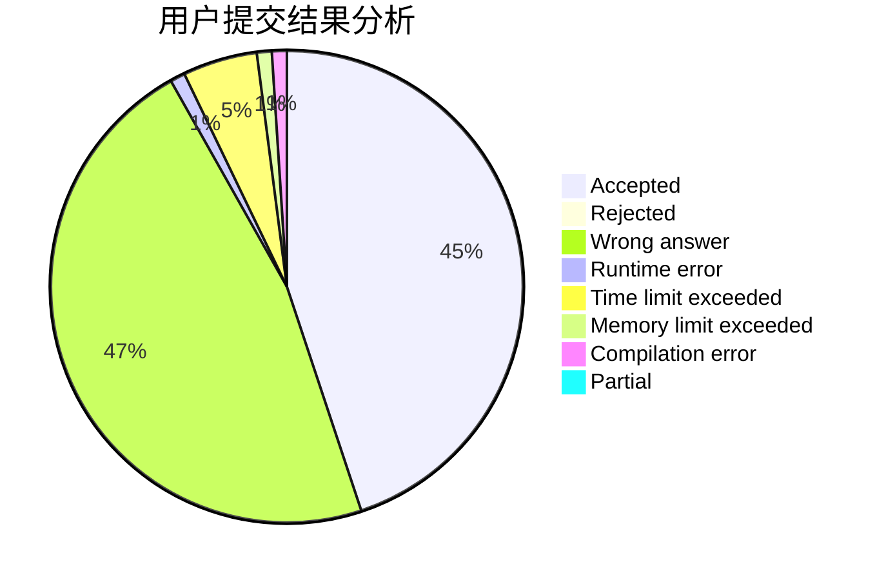
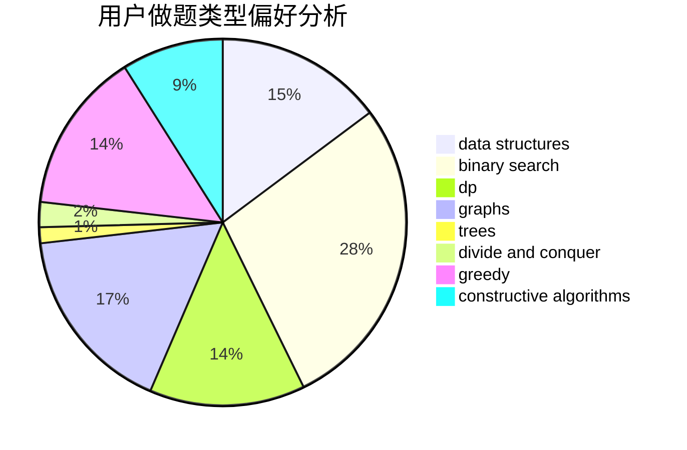

# henuzxy

<!-- tabs:start -->

#### **用户提交结果分析**

#### **用户做题类型偏好分析**

#### **用户错题知识点分析**

<!-- tabs:end -->
# 推荐题目
[1511A](https://codeforces.com/contest/1511/problem/A)		greedy		  
[1165B](https://codeforces.com/contest/1165/problem/B)		data structures,
                        greedy,
                        sortings		  
[94B](https://codeforces.com/contest/94/problem/B)		graphs,
                        implementation,
                        math		  
[1044D](https://codeforces.com/contest/1044/problem/D)		data structures,
                        dsu		  
[947A](https://codeforces.com/contest/947/problem/A)		dsu,graphs,sortings,trees		  
[1199A](https://codeforces.com/contest/1199/problem/A)		implementation		  
[715A](https://codeforces.com/contest/715/problem/A)		constructive algorithms,
                        math		  
[39B](https://codeforces.com/contest/39/problem/B)		greedy		  
[868F](https://codeforces.com/contest/868/problem/F)		divide and conquer,
                        dp		  
[611C](https://codeforces.com/contest/611/problem/C)		dp,
                        implementation		  
