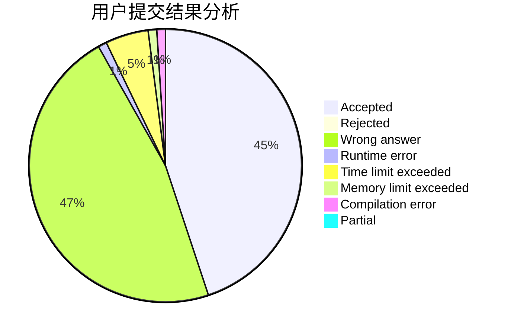
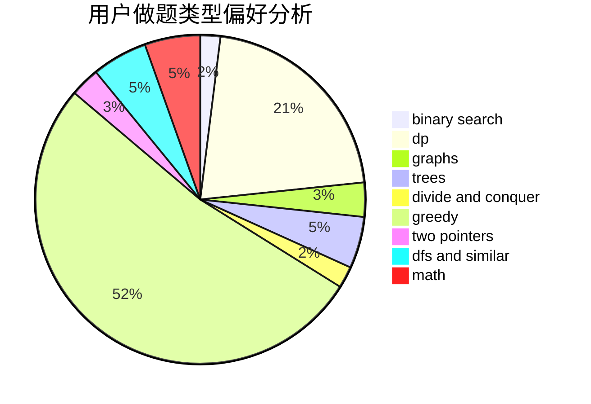

# henuzxy

<!-- tabs:start -->

#### **用户提交结果分析**

#### **用户做题类型偏好分析**

<!-- tabs:end -->
# 推荐题目
[167B](https://codeforces.com/contest/167/problem/B)
[1167D](https://codeforces.com/contest/1167/problem/D)
[967A](https://codeforces.com/contest/967/problem/A)
[1045E](https://codeforces.com/contest/1045/problem/E)
[963E](https://codeforces.com/contest/963/problem/E)
[1202E](https://codeforces.com/contest/1202/problem/E)
[733C](https://codeforces.com/contest/733/problem/C)
[425C](https://codeforces.com/contest/425/problem/C)
[888B](https://codeforces.com/contest/888/problem/B)
[630F](https://codeforces.com/contest/630/problem/F)
