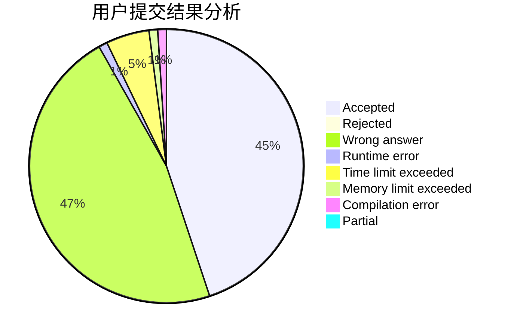
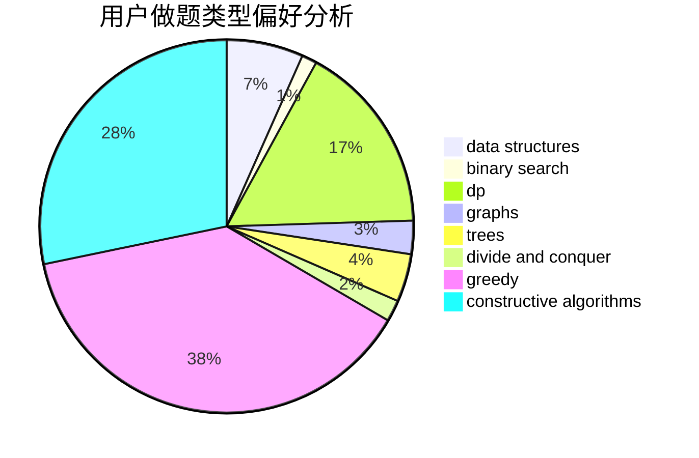

# henuzxy

<!-- tabs:start -->

#### **用户提交结果分析**

#### **用户做题类型偏好分析**

#### **用户错题知识点分析**

<!-- tabs:end -->
# 推荐题目
[167B](https://codeforces.com/contest/167/problem/B)		dp,
                        math,
                        probabilities		  
[1167D](https://codeforces.com/contest/1167/problem/D)		constructive algorithms,
                        greedy		  
[967A](https://codeforces.com/contest/967/problem/A)		implementation		  
[1045E](https://codeforces.com/contest/1045/problem/E)		constructive algorithms,
                        geometry		  
[963E](https://codeforces.com/contest/963/problem/E)		math		  
[1202E](https://codeforces.com/contest/1202/problem/E)		brute force,
                        string suffix structures,
                        strings		  
[733C](https://codeforces.com/contest/733/problem/C)		constructive algorithms,
                        dp,
                        greedy,
                        two pointers		  
[425C](https://codeforces.com/contest/425/problem/C)		data structures,
                        dp		  
[888B](https://codeforces.com/contest/888/problem/B)		greedy		  
[630F](https://codeforces.com/contest/630/problem/F)		combinatorics,
                        math		  
