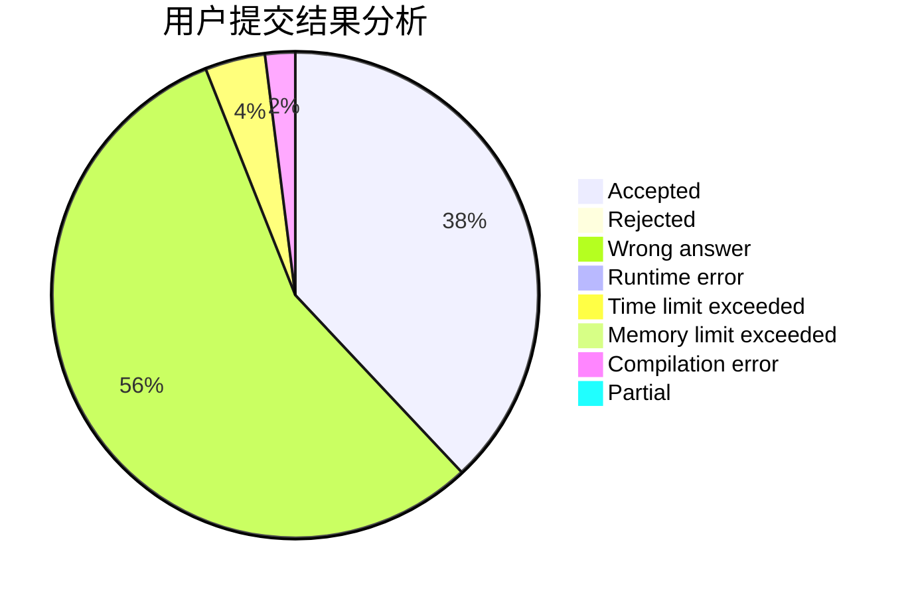
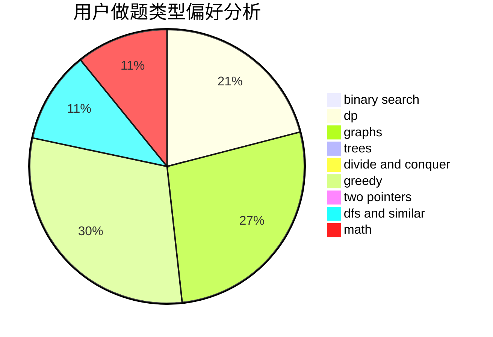

# hero_zl

<!-- tabs:start -->

#### **用户提交结果分析**

#### **用户做题类型偏好分析**

<!-- tabs:end -->
# 推荐题目
[825E](https://codeforces.com/contest/825/problem/E)
[772D](https://codeforces.com/contest/772/problem/D)
[1016B](https://codeforces.com/contest/1016/problem/B)
[1346E](https://codeforces.com/contest/1346/problem/E)
[11521](https://codeforces.com/contest/1152/problem/1)
[234A](https://codeforces.com/contest/234/problem/A)
[280E](https://codeforces.com/contest/280/problem/E)
[1365G](https://codeforces.com/contest/1365/problem/G)
[425C](https://codeforces.com/contest/425/problem/C)
[252A](https://codeforces.com/contest/252/problem/A)
