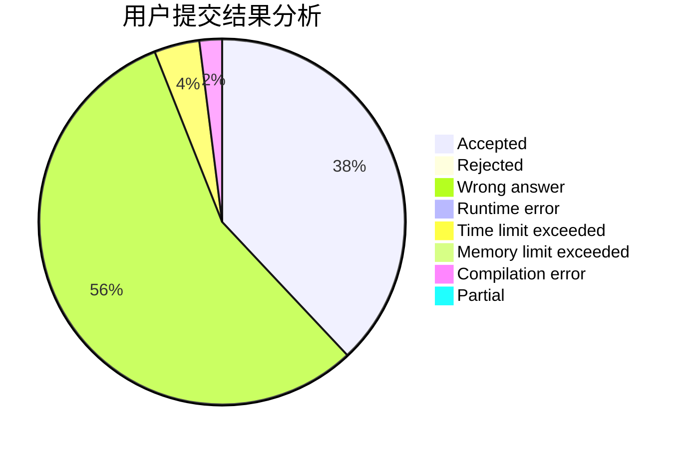
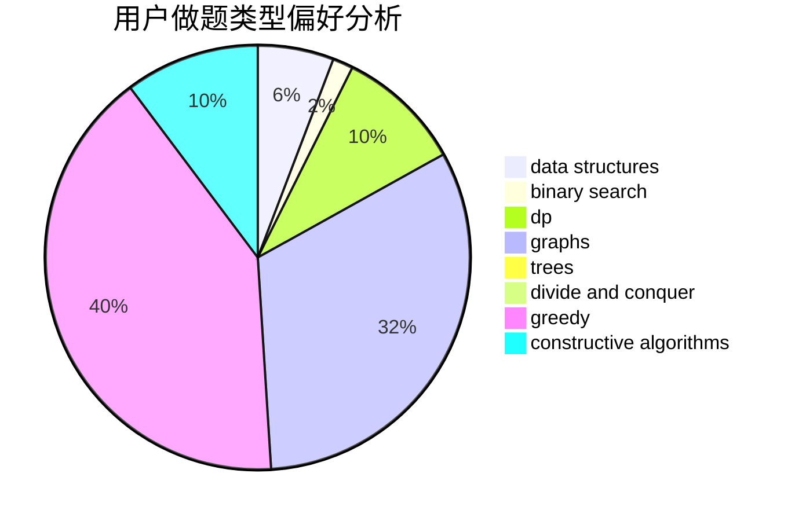

# hero_zl

<!-- tabs:start -->

#### **用户提交结果分析**

#### **用户做题类型偏好分析**

#### **用户错题知识点分析**

<!-- tabs:end -->
# 推荐题目
[825E](https://codeforces.com/contest/825/problem/E)		data structures,
                        dfs and similar,
                        graphs,
                        greedy		  
[772D](https://codeforces.com/contest/772/problem/D)		bitmasks,
                        dp		  
[1016B](https://codeforces.com/contest/1016/problem/B)		brute force,
                        implementation		  
[1346E](https://codeforces.com/contest/1346/problem/E)		*special problem,
                        dp,
                        graphs		  
[11521](https://codeforces.com/contest/1152/problem/1)		dsu,graphs,sortings,trees		  
[234A](https://codeforces.com/contest/234/problem/A)		implementation		  
[280E](https://codeforces.com/contest/280/problem/E)		data structures,
                        dp,
                        implementation,
                        math		  
[1365G](https://codeforces.com/contest/1365/problem/G)		bitmasks,
                        combinatorics,
                        constructive algorithms,
                        interactive,
                        math		  
[425C](https://codeforces.com/contest/425/problem/C)		data structures,
                        dp		  
[252A](https://codeforces.com/contest/252/problem/A)		brute force,
                        implementation		  
