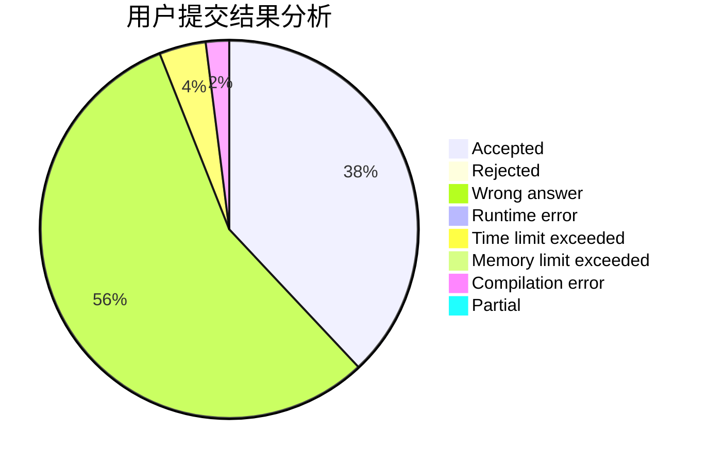
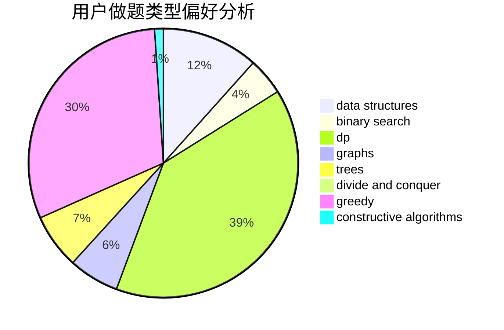
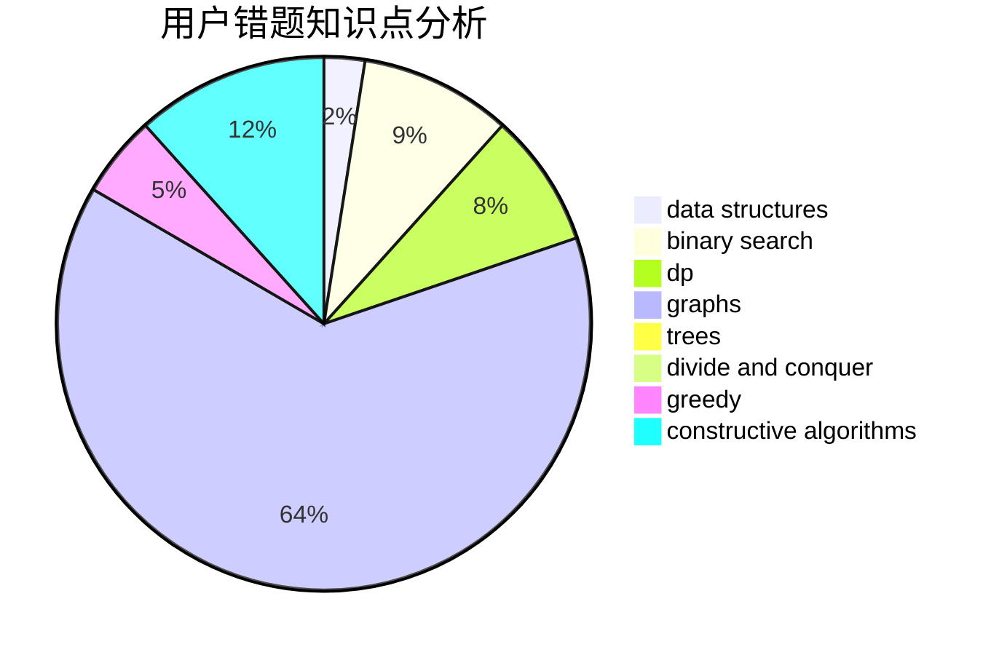

# hero_zl

<!-- tabs:start -->

#### **用户提交结果分析**

#### **用户做题类型偏好分析**

#### **用户错题知识点分析**

<!-- tabs:end -->
# 推荐题目
[808F](https://codeforces.com/contest/808/problem/F)		binary search,
                        flows,
                        graphs		  
[754C](https://codeforces.com/contest/754/problem/C)		brute force,
                        constructive algorithms,
                        dp,
                        implementation,
                        strings		  
[1015E2](https://codeforces.com/contest/1015E/problem/2)		binary search,
                        dp,
                        greedy		  
[1339E](https://codeforces.com/contest/1339/problem/E)		dsu,graphs,sortings,trees		  
[114D](https://codeforces.com/contest/114/problem/D)		dsu,graphs,sortings,trees		  
[215B](https://codeforces.com/contest/215/problem/B)		greedy,
                        math		  
[264E](https://codeforces.com/contest/264/problem/E)		data structures,
                        dp		  
[1357D5](https://codeforces.com/contest/1357D/problem/5)		nan		  
[39B](https://codeforces.com/contest/39/problem/B)		greedy		  
[231B](https://codeforces.com/contest/231/problem/B)		constructive algorithms,
                        greedy		  
