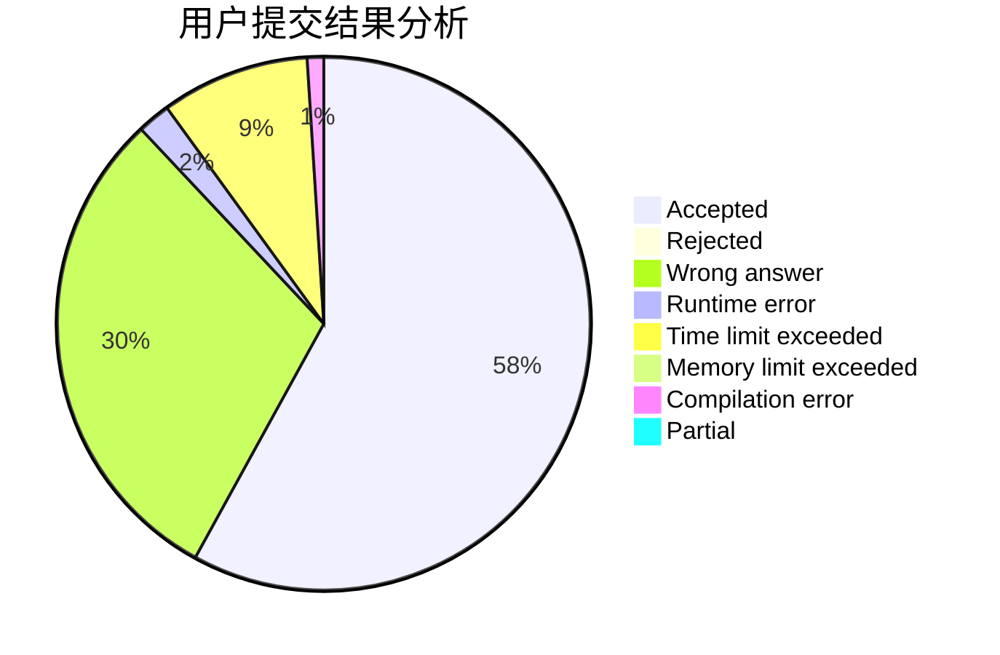
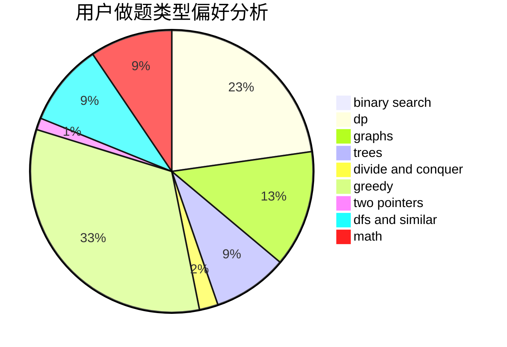

# BYTX

<!-- tabs:start -->

#### **用户提交结果分析**

#### **用户做题类型偏好分析**

<!-- tabs:end -->
# 推荐题目
[11302](https://codeforces.com/contest/1130/problem/2)
[1198F](https://codeforces.com/contest/1198/problem/F)
[1423C](https://codeforces.com/contest/1423/problem/C)
[485A](https://codeforces.com/contest/485/problem/A)
[1408I](https://codeforces.com/contest/1408/problem/I)
[484B](https://codeforces.com/contest/484/problem/B)
[1213F](https://codeforces.com/contest/1213/problem/F)
[1092E](https://codeforces.com/contest/1092/problem/E)
[1366B](https://codeforces.com/contest/1366/problem/B)
[484A](https://codeforces.com/contest/484/problem/A)
