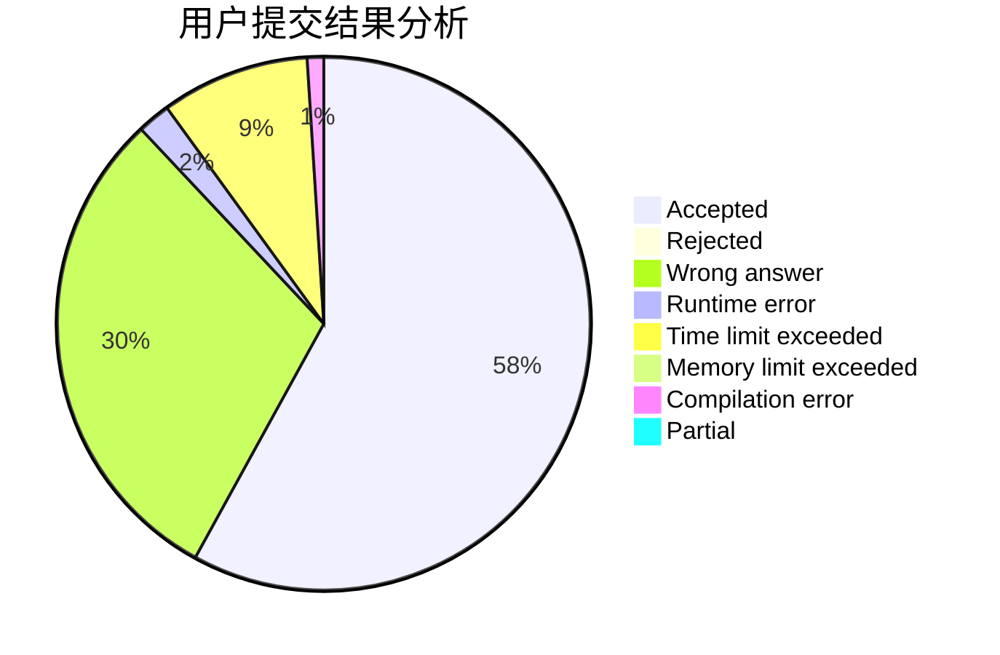
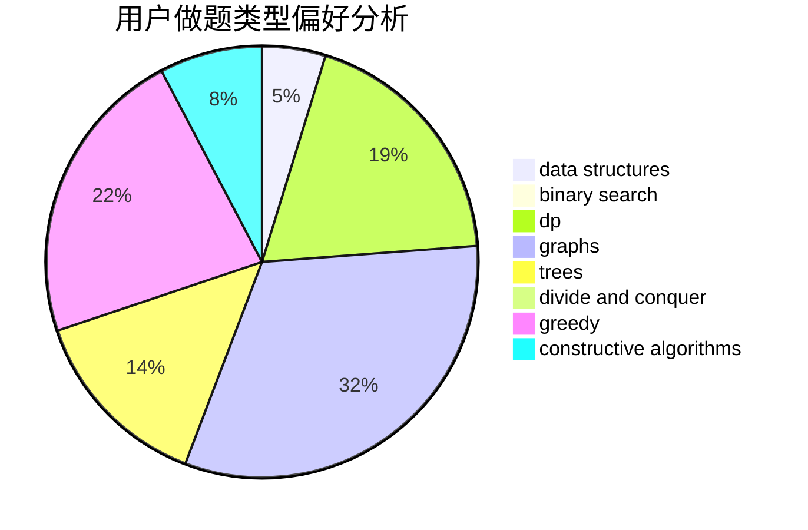

# BYTX

<!-- tabs:start -->

#### **用户提交结果分析**

#### **用户做题类型偏好分析**

#### **用户错题知识点分析**

<!-- tabs:end -->
# 推荐题目
[11302](https://codeforces.com/contest/1130/problem/2)		dsu,graphs,sortings,trees		  
[1198F](https://codeforces.com/contest/1198/problem/F)		greedy,
                        number theory,
                        probabilities		  
[1423C](https://codeforces.com/contest/1423/problem/C)		divide and conquer,
                        graphs,
                        trees		  
[485A](https://codeforces.com/contest/485/problem/A)		implementation,
                        math,
                        matrices		  
[1408I](https://codeforces.com/contest/1408/problem/I)		dp,
                        math		  
[484B](https://codeforces.com/contest/484/problem/B)		binary search,
                        math,
                        sortings,
                        two pointers		  
[1213F](https://codeforces.com/contest/1213/problem/F)		data structures,
                        dfs and similar,
                        dsu,
                        graphs,
                        greedy,
                        implementation,
                        strings		  
[1092E](https://codeforces.com/contest/1092/problem/E)		constructive algorithms,
                        dfs and similar,
                        greedy,
                        trees		  
[1366B](https://codeforces.com/contest/1366/problem/B)		math,
                        two pointers		  
[484A](https://codeforces.com/contest/484/problem/A)		bitmasks,
                        constructive algorithms		  
