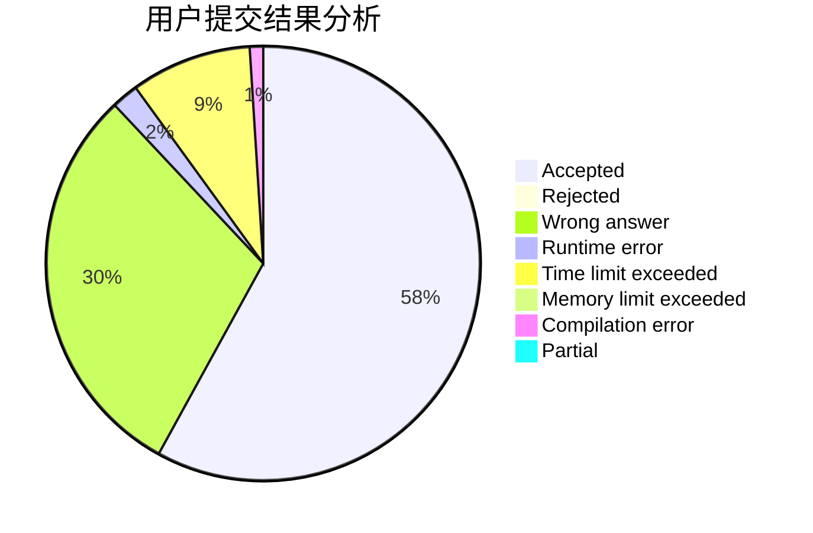
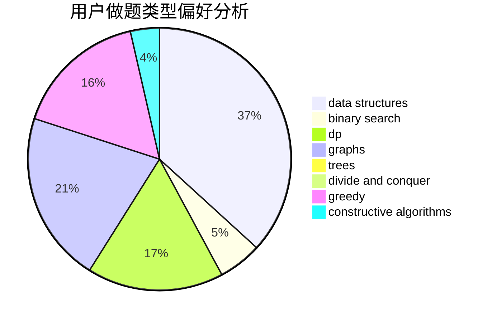

# BYTX

<!-- tabs:start -->

#### **用户提交结果分析**

#### **用户做题类型偏好分析**

#### **用户错题知识点分析**

<!-- tabs:end -->
# 推荐题目
[1120F](https://codeforces.com/contest/1120/problem/F)		data structures,
                        dp,
                        greedy		  
[1194D](https://codeforces.com/contest/1194/problem/D)		games,
                        math		  
[1413F](https://codeforces.com/contest/1413/problem/F)		data structures,
                        trees		  
[466A](https://codeforces.com/contest/466/problem/A)		implementation		  
[139A](https://codeforces.com/contest/139/problem/A)		implementation		  
[464C](https://codeforces.com/contest/464/problem/C)		dp		  
[1208B](https://codeforces.com/contest/1208/problem/B)		binary search,
                        brute force,
                        implementation,
                        two pointers		  
[1092B](https://codeforces.com/contest/1092/problem/B)		sortings		  
[1357E2](https://codeforces.com/contest/1357E/problem/2)		nan		  
[464B](https://codeforces.com/contest/464/problem/B)		brute force,
                        geometry		  
