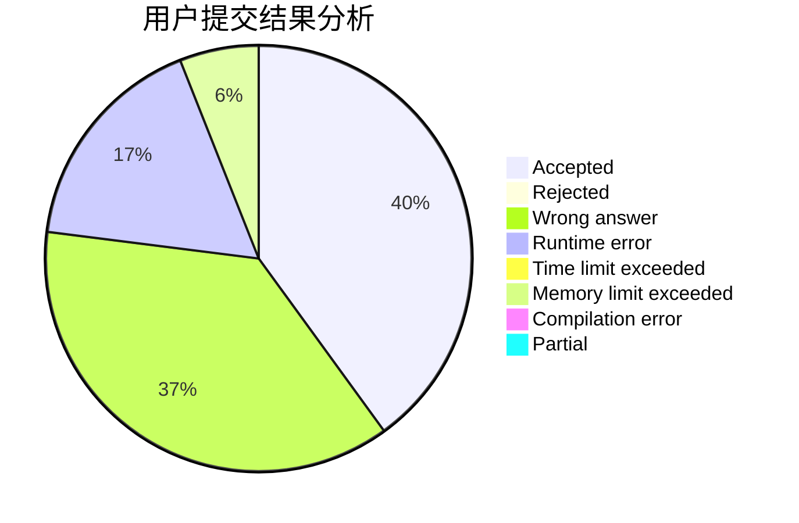
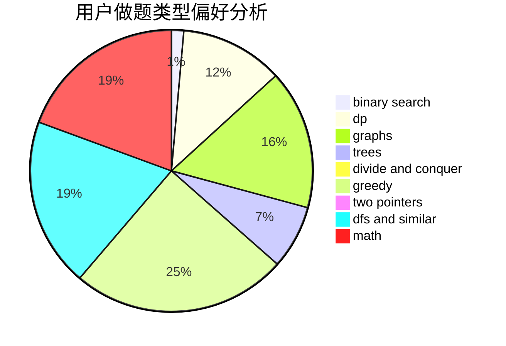

# heroes_tonight

<!-- tabs:start -->

#### **用户提交结果分析**

#### **用户做题类型偏好分析**

<!-- tabs:end -->
# 推荐题目
[17C](https://codeforces.com/contest/17/problem/C)
[1083D](https://codeforces.com/contest/1083/problem/D)
[796D](https://codeforces.com/contest/796/problem/D)
[477D](https://codeforces.com/contest/477/problem/D)
[271E](https://codeforces.com/contest/271/problem/E)
[276E](https://codeforces.com/contest/276/problem/E)
[113B](https://codeforces.com/contest/113/problem/B)
[656D](https://codeforces.com/contest/656/problem/D)
[261C](https://codeforces.com/contest/261/problem/C)
[13C](https://codeforces.com/contest/13/problem/C)
