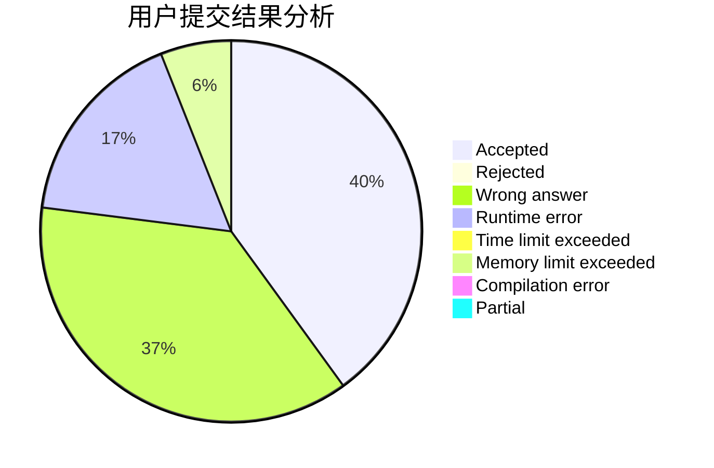
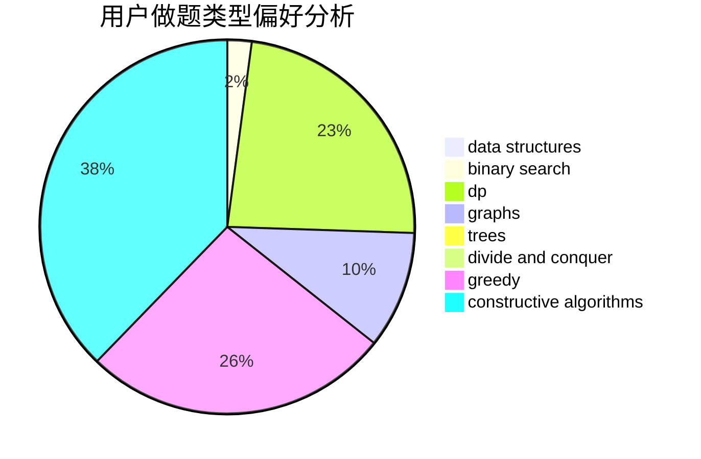

# heroes_tonight

<!-- tabs:start -->

#### **用户提交结果分析**

#### **用户做题类型偏好分析**

#### **用户错题知识点分析**

<!-- tabs:end -->
# 推荐题目
[158A](https://codeforces.com/contest/158/problem/A)		*special problem,
                        implementation		  
[1083A](https://codeforces.com/contest/1083/problem/A)		data structures,
                        dp,
                        trees		  
[778C](https://codeforces.com/contest/778/problem/C)		brute force,
                        dfs and similar,
                        dsu,
                        hashing,
                        strings,
                        trees		  
[457D](https://codeforces.com/contest/457/problem/D)		combinatorics,
                        math,
                        probabilities		  
[254A](https://codeforces.com/contest/254/problem/A)		constructive algorithms,
                        sortings		  
[259D](https://codeforces.com/contest/259/problem/D)		dsu,graphs,sortings,trees		  
[1137F](https://codeforces.com/contest/1137/problem/F)		data structures,
                        trees		  
[628C](https://codeforces.com/contest/628/problem/C)		greedy,
                        strings		  
[240E](https://codeforces.com/contest/240/problem/E)		dfs and similar,
                        graphs,
                        greedy		  
[1392A](https://codeforces.com/contest/1392/problem/A)		greedy,
                        math		  
