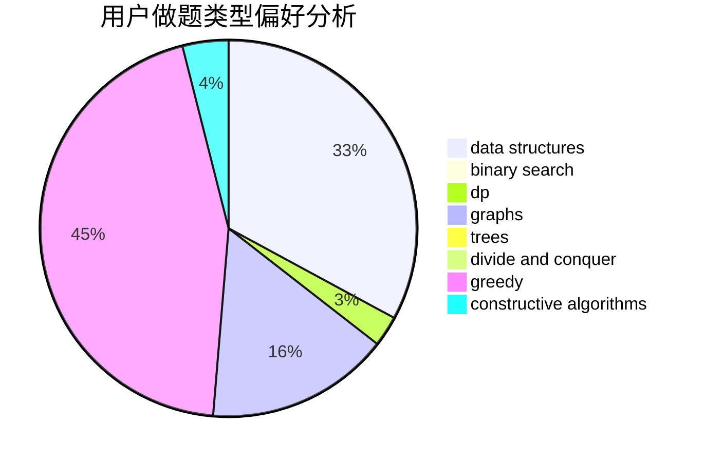

# heroes_tonight

<!-- tabs:start -->

#### **用户提交结果分析**

#### **用户做题类型偏好分析**

#### **用户错题知识点分析**

<!-- tabs:end -->
# 推荐题目
[17C](https://codeforces.com/contest/17/problem/C)		dp		  
[1083D](https://codeforces.com/contest/1083/problem/D)		data structures,
                        implementation		  
[796D](https://codeforces.com/contest/796/problem/D)		constructive algorithms,
                        dfs and similar,
                        dp,
                        graphs,
                        shortest paths,
                        trees		  
[477D](https://codeforces.com/contest/477/problem/D)		dp,
                        strings		  
[271E](https://codeforces.com/contest/271/problem/E)		constructive algorithms,
                        math,
                        number theory		  
[276E](https://codeforces.com/contest/276/problem/E)		data structures,
                        graphs,
                        trees		  
[113B](https://codeforces.com/contest/113/problem/B)		brute force,
                        data structures,
                        hashing,
                        strings		  
[656D](https://codeforces.com/contest/656/problem/D)		*special problem		  
[261C](https://codeforces.com/contest/261/problem/C)		constructive algorithms,
                        dp,
                        math		  
[13C](https://codeforces.com/contest/13/problem/C)		dp,
                        sortings		  
