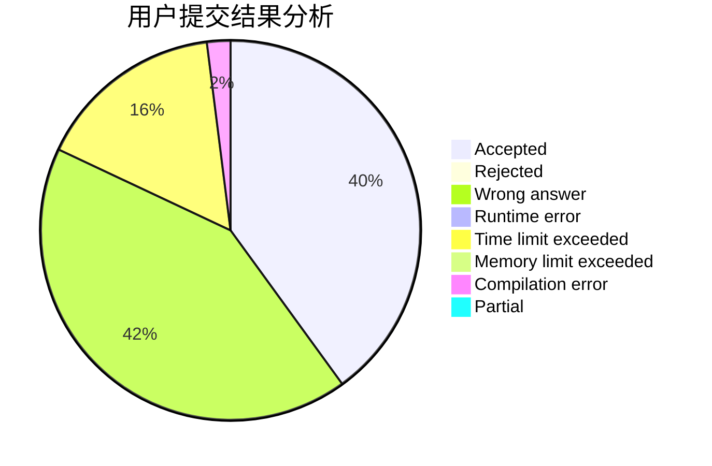
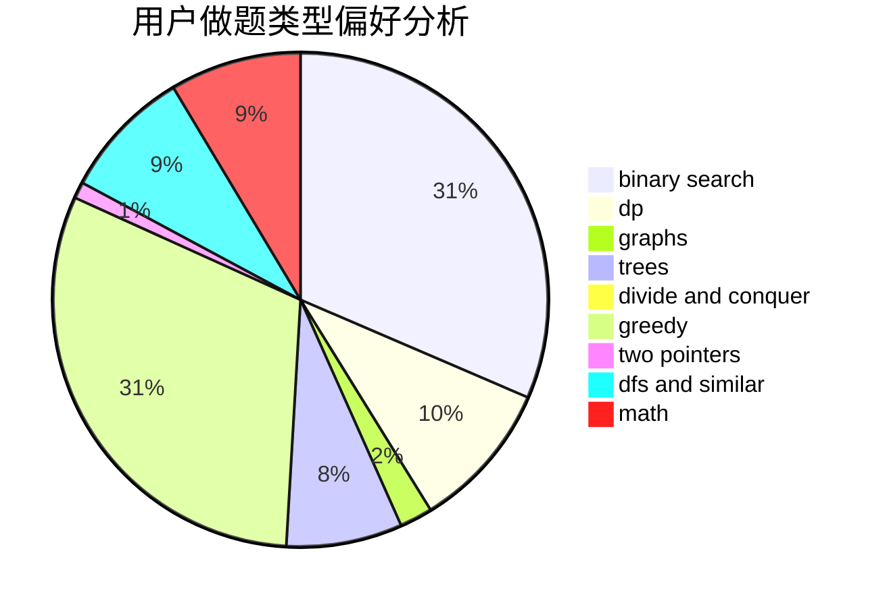

# heterogeneity.zzy

<!-- tabs:start -->

#### **用户提交结果分析**

#### **用户做题类型偏好分析**

<!-- tabs:end -->
# 推荐题目
[1342D](https://codeforces.com/contest/1342/problem/D)
[485A](https://codeforces.com/contest/485/problem/A)
[514B](https://codeforces.com/contest/514/problem/B)
[1321F](https://codeforces.com/contest/1321/problem/F)
[424D](https://codeforces.com/contest/424/problem/D)
[354D](https://codeforces.com/contest/354/problem/D)
[841A](https://codeforces.com/contest/841/problem/A)
[810B](https://codeforces.com/contest/810/problem/B)
[1173D](https://codeforces.com/contest/1173/problem/D)
[876F](https://codeforces.com/contest/876/problem/F)
