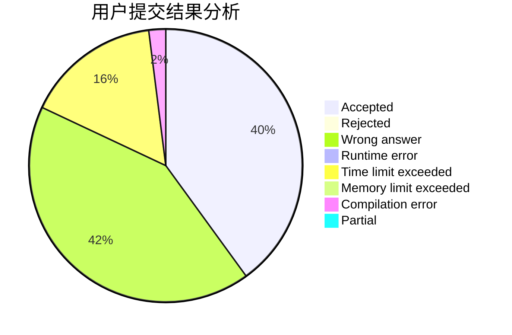
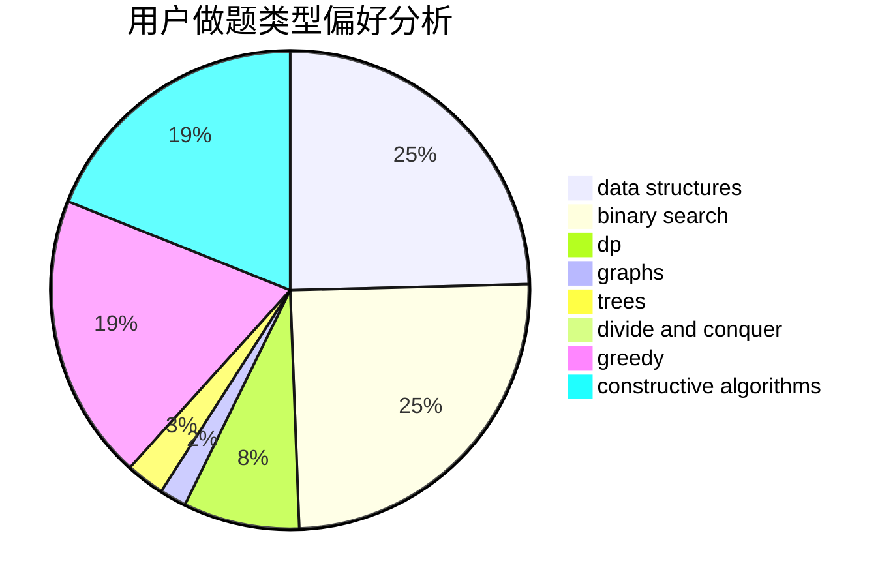
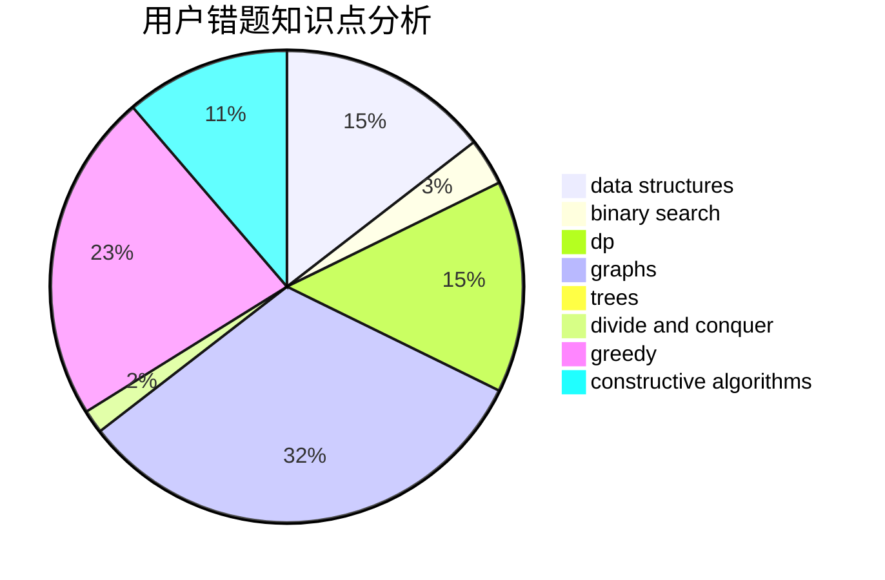

# heterogeneity.zzy

<!-- tabs:start -->

#### **用户提交结果分析**

#### **用户做题类型偏好分析**

#### **用户错题知识点分析**

<!-- tabs:end -->
# 推荐题目
[1335D](https://codeforces.com/contest/1335/problem/D)		constructive algorithms,
                        implementation		  
[466A](https://codeforces.com/contest/466/problem/A)		implementation		  
[494A](https://codeforces.com/contest/494/problem/A)		greedy		  
[1312D](https://codeforces.com/contest/1312/problem/D)		combinatorics,
                        math		  
[398A](https://codeforces.com/contest/398/problem/A)		constructive algorithms,
                        implementation		  
[325C](https://codeforces.com/contest/325/problem/C)		dfs and similar,
                        graphs,
                        shortest paths		  
[821B](https://codeforces.com/contest/821/problem/B)		brute force,
                        math		  
[796A](https://codeforces.com/contest/796/problem/A)		brute force,
                        implementation		  
[1169C](https://codeforces.com/contest/1169/problem/C)		dsu,graphs,sortings,trees		  
[859B](https://codeforces.com/contest/859/problem/B)		brute force,
                        geometry,
                        math		  
