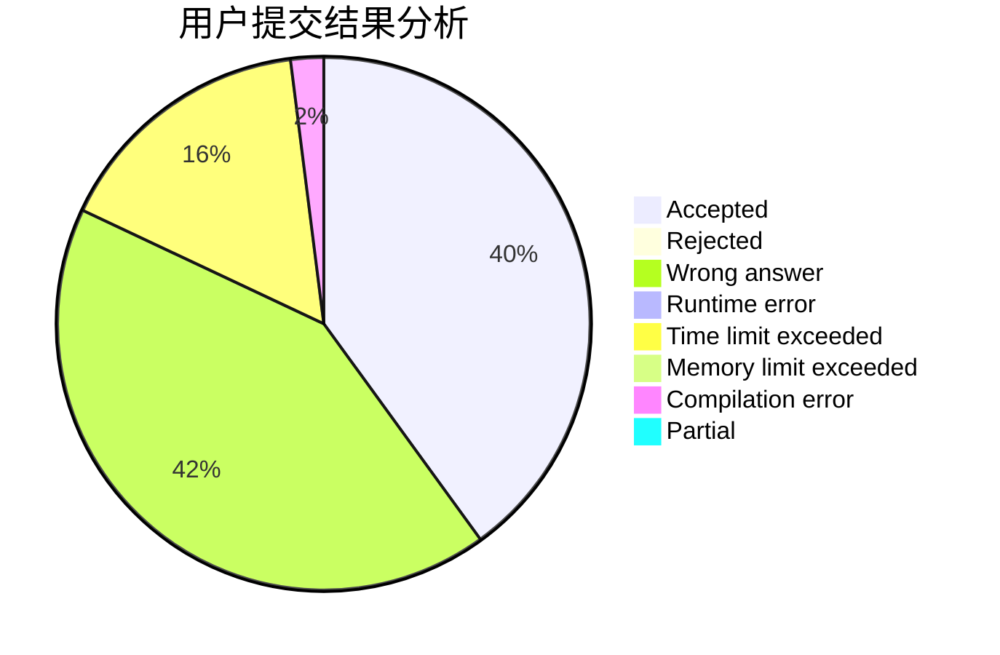
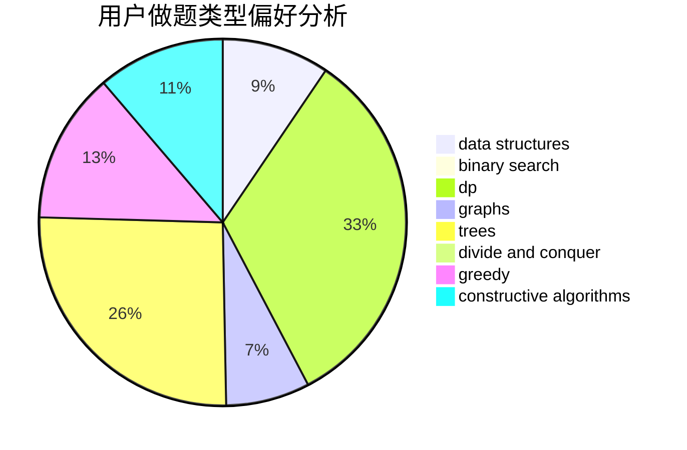
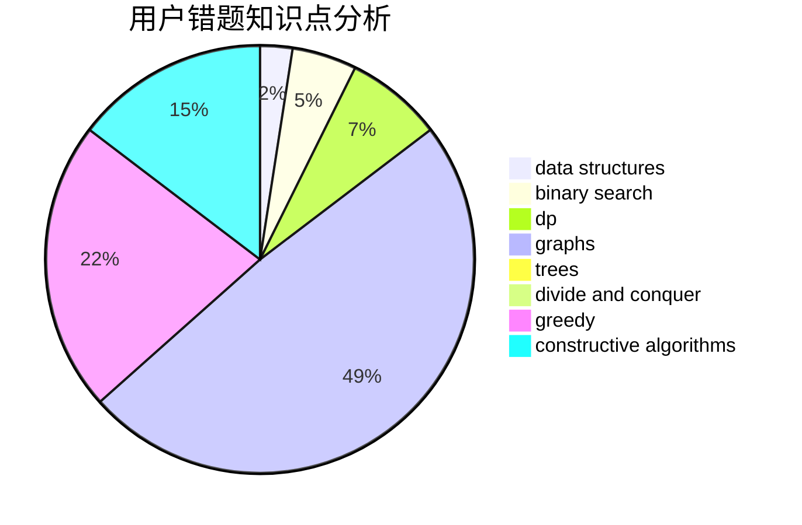

# heterogeneity.zzy

<!-- tabs:start -->

#### **用户提交结果分析**

#### **用户做题类型偏好分析**

#### **用户错题知识点分析**

<!-- tabs:end -->
# 推荐题目
[1342D](https://codeforces.com/contest/1342/problem/D)		binary search,
                        constructive algorithms,
                        data structures,
                        greedy,
                        sortings,
                        two pointers		  
[485A](https://codeforces.com/contest/485/problem/A)		implementation,
                        math,
                        matrices		  
[514B](https://codeforces.com/contest/514/problem/B)		brute force,
                        data structures,
                        geometry,
                        implementation,
                        math		  
[1321F](https://codeforces.com/contest/1321/problem/F)		dsu,graphs,sortings,trees		  
[424D](https://codeforces.com/contest/424/problem/D)		binary search,
                        brute force,
                        constructive algorithms,
                        data structures,
                        dp		  
[354D](https://codeforces.com/contest/354/problem/D)		dp		  
[841A](https://codeforces.com/contest/841/problem/A)		brute force,
                        implementation		  
[810B](https://codeforces.com/contest/810/problem/B)		greedy,
                        sortings		  
[1173D](https://codeforces.com/contest/1173/problem/D)		dsu,graphs,sortings,trees		  
[876F](https://codeforces.com/contest/876/problem/F)		dsu,graphs,sortings,trees		  
