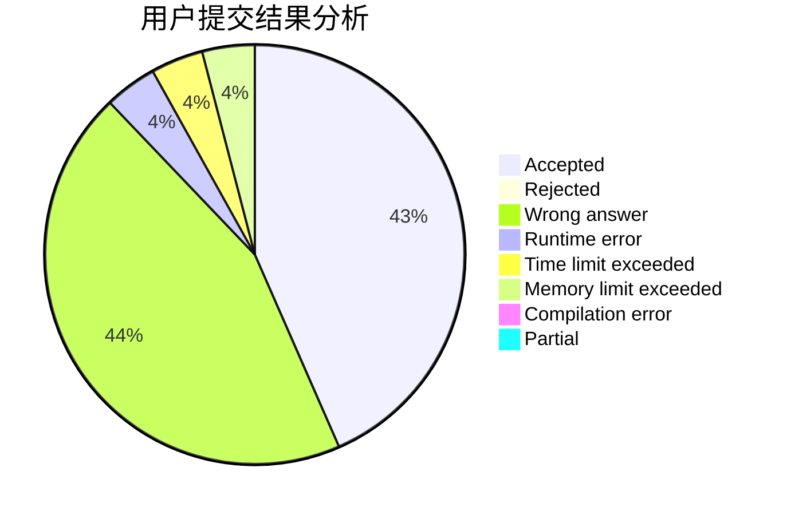
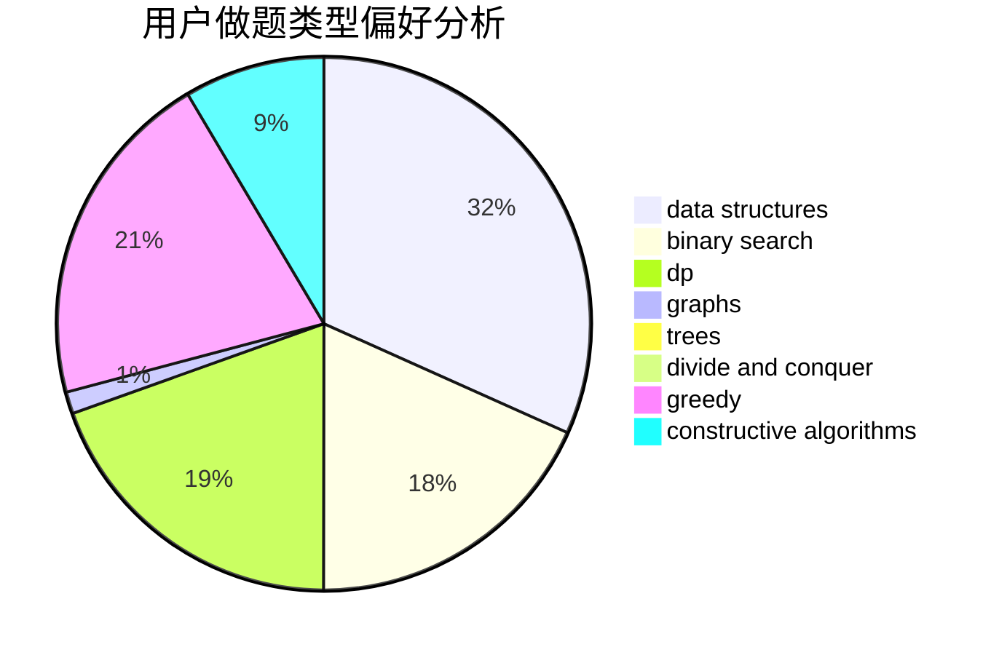
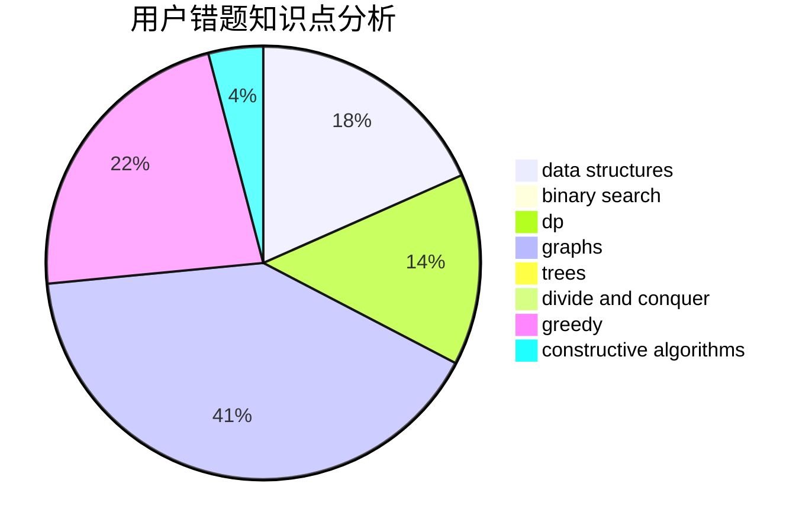

# heyongxin233

<!-- tabs:start -->

#### **用户提交结果分析**

#### **用户做题类型偏好分析**

#### **用户错题知识点分析**

<!-- tabs:end -->
# 推荐题目
[1093A](https://codeforces.com/contest/1093/problem/A)		math		  
[1399F](https://codeforces.com/contest/1399/problem/F)		data structures,
                        dp,
                        graphs,
                        sortings		  
[261C](https://codeforces.com/contest/261/problem/C)		constructive algorithms,
                        dp,
                        math		  
[903A](https://codeforces.com/contest/903/problem/A)		greedy,
                        implementation		  
[609F](https://codeforces.com/contest/609/problem/F)		data structures,
                        greedy		  
[1263F](https://codeforces.com/contest/1263/problem/F)		data structures,
                        dfs and similar,
                        dp,
                        flows,
                        graphs,
                        trees		  
[337C](https://codeforces.com/contest/337/problem/C)		binary search,
                        greedy,
                        math,
                        matrices,
                        number theory		  
[1238D](https://codeforces.com/contest/1238/problem/D)		binary search,
                        combinatorics,
                        dp,
                        strings		  
[587C](https://codeforces.com/contest/587/problem/C)		data structures,
                        trees		  
[520B](https://codeforces.com/contest/520/problem/B)		dfs and similar,
                        graphs,
                        greedy,
                        implementation,
                        math,
                        shortest paths		  
