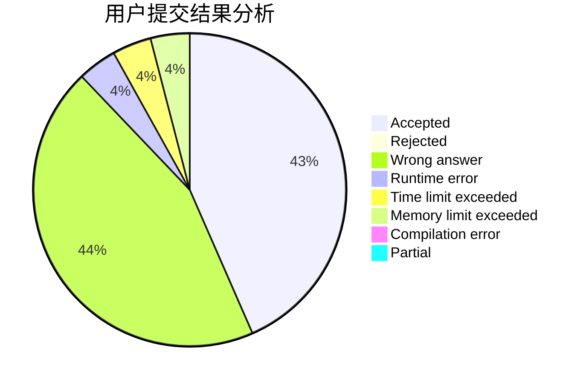
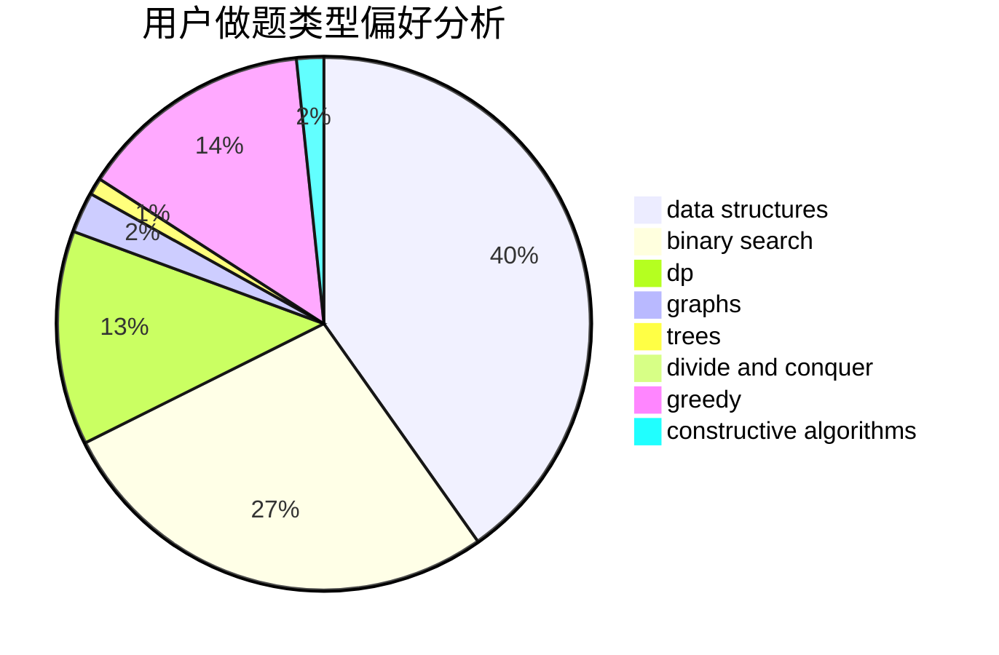
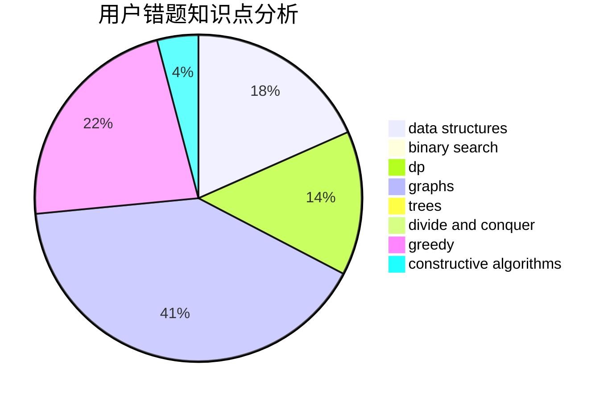

# heyongxin233

<!-- tabs:start -->

#### **用户提交结果分析**

#### **用户做题类型偏好分析**

#### **用户错题知识点分析**

<!-- tabs:end -->
# 推荐题目
[1093D](https://codeforces.com/contest/1093/problem/D)		dfs and similar,
                        graphs		  
[1408H](https://codeforces.com/contest/1408/problem/H)		binary search,
                        data structures,
                        flows,
                        greedy		  
[27A](https://codeforces.com/contest/27/problem/A)		implementation,
                        sortings		  
[919B](https://codeforces.com/contest/919/problem/B)		binary search,
                        brute force,
                        dp,
                        implementation,
                        number theory		  
[629A](https://codeforces.com/contest/629/problem/A)		brute force,
                        combinatorics,
                        constructive algorithms,
                        implementation		  
[1269D](https://codeforces.com/contest/1269/problem/D)		dsu,graphs,sortings,trees		  
[364A](https://codeforces.com/contest/364/problem/A)		combinatorics,
                        data structures,
                        implementation		  
[1243D](https://codeforces.com/contest/1243/problem/D)		dsu,graphs,sortings,trees		  
[607D](https://codeforces.com/contest/607/problem/D)		data structures,
                        trees		  
[546A](https://codeforces.com/contest/546/problem/A)		brute force,
                        implementation,
                        math		  
