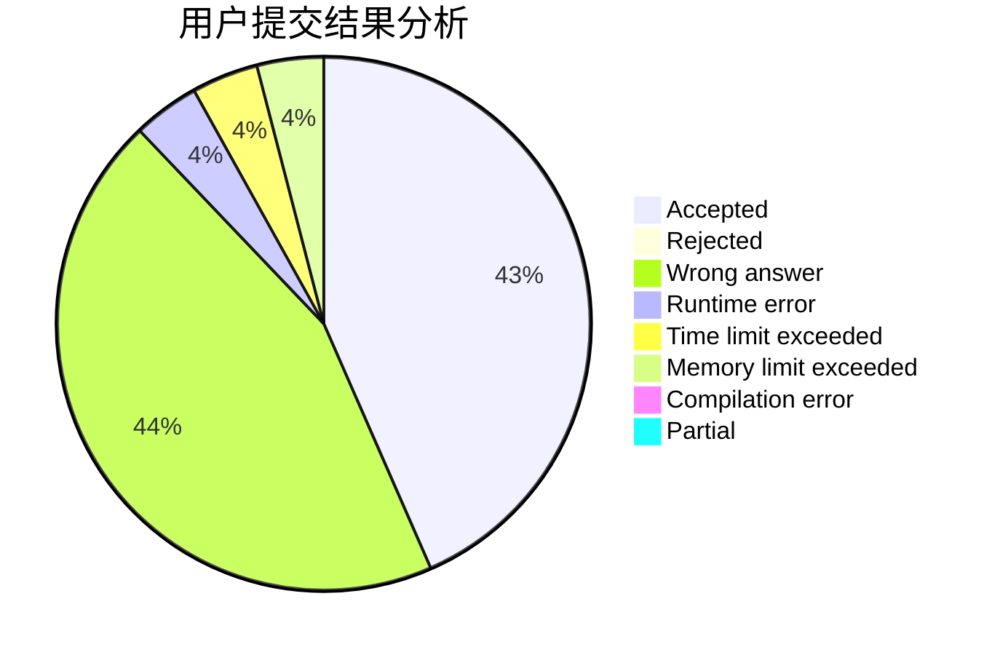
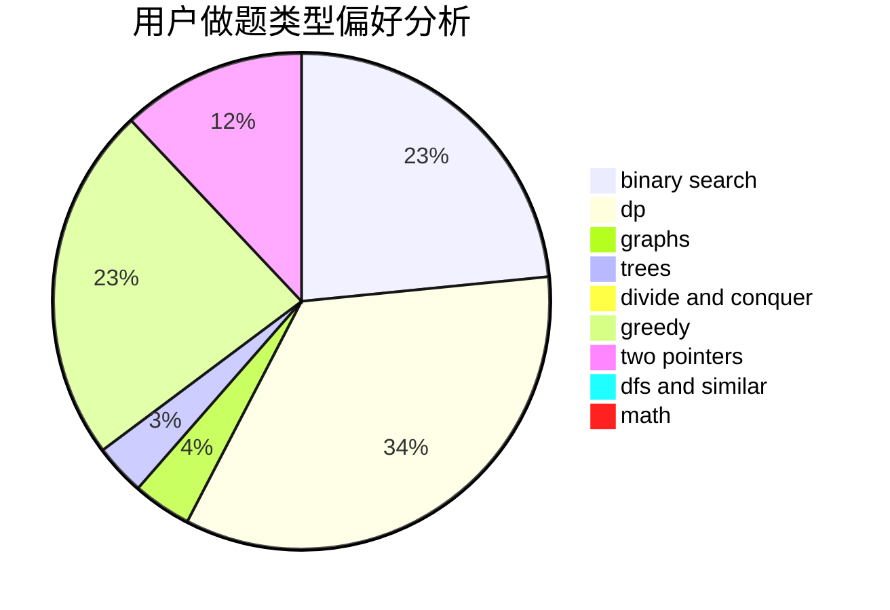

# heyongxin233

<!-- tabs:start -->

#### **用户提交结果分析**

#### **用户做题类型偏好分析**

<!-- tabs:end -->
# 推荐题目
[1093D](https://codeforces.com/contest/1093/problem/D)
[1408H](https://codeforces.com/contest/1408/problem/H)
[27A](https://codeforces.com/contest/27/problem/A)
[919B](https://codeforces.com/contest/919/problem/B)
[629A](https://codeforces.com/contest/629/problem/A)
[1269D](https://codeforces.com/contest/1269/problem/D)
[364A](https://codeforces.com/contest/364/problem/A)
[1243D](https://codeforces.com/contest/1243/problem/D)
[607D](https://codeforces.com/contest/607/problem/D)
[546A](https://codeforces.com/contest/546/problem/A)
