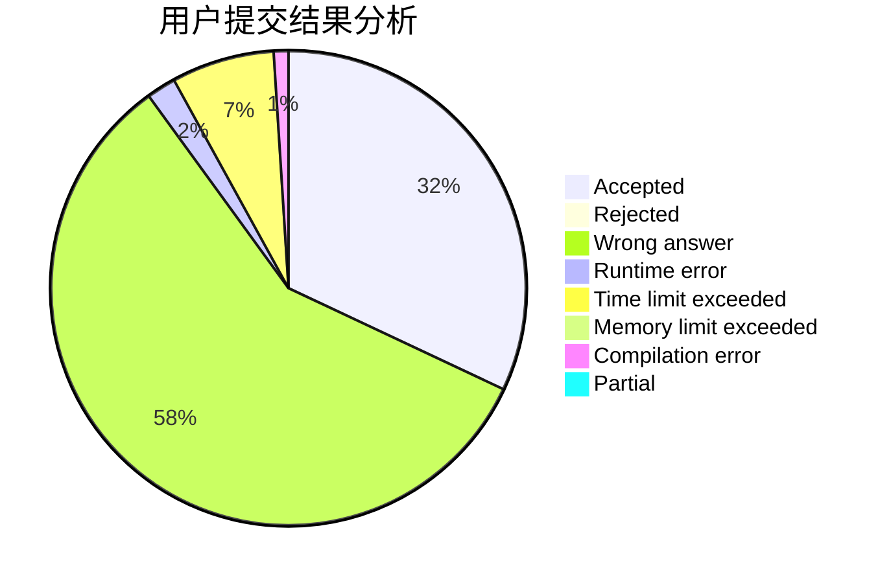
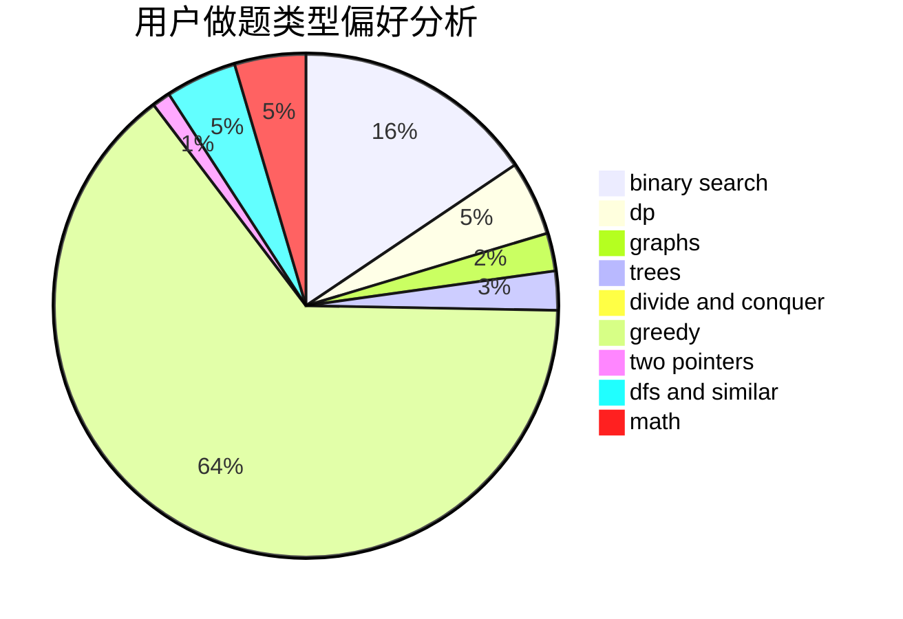

# heyuhhh

<!-- tabs:start -->

#### **用户提交结果分析**

#### **用户做题类型偏好分析**

<!-- tabs:end -->
# 推荐题目
[519D](https://codeforces.com/contest/519/problem/D)
[710D](https://codeforces.com/contest/710/problem/D)
[55C](https://codeforces.com/contest/55/problem/C)
[462A](https://codeforces.com/contest/462/problem/A)
[852D](https://codeforces.com/contest/852/problem/D)
[447A](https://codeforces.com/contest/447/problem/A)
[193D](https://codeforces.com/contest/193/problem/D)
[35C](https://codeforces.com/contest/35/problem/C)
[29A](https://codeforces.com/contest/29/problem/A)
[124A](https://codeforces.com/contest/124/problem/A)
