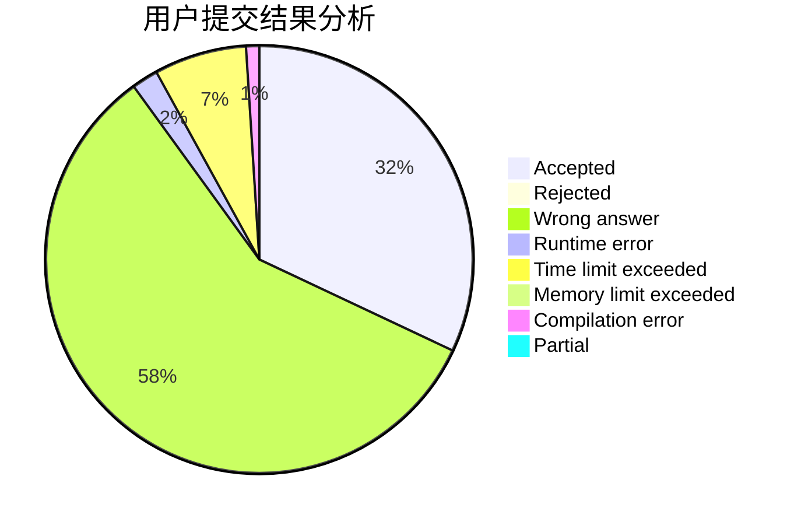
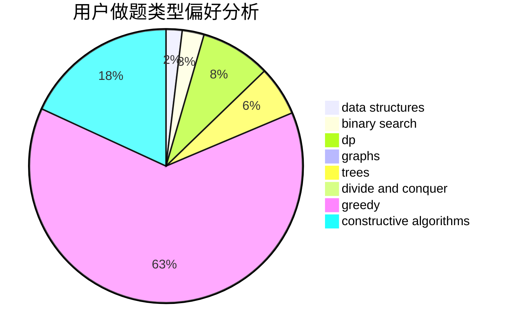
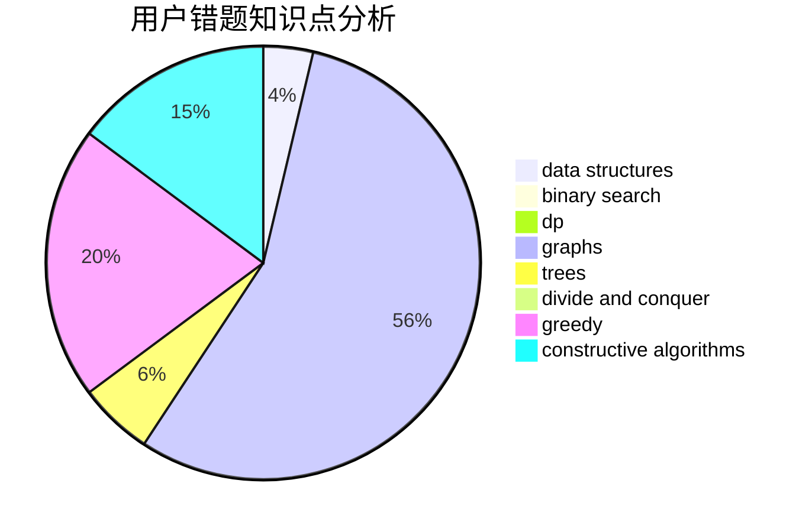

# heyuhhh

<!-- tabs:start -->

#### **用户提交结果分析**

#### **用户做题类型偏好分析**

#### **用户错题知识点分析**

<!-- tabs:end -->
# 推荐题目
[519D](https://codeforces.com/contest/519/problem/D)		data structures,
                        dp,
                        two pointers		  
[710D](https://codeforces.com/contest/710/problem/D)		math,
                        number theory		  
[55C](https://codeforces.com/contest/55/problem/C)		games		  
[462A](https://codeforces.com/contest/462/problem/A)		brute force,
                        implementation		  
[852D](https://codeforces.com/contest/852/problem/D)		binary search,
                        flows,
                        graph matchings,
                        shortest paths		  
[447A](https://codeforces.com/contest/447/problem/A)		implementation		  
[193D](https://codeforces.com/contest/193/problem/D)		data structures		  
[35C](https://codeforces.com/contest/35/problem/C)		brute force,
                        dfs and similar,
                        shortest paths		  
[29A](https://codeforces.com/contest/29/problem/A)		brute force		  
[124A](https://codeforces.com/contest/124/problem/A)		math		  
