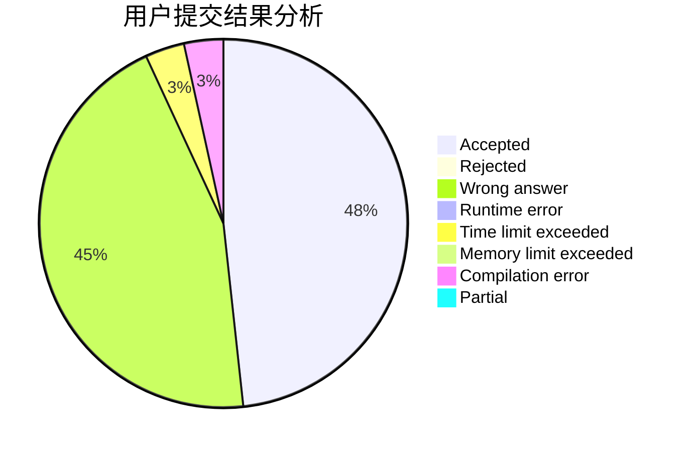
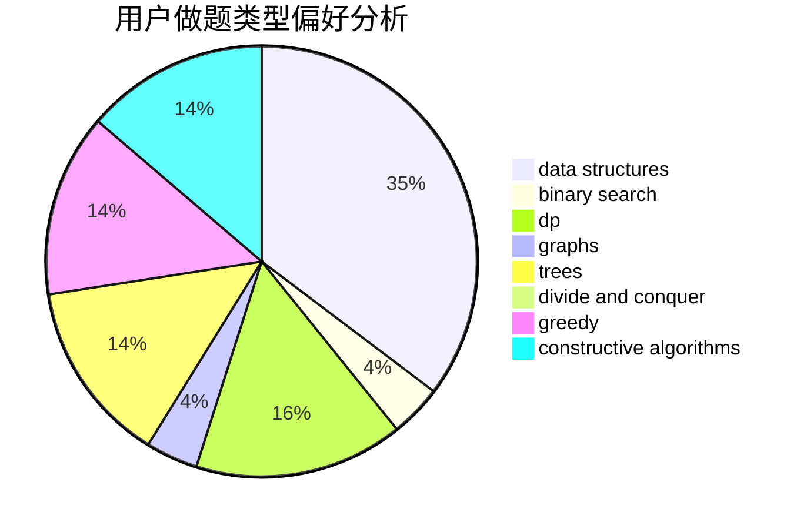

# heyujun

<!-- tabs:start -->

#### **用户提交结果分析**

#### **用户做题类型偏好分析**

#### **用户错题知识点分析**

<!-- tabs:end -->
# 推荐题目
[967D](https://codeforces.com/contest/967/problem/D)		dsu,graphs,sortings,trees		  
[1315D](https://codeforces.com/contest/1315/problem/D)		dsu,graphs,sortings,trees		  
[379D](https://codeforces.com/contest/379/problem/D)		bitmasks,
                        brute force,
                        dp		  
[1333D](https://codeforces.com/contest/1333/problem/D)		brute force,
                        constructive algorithms,
                        games,
                        graphs,
                        greedy,
                        implementation,
                        sortings		  
[1365E](https://codeforces.com/contest/1365/problem/E)		brute force,
                        constructive algorithms		  
[140A](https://codeforces.com/contest/140/problem/A)		geometry,
                        math		  
[132E](https://codeforces.com/contest/132/problem/E)		flows,
                        graphs		  
[573D](https://codeforces.com/contest/573/problem/D)		data structures,
                        divide and conquer,
                        dp		  
[282B](https://codeforces.com/contest/282/problem/B)		greedy,
                        math		  
[82D](https://codeforces.com/contest/82/problem/D)		dp		  
