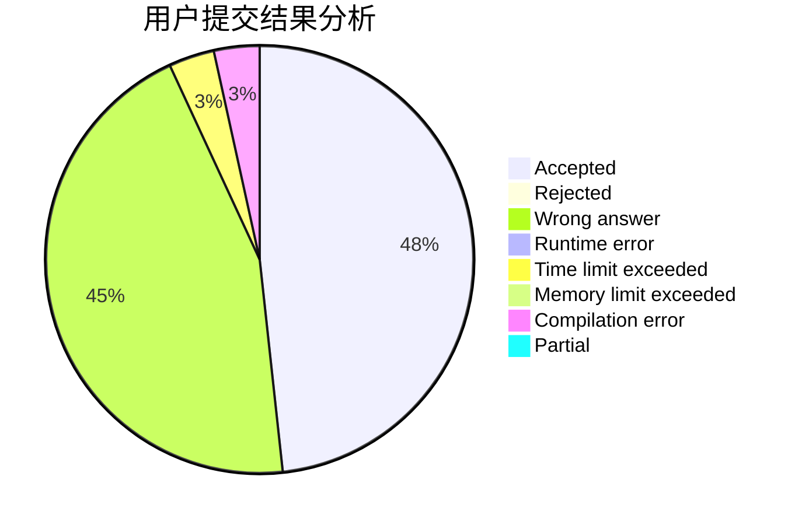
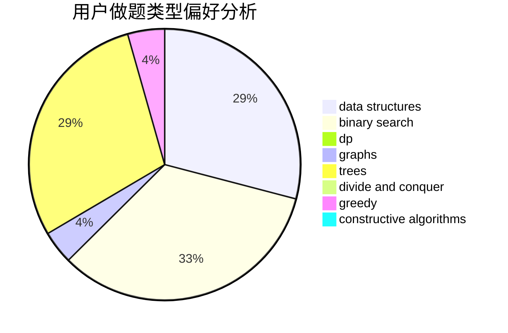

# heyujun

<!-- tabs:start -->

#### **用户提交结果分析**

#### **用户做题类型偏好分析**

#### **用户错题知识点分析**

<!-- tabs:end -->
# 推荐题目
[950B](https://codeforces.com/contest/950/problem/B)		greedy,
                        implementation		  
[1307C](https://codeforces.com/contest/1307/problem/C)		brute force,
                        dp,
                        math,
                        strings		  
[352E](https://codeforces.com/contest/352/problem/E)		dsu,graphs,sortings,trees		  
[1327A](https://codeforces.com/contest/1327/problem/A)		math		  
[1357D3](https://codeforces.com/contest/1357D/problem/3)		nan		  
[1400B](https://codeforces.com/contest/1400/problem/B)		brute force,
                        greedy,
                        math		  
[1323B](https://codeforces.com/contest/1323/problem/B)		binary search,
                        greedy,
                        implementation		  
[548B](https://codeforces.com/contest/548/problem/B)		brute force,
                        dp,
                        greedy,
                        implementation		  
[266C](https://codeforces.com/contest/266/problem/C)		constructive algorithms,
                        greedy,
                        math		  
[811B](https://codeforces.com/contest/811/problem/B)		implementation,
                        sortings		  
