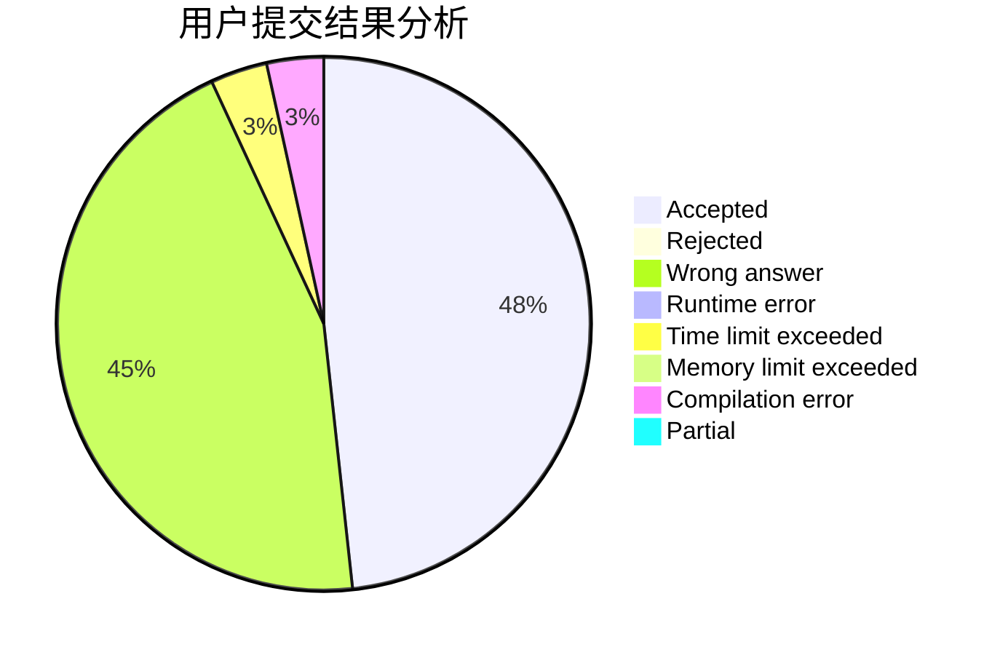
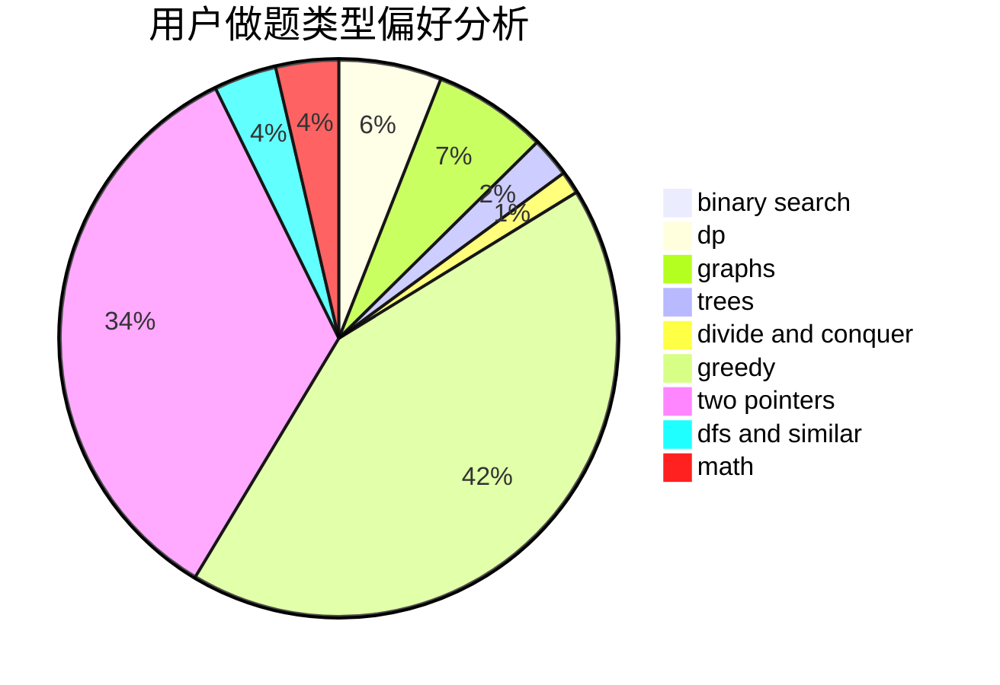

# heyujun

<!-- tabs:start -->

#### **用户提交结果分析**

#### **用户做题类型偏好分析**

<!-- tabs:end -->
# 推荐题目
[967D](https://codeforces.com/contest/967/problem/D)
[1315D](https://codeforces.com/contest/1315/problem/D)
[379D](https://codeforces.com/contest/379/problem/D)
[1333D](https://codeforces.com/contest/1333/problem/D)
[1365E](https://codeforces.com/contest/1365/problem/E)
[140A](https://codeforces.com/contest/140/problem/A)
[132E](https://codeforces.com/contest/132/problem/E)
[573D](https://codeforces.com/contest/573/problem/D)
[282B](https://codeforces.com/contest/282/problem/B)
[82D](https://codeforces.com/contest/82/problem/D)
