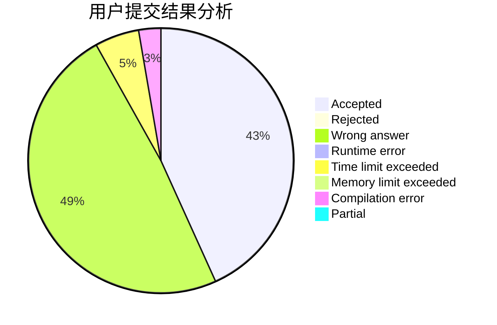
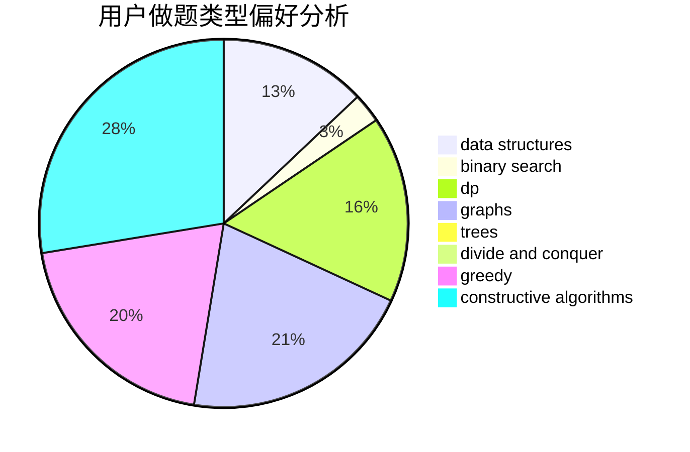
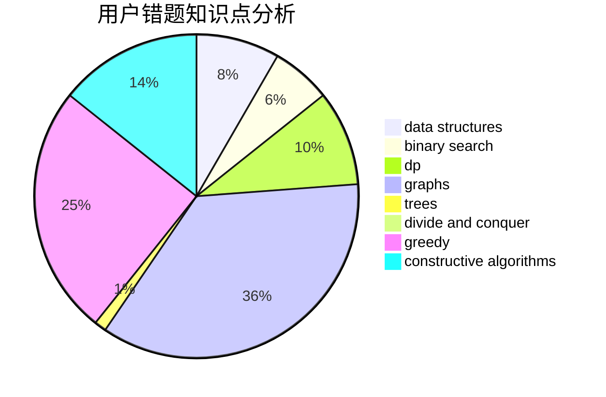

# hfxylsty

<!-- tabs:start -->

#### **用户提交结果分析**

#### **用户做题类型偏好分析**

#### **用户错题知识点分析**

<!-- tabs:end -->
# 推荐题目
[906C](https://codeforces.com/contest/906/problem/C)		bitmasks,
                        brute force,
                        dp,
                        graphs		  
[1220C](https://codeforces.com/contest/1220/problem/C)		games,
                        greedy,
                        strings		  
[519E](https://codeforces.com/contest/519/problem/E)		binary search,
                        data structures,
                        dfs and similar,
                        dp,
                        trees		  
[1085A](https://codeforces.com/contest/1085/problem/A)		implementation,
                        strings		  
[154C](https://codeforces.com/contest/154/problem/C)		graphs,
                        hashing,
                        sortings		  
[952A](https://codeforces.com/contest/952/problem/A)		math		  
[145B](https://codeforces.com/contest/145/problem/B)		constructive algorithms		  
[95E](https://codeforces.com/contest/95/problem/E)		dp,
                        dsu,
                        graphs		  
[788E](https://codeforces.com/contest/788/problem/E)		data structures		  
[317B](https://codeforces.com/contest/317/problem/B)		brute force,
                        implementation		  
