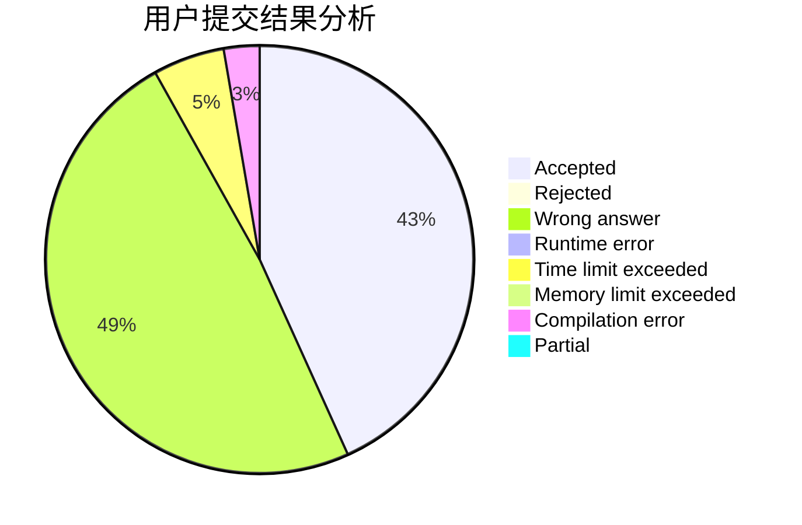
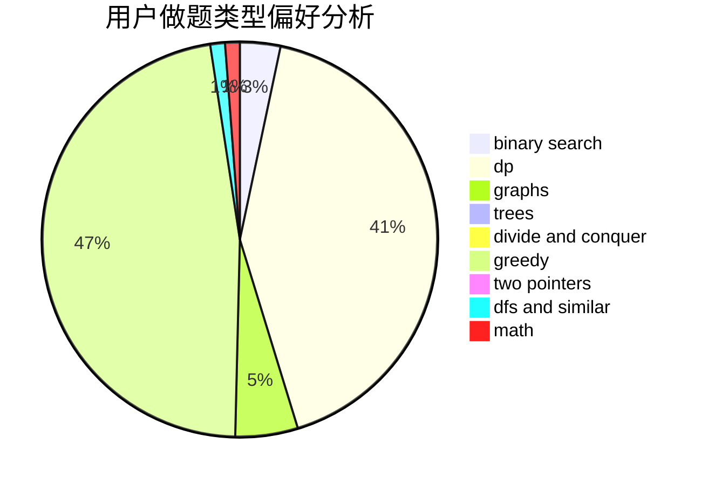

# hfxylsty

<!-- tabs:start -->

#### **用户提交结果分析**

#### **用户做题类型偏好分析**

<!-- tabs:end -->
# 推荐题目
[906C](https://codeforces.com/contest/906/problem/C)
[1220C](https://codeforces.com/contest/1220/problem/C)
[519E](https://codeforces.com/contest/519/problem/E)
[1085A](https://codeforces.com/contest/1085/problem/A)
[154C](https://codeforces.com/contest/154/problem/C)
[952A](https://codeforces.com/contest/952/problem/A)
[145B](https://codeforces.com/contest/145/problem/B)
[95E](https://codeforces.com/contest/95/problem/E)
[788E](https://codeforces.com/contest/788/problem/E)
[317B](https://codeforces.com/contest/317/problem/B)
