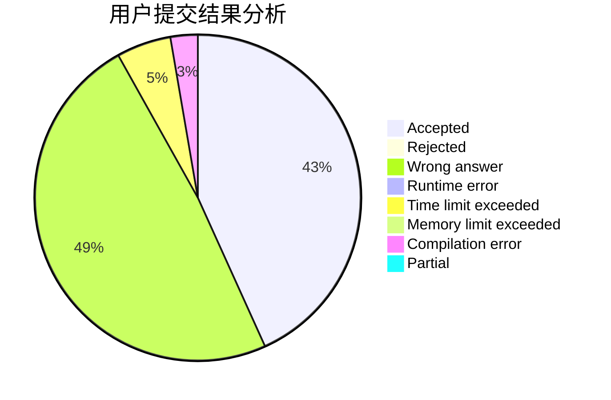
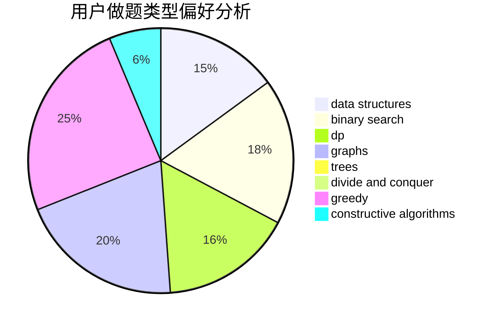
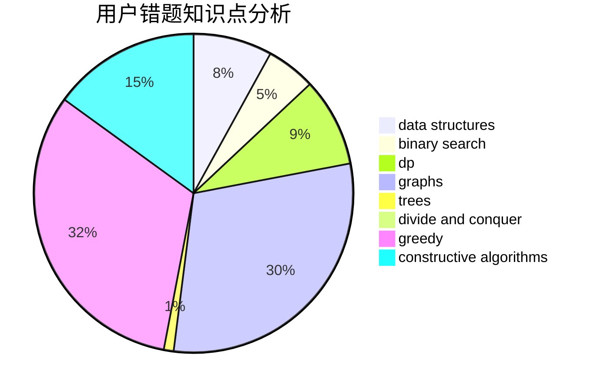

# hfxylsty

<!-- tabs:start -->

#### **用户提交结果分析**

#### **用户做题类型偏好分析**

#### **用户错题知识点分析**

<!-- tabs:end -->
# 推荐题目
[887B](https://codeforces.com/contest/887/problem/B)		brute force,
                        implementation		  
[1214G](https://codeforces.com/contest/1214/problem/G)		bitmasks,
                        data structures		  
[498E](https://codeforces.com/contest/498/problem/E)		dp,
                        matrices		  
[1084B](https://codeforces.com/contest/1084/problem/B)		greedy,
                        implementation		  
[1505E](https://codeforces.com/contest/1505/problem/E)		greedy,
                        implementation,
                        shortest paths		  
[931A](https://codeforces.com/contest/931/problem/A)		brute force,
                        greedy,
                        implementation,
                        math		  
[1451B](https://codeforces.com/contest/1451/problem/B)		dp,
                        greedy,
                        implementation,
                        strings		  
[938D](https://codeforces.com/contest/938/problem/D)		data structures,
                        graphs,
                        shortest paths		  
[768G](https://codeforces.com/contest/768/problem/G)		binary search,
                        data structures		  
[29C](https://codeforces.com/contest/29/problem/C)		data structures,
                        dfs and similar,
                        graphs,
                        implementation		  
