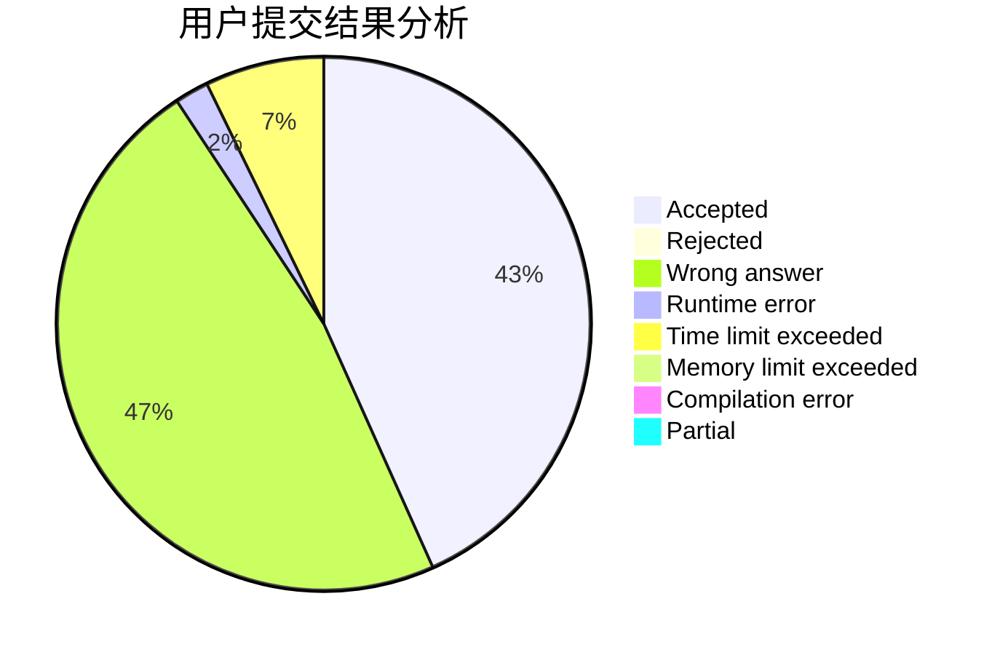
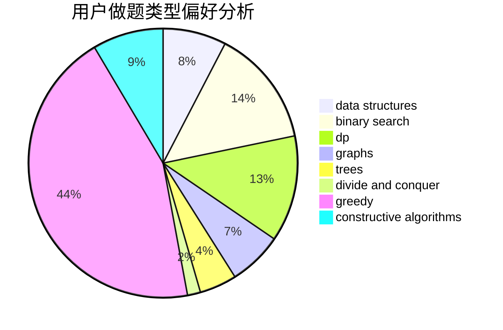

# hhh666
<!-- tabs:start -->
#### **用户提交结果分析**

#### **用户做题类型偏好分析**

#### **用户错题知识点分析**

<!-- tabs:end -->
# 推荐题目
[Crazy Town](https://codeforces.com/contest/499/problem/C)		geometry		  
[Rectangles](http://codeforces.com/problemset/problem/1028/C)		geometry,
                        implementation,
                        sortings		  
[Digital Root](http://codeforces.com/problemset/problem/10/C)		number theory		  
[Collective Mindsets (medium)](http://codeforces.com/problemset/problem/690/A2)		nan		  
[Time to Run](http://codeforces.com/problemset/problem/1301/D)		constructive algorithms,
                        graphs,
                        implementation		  
[Berland Elections](http://codeforces.com/problemset/problem/847/F)		greedy,
                        sortings		  
[Voting](http://codeforces.com/problemset/problem/749/C)		greedy,
                        implementation,
                        two pointers		  
[Adilbek and the Watering System](http://codeforces.com/problemset/problem/1238/G)		data structures,
                        greedy,
                        sortings		  
[Teams Forming](http://codeforces.com/problemset/problem/1092/B)		sortings		  
[Flipping Game](http://codeforces.com/problemset/problem/327/A)		brute force,
                        dp,
                        implementation		  
<!-- tabs:start -->
#### **data structures**
[Crazy Town](http://codeforces.com/problemset/problem/1238/G)		data structures,
                        greedy,
                        sortings		  
[Rectangles](http://codeforces.com/problemset/problem/878/C)		data structures,
                        graphs		  
[Digital Root](http://codeforces.com/problemset/problem/797/F)		data structures,
                        dp,
                        greedy,
                        sortings		  
[Collective Mindsets (medium)](http://codeforces.com/problemset/problem/343/D)		data structures,
                        dfs and similar,
                        graphs,
                        trees		  
[Time to Run](http://codeforces.com/problemset/problem/1499/C)		brute force,
                        data structures,
                        greedy,
                        math		  
[Berland Elections](http://codeforces.com/problemset/problem/708/C)		data structures,
                        dfs and similar,
                        dp,
                        graphs,
                        greedy,
                        trees		  
[Voting](http://codeforces.com/problemset/problem/1492/C)		binary search,
                        data structures,
                        dp,
                        greedy,
                        two pointers		  
[Adilbek and the Watering System](http://codeforces.com/problemset/problem/1490/G)		binary search,
                        data structures,
                        math		  
[Teams Forming](http://codeforces.com/problemset/problem/1479/D)		binary search,
                        bitmasks,
                        brute force,
                        data structures,
                        probabilities,
                        trees		  
[Flipping Game](http://codeforces.com/problemset/problem/1497/A)		brute force,
                        data structures,
                        greedy,
                        sortings		  
#### **binary search**
[Crazy Town](https://codeforces.com/contest/1240/problem/A)		binary search,
                        greedy		  
[Rectangles](http://codeforces.com/problemset/problem/803/D)		binary search,
                        greedy		  
[Digital Root](https://codeforces.com/contest/1246/problem/C)		binary search,
                        dp		  
[Collective Mindsets (medium)](http://codeforces.com/problemset/problem/1345/B)		binary search,
                        brute force,
                        dp,
                        math		  
[Time to Run](http://codeforces.com/problemset/problem/125/E)		binary search,
                        graphs		  
[Berland Elections](http://codeforces.com/problemset/problem/1492/C)		binary search,
                        data structures,
                        dp,
                        greedy,
                        two pointers		  
[Voting](http://codeforces.com/problemset/problem/1463/D)		binary search,
                        constructive algorithms,
                        greedy,
                        two pointers		  
[Adilbek and the Watering System](http://codeforces.com/problemset/problem/1490/G)		binary search,
                        data structures,
                        math		  
[Teams Forming](http://codeforces.com/problemset/problem/1479/D)		binary search,
                        bitmasks,
                        brute force,
                        data structures,
                        probabilities,
                        trees		  
[Flipping Game](http://codeforces.com/problemset/problem/1436/E)		binary search,
                        data structures,
                        two pointers		  
#### **dp**
[Crazy Town](http://codeforces.com/problemset/problem/327/A)		brute force,
                        dp,
                        implementation		  
[Rectangles](http://codeforces.com/problemset/problem/750/G)		bitmasks,
                        brute force,
                        combinatorics,
                        dp		  
[Digital Root](http://codeforces.com/problemset/problem/331/E2)		constructive algorithms,
                        dp		  
[Collective Mindsets (medium)](http://codeforces.com/problemset/problem/771/D)		dp		  
[Time to Run](http://codeforces.com/problemset/problem/852/E)		dp		  
[Berland Elections](https://codeforces.com/contest/1246/problem/C)		binary search,
                        dp		  
[Voting](http://codeforces.com/problemset/problem/24/D)		dp,
                        math,
                        probabilities		  
[Adilbek and the Watering System](http://codeforces.com/problemset/problem/797/F)		data structures,
                        dp,
                        greedy,
                        sortings		  
[Teams Forming](http://codeforces.com/problemset/problem/1345/B)		binary search,
                        brute force,
                        dp,
                        math		  
[Flipping Game](http://codeforces.com/problemset/problem/623/E)		combinatorics,
                        dp,
                        fft,
                        math		  
#### **graph**
[Crazy Town](http://codeforces.com/problemset/problem/1301/D)		constructive algorithms,
                        graphs,
                        implementation		  
[Rectangles](http://codeforces.com/problemset/problem/1340/D)		constructive algorithms,
                        dfs and similar,
                        graphs,
                        trees		  
[Digital Root](http://codeforces.com/problemset/problem/878/C)		data structures,
                        graphs		  
[Collective Mindsets (medium)](http://codeforces.com/problemset/problem/34/D)		dfs and similar,
                        graphs		  
[Time to Run](http://codeforces.com/problemset/problem/343/D)		data structures,
                        dfs and similar,
                        graphs,
                        trees		  
[Berland Elections](http://codeforces.com/problemset/problem/125/E)		binary search,
                        graphs		  
[Voting](http://codeforces.com/problemset/problem/708/C)		data structures,
                        dfs and similar,
                        dp,
                        graphs,
                        greedy,
                        trees		  
[Adilbek and the Watering System](http://codeforces.com/problemset/problem/22/E)		dfs and similar,
                        graphs,
                        trees		  
[Teams Forming](http://codeforces.com/problemset/problem/1428/B)		graphs,
                        implementation		  
[Flipping Game](http://codeforces.com/problemset/problem/1487/C)		brute force,
                        constructive algorithms,
                        dfs and similar,
                        graphs,
                        greedy,
                        implementation,
                        math		  
#### **trees**
[Crazy Town](http://codeforces.com/problemset/problem/1340/D)		constructive algorithms,
                        dfs and similar,
                        graphs,
                        trees		  
[Rectangles](http://codeforces.com/problemset/problem/343/D)		data structures,
                        dfs and similar,
                        graphs,
                        trees		  
[Digital Root](http://codeforces.com/problemset/problem/708/C)		data structures,
                        dfs and similar,
                        dp,
                        graphs,
                        greedy,
                        trees		  
[Collective Mindsets (medium)](http://codeforces.com/problemset/problem/22/E)		dfs and similar,
                        graphs,
                        trees		  
[Time to Run](http://codeforces.com/problemset/problem/1479/D)		binary search,
                        bitmasks,
                        brute force,
                        data structures,
                        probabilities,
                        trees		  
[Berland Elections](http://codeforces.com/problemset/problem/1511/C)		brute force,
                        data structures,
                        implementation,
                        trees		  
[Voting](http://codeforces.com/problemset/problem/1499/F)		combinatorics,
                        dfs and similar,
                        dp,
                        trees		  
[Adilbek and the Watering System](http://codeforces.com/problemset/problem/1491/E)		brute force,
                        dfs and similar,
                        divide and conquer,
                        number theory,
                        trees		  
[Teams Forming](http://codeforces.com/problemset/problem/1466/D)		data structures,
                        greedy,
                        sortings,
                        trees		  
[Flipping Game](http://codeforces.com/problemset/problem/1495/D)		combinatorics,
                        dfs and similar,
                        graphs,
                        math,
                        shortest paths,
                        trees		  
#### **divide and conquer**
[Crazy Town](http://codeforces.com/problemset/problem/1461/D)		binary search,
                        brute force,
                        data structures,
                        divide and conquer,
                        implementation,
                        sortings		  
[Rectangles](http://codeforces.com/problemset/problem/1466/G)		combinatorics,
                        divide and conquer,
                        hashing,
                        math,
                        string suffix structures,
                        strings		  
[Digital Root](http://codeforces.com/problemset/problem/1490/D)		dfs and similar,
                        divide and conquer,
                        implementation		  
[Collective Mindsets (medium)](https://codeforces.com/contest/1483/problem/C)		data structures,
                        divide and conquer,
                        dp		  
[Time to Run](http://codeforces.com/problemset/problem/1491/E)		brute force,
                        dfs and similar,
                        divide and conquer,
                        number theory,
                        trees		  
[Berland Elections](http://codeforces.com/problemset/problem/1303/G)		data structures,
                        divide and conquer,
                        geometry,
                        trees		  
[Voting](http://codeforces.com/problemset/problem/1494/D)		constructive algorithms,
                        data structures,
                        dfs and similar,
                        divide and conquer,
                        dsu,
                        greedy,
                        sortings,
                        trees		  
[Adilbek and the Watering System](http://codeforces.com/problemset/problem/1482/E)		data structures,
                        divide and conquer,
                        dp		  
[Teams Forming](http://codeforces.com/problemset/problem/566/C)		dfs and similar,
                        divide and conquer,
                        trees		  
[Flipping Game](http://codeforces.com/problemset/problem/1428/F)		binary search,
                        data structures,
                        divide and conquer,
                        dp,
                        two pointers		  
#### **greedy**
[Crazy Town](http://codeforces.com/problemset/problem/847/F)		greedy,
                        sortings		  
[Rectangles](http://codeforces.com/problemset/problem/749/C)		greedy,
                        implementation,
                        two pointers		  
[Digital Root](http://codeforces.com/problemset/problem/1238/G)		data structures,
                        greedy,
                        sortings		  
[Collective Mindsets (medium)](https://codeforces.com/contest/1240/problem/A)		binary search,
                        greedy		  
[Time to Run](http://codeforces.com/problemset/problem/729/D)		constructive algorithms,
                        greedy,
                        math		  
[Berland Elections](http://codeforces.com/problemset/problem/1119/C)		constructive algorithms,
                        greedy,
                        implementation,
                        math		  
[Voting](http://codeforces.com/problemset/problem/803/D)		binary search,
                        greedy		  
[Adilbek and the Watering System](http://codeforces.com/problemset/problem/1189/B)		greedy,
                        math,
                        sortings		  
[Teams Forming](https://codeforces.com/contest/1362/problem/E)		greedy,
                        implementation,
                        math,
                        sortings		  
[Flipping Game](http://codeforces.com/problemset/problem/797/F)		data structures,
                        dp,
                        greedy,
                        sortings		  
#### **constructive algorithms**
[Crazy Town](http://codeforces.com/problemset/problem/1301/D)		constructive algorithms,
                        graphs,
                        implementation		  
[Rectangles](http://codeforces.com/problemset/problem/1340/D)		constructive algorithms,
                        dfs and similar,
                        graphs,
                        trees		  
[Digital Root](http://codeforces.com/problemset/problem/729/D)		constructive algorithms,
                        greedy,
                        math		  
[Collective Mindsets (medium)](http://codeforces.com/problemset/problem/331/E2)		constructive algorithms,
                        dp		  
[Time to Run](http://codeforces.com/problemset/problem/1119/C)		constructive algorithms,
                        greedy,
                        implementation,
                        math		  
[Berland Elections](https://codeforces.com/contest/1480/problem/E)		bitmasks,
                        constructive algorithms		  
[Voting](http://codeforces.com/problemset/problem/439/C)		brute force,
                        constructive algorithms,
                        implementation,
                        number theory		  
[Adilbek and the Watering System](http://codeforces.com/problemset/problem/1493/A)		constructive algorithms,
                        greedy		  
[Teams Forming](http://codeforces.com/problemset/problem/1463/D)		binary search,
                        constructive algorithms,
                        greedy,
                        two pointers		  
[Flipping Game](https://codeforces.com/contest/1456/problem/B)		bitmasks,
                        brute force,
                        constructive algorithms		  
#### **sortings**
[Crazy Town](http://codeforces.com/problemset/problem/1028/C)		geometry,
                        implementation,
                        sortings		  
[Rectangles](http://codeforces.com/problemset/problem/847/F)		greedy,
                        sortings		  
[Digital Root](http://codeforces.com/problemset/problem/1238/G)		data structures,
                        greedy,
                        sortings		  
[Collective Mindsets (medium)](http://codeforces.com/problemset/problem/1092/B)		sortings		  
[Time to Run](http://codeforces.com/problemset/problem/977/C)		sortings		  
[Berland Elections](http://codeforces.com/problemset/problem/1189/B)		greedy,
                        math,
                        sortings		  
[Voting](https://codeforces.com/contest/1362/problem/E)		greedy,
                        implementation,
                        math,
                        sortings		  
[Adilbek and the Watering System](http://codeforces.com/problemset/problem/797/F)		data structures,
                        dp,
                        greedy,
                        sortings		  
[Teams Forming](http://codeforces.com/problemset/problem/581/C)		implementation,
                        math,
                        sortings		  
[Flipping Game](http://codeforces.com/problemset/problem/1185/C1)		greedy,
                        sortings		  
<!-- tabs:end -->
