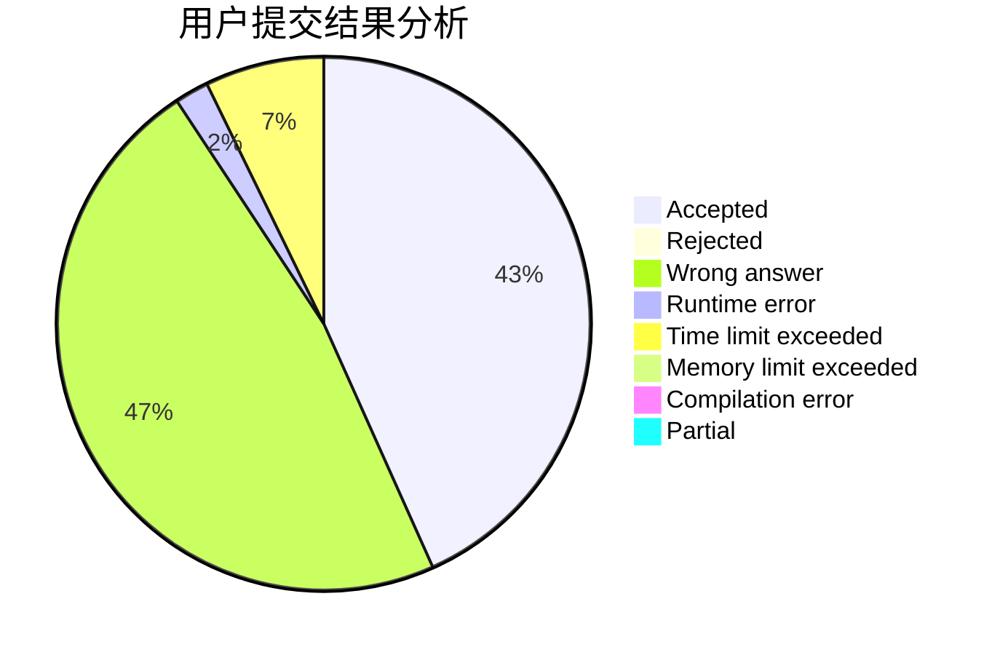
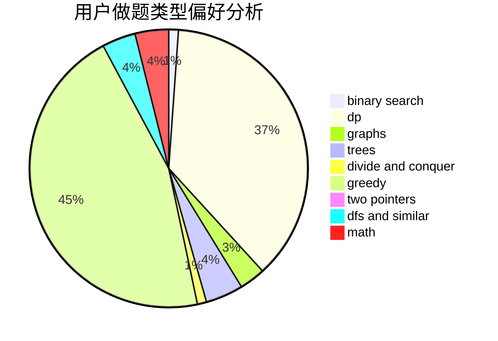

# hhh666

<!-- tabs:start -->

#### **用户提交结果分析**

#### **用户做题类型偏好分析**

<!-- tabs:end -->
# 推荐题目
[1028G](https://codeforces.com/contest/1028/problem/G)
[1100A](https://codeforces.com/contest/1100/problem/A)
[1092E](https://codeforces.com/contest/1092/problem/E)
[51A](https://codeforces.com/contest/51/problem/A)
[771C](https://codeforces.com/contest/771/problem/C)
[710C](https://codeforces.com/contest/710/problem/C)
[1386B](https://codeforces.com/contest/1386/problem/B)
[1347C](https://codeforces.com/contest/1347/problem/C)
[727E](https://codeforces.com/contest/727/problem/E)
[1245D](https://codeforces.com/contest/1245/problem/D)
