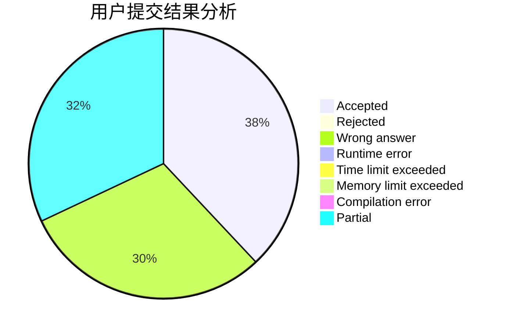
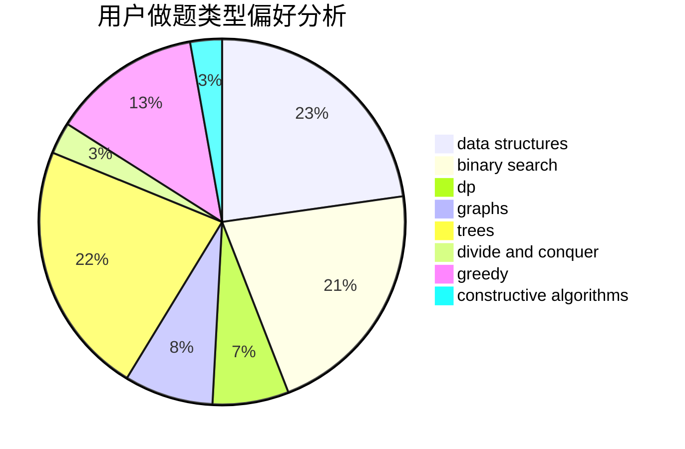
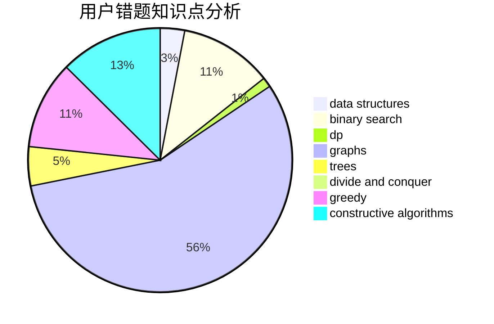

# hhhyyyfff

<!-- tabs:start -->

#### **用户提交结果分析**

#### **用户做题类型偏好分析**

#### **用户错题知识点分析**

<!-- tabs:end -->
# 推荐题目
[544D](https://codeforces.com/contest/544/problem/D)		dsu,graphs,sortings,trees		  
[687A](https://codeforces.com/contest/687/problem/A)		dfs and similar,
                        graphs		  
[1270H](https://codeforces.com/contest/1270/problem/H)		data structures		  
[418E](https://codeforces.com/contest/418/problem/E)		data structures		  
[389B](https://codeforces.com/contest/389/problem/B)		greedy,
                        implementation		  
[873D](https://codeforces.com/contest/873/problem/D)		constructive algorithms,
                        divide and conquer		  
[261E](https://codeforces.com/contest/261/problem/E)		brute force,
                        dp,
                        two pointers		  
[742E](https://codeforces.com/contest/742/problem/E)		dsu,graphs,sortings,trees		  
[1374C](https://codeforces.com/contest/1374/problem/C)		greedy,
                        strings		  
[1184C1](https://codeforces.com/contest/1184C/problem/1)		implementation		  
