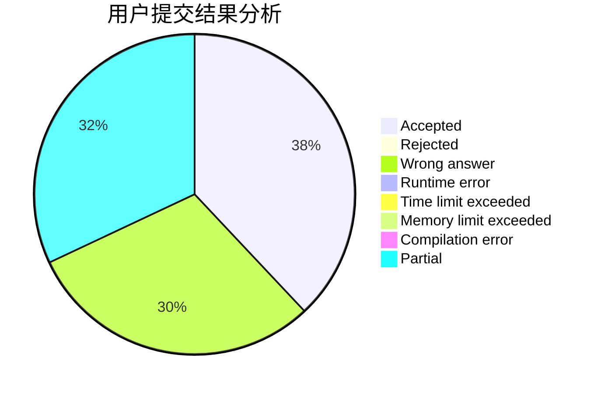
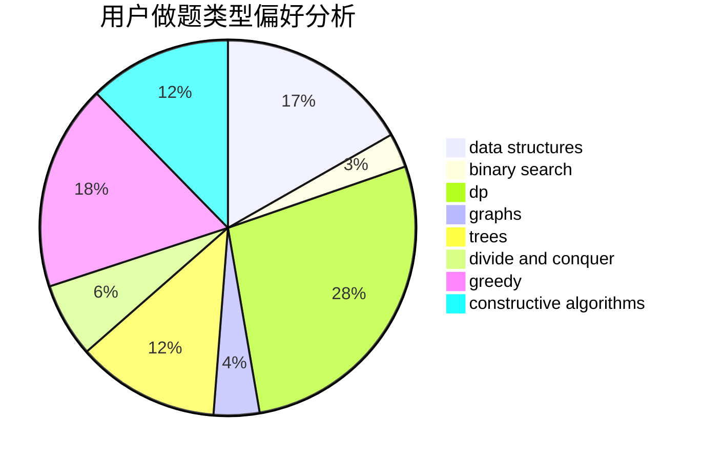
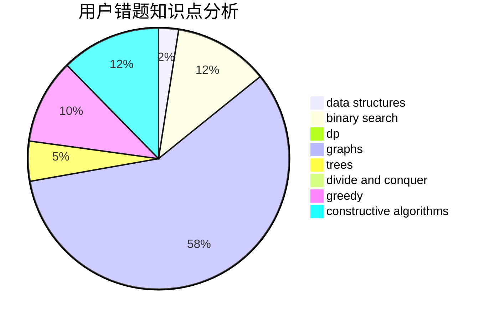

# hhhyyyfff

<!-- tabs:start -->

#### **用户提交结果分析**

#### **用户做题类型偏好分析**

#### **用户错题知识点分析**

<!-- tabs:end -->
# 推荐题目
[569A](https://codeforces.com/contest/569/problem/A)		implementation,
                        math		  
[708E](https://codeforces.com/contest/708/problem/E)		dp,
                        math		  
[1280A](https://codeforces.com/contest/1280/problem/A)		implementation,
                        math		  
[444D](https://codeforces.com/contest/444/problem/D)		binary search,
                        hashing,
                        strings,
                        two pointers		  
[418D](https://codeforces.com/contest/418/problem/D)		data structures,
                        graphs,
                        trees		  
[894C](https://codeforces.com/contest/894/problem/C)		constructive algorithms,
                        math		  
[27C](https://codeforces.com/contest/27/problem/C)		constructive algorithms,
                        greedy		  
[763B](https://codeforces.com/contest/763/problem/B)		constructive algorithms,
                        geometry		  
[1383B](https://codeforces.com/contest/1383/problem/B)		bitmasks,
                        constructive algorithms,
                        dp,
                        games,
                        greedy,
                        math		  
[1187G](https://codeforces.com/contest/1187/problem/G)		flows,
                        graphs		  
