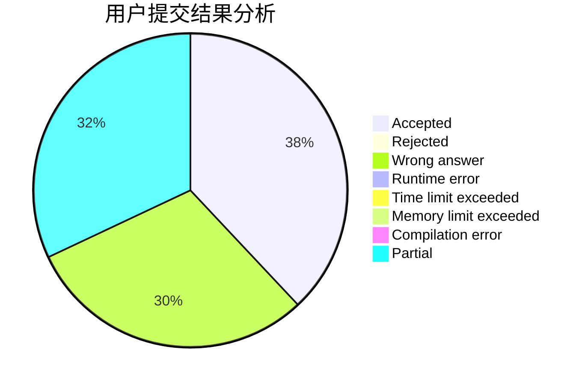
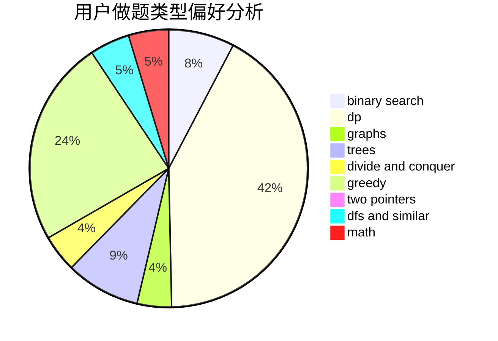

# hhhyyyfff

<!-- tabs:start -->

#### **用户提交结果分析**

#### **用户做题类型偏好分析**

<!-- tabs:end -->
# 推荐题目
[569A](https://codeforces.com/contest/569/problem/A)
[708E](https://codeforces.com/contest/708/problem/E)
[1280A](https://codeforces.com/contest/1280/problem/A)
[444D](https://codeforces.com/contest/444/problem/D)
[418D](https://codeforces.com/contest/418/problem/D)
[894C](https://codeforces.com/contest/894/problem/C)
[27C](https://codeforces.com/contest/27/problem/C)
[763B](https://codeforces.com/contest/763/problem/B)
[1383B](https://codeforces.com/contest/1383/problem/B)
[1187G](https://codeforces.com/contest/1187/problem/G)
