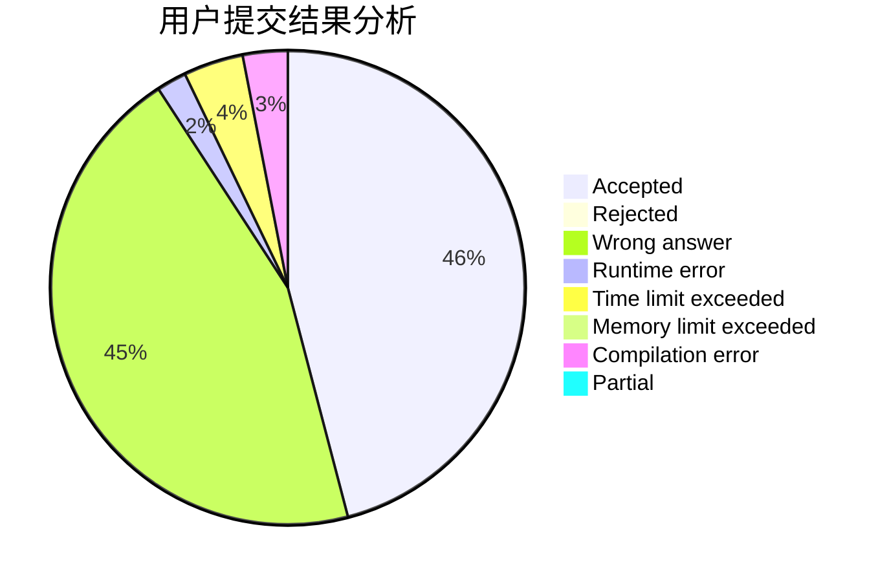
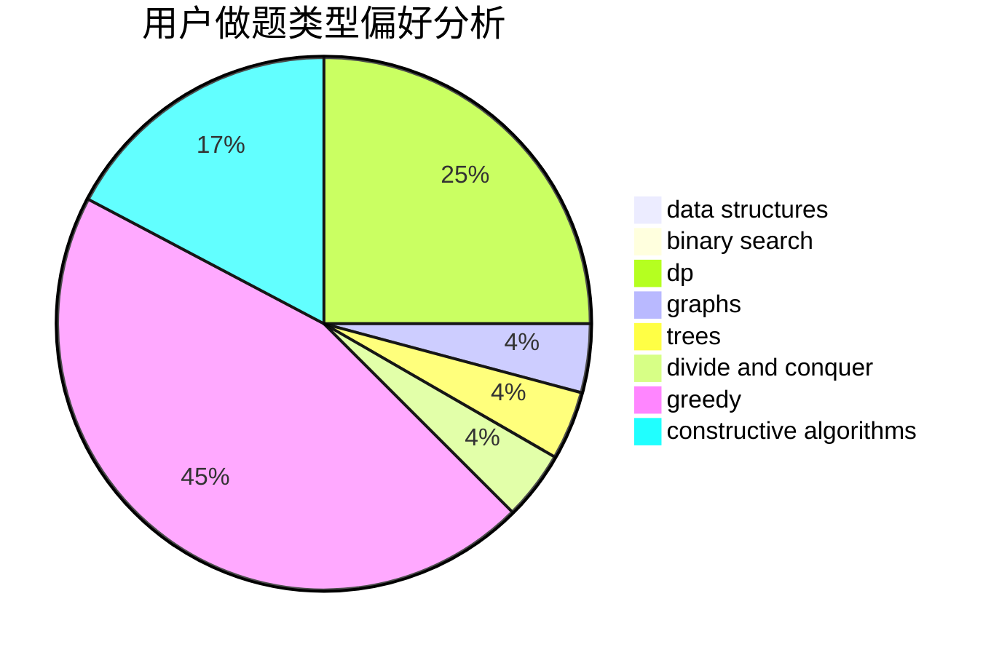
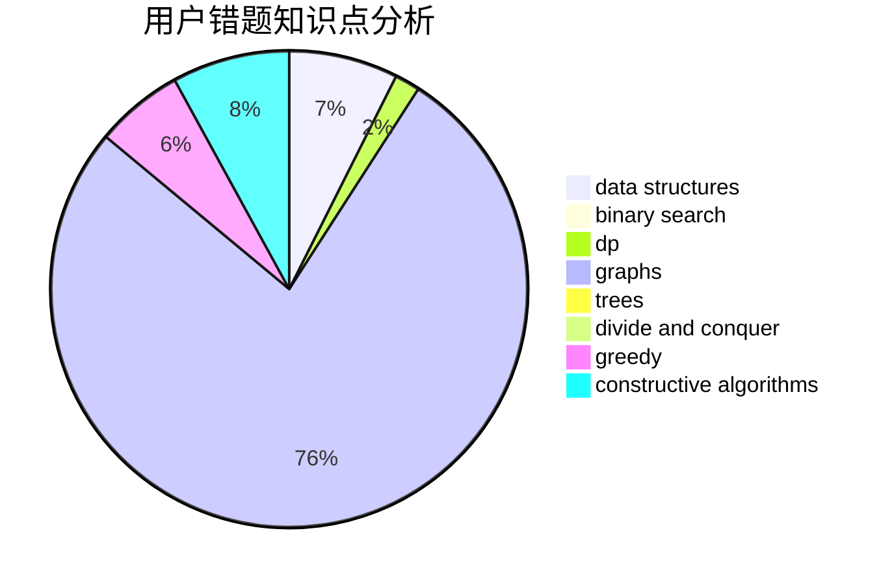

# hhoppitree

<!-- tabs:start -->

#### **用户提交结果分析**

#### **用户做题类型偏好分析**

#### **用户错题知识点分析**

<!-- tabs:end -->
# 推荐题目
[1307F](https://codeforces.com/contest/1307/problem/F)		dfs and similar,
                        dsu,
                        trees		  
[559C](https://codeforces.com/contest/559/problem/C)		combinatorics,
                        dp,
                        math,
                        number theory		  
[1023G](https://codeforces.com/contest/1023/problem/G)		data structures,
                        flows,
                        trees		  
[407B](https://codeforces.com/contest/407/problem/B)		dp,
                        implementation		  
[1239C](https://codeforces.com/contest/1239/problem/C)		data structures,
                        greedy,
                        implementation		  
[52A](https://codeforces.com/contest/52/problem/A)		implementation		  
[1362F](https://codeforces.com/contest/1362/problem/F)		dsu,graphs,sortings,trees		  
[767C](https://codeforces.com/contest/767/problem/C)		dfs and similar,
                        graphs,
                        greedy,
                        trees		  
[962A](https://codeforces.com/contest/962/problem/A)		implementation		  
[229B](https://codeforces.com/contest/229/problem/B)		binary search,
                        data structures,
                        graphs,
                        shortest paths		  
