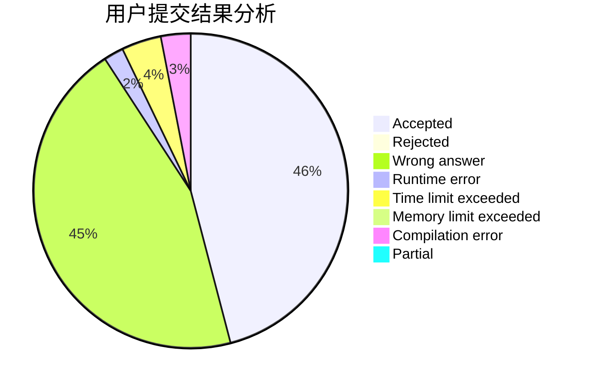
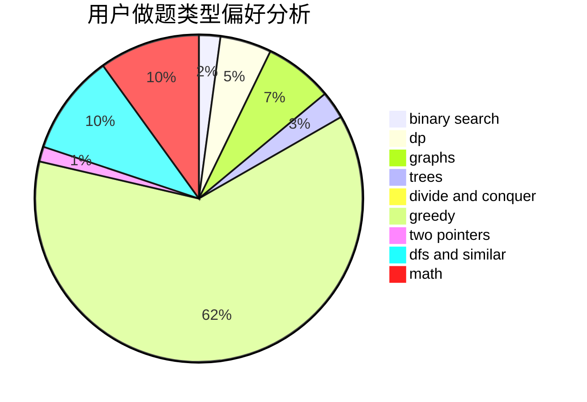

# hhoppitree

<!-- tabs:start -->

#### **用户提交结果分析**

#### **用户做题类型偏好分析**

<!-- tabs:end -->
# 推荐题目
[1316B](https://codeforces.com/contest/1316/problem/B)
[582A](https://codeforces.com/contest/582/problem/A)
[1025C](https://codeforces.com/contest/1025/problem/C)
[436A](https://codeforces.com/contest/436/problem/A)
[1244E](https://codeforces.com/contest/1244/problem/E)
[553B](https://codeforces.com/contest/553/problem/B)
[13701](https://codeforces.com/contest/1370/problem/1)
[786E](https://codeforces.com/contest/786/problem/E)
[984D](https://codeforces.com/contest/984/problem/D)
[248E](https://codeforces.com/contest/248/problem/E)
