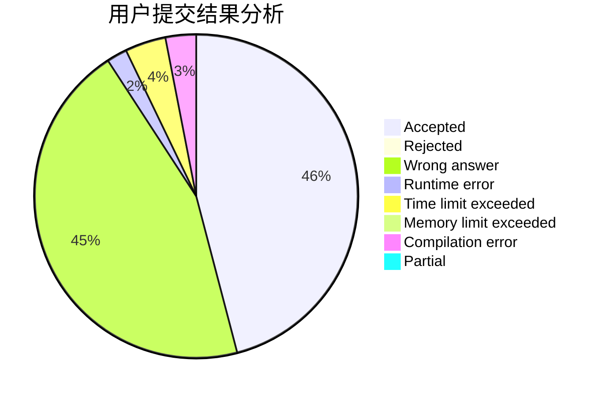
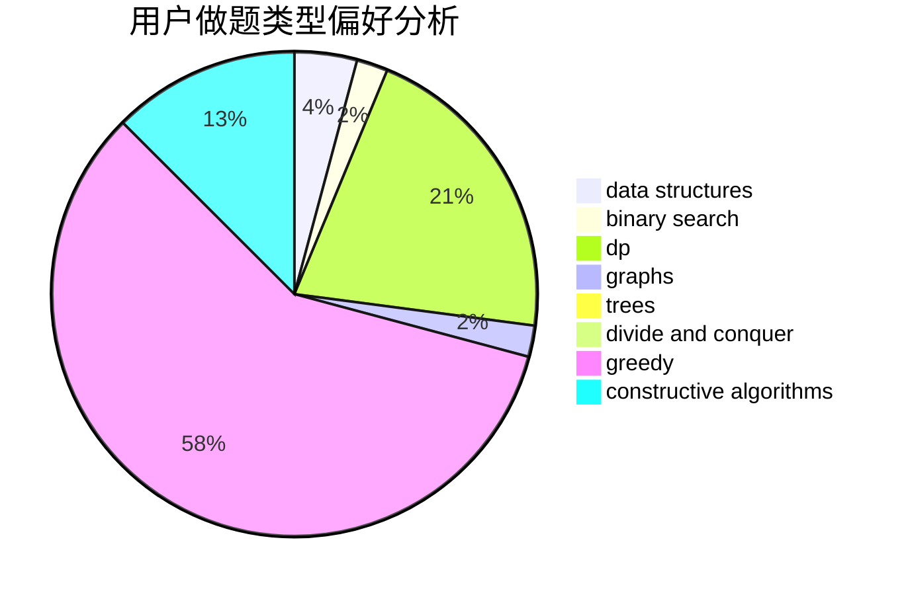
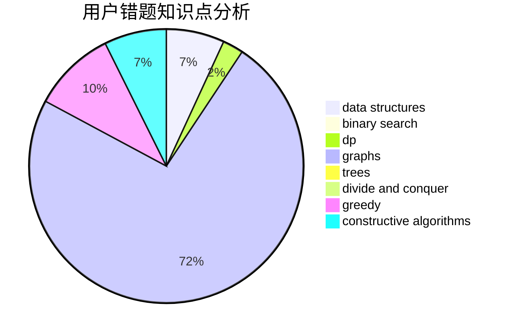

# hhoppitree

<!-- tabs:start -->

#### **用户提交结果分析**

#### **用户做题类型偏好分析**

#### **用户错题知识点分析**

<!-- tabs:end -->
# 推荐题目
[1316B](https://codeforces.com/contest/1316/problem/B)		brute force,
                        constructive algorithms,
                        implementation,
                        sortings,
                        strings		  
[582A](https://codeforces.com/contest/582/problem/A)		constructive algorithms,
                        greedy,
                        number theory		  
[1025C](https://codeforces.com/contest/1025/problem/C)		constructive algorithms,
                        implementation		  
[436A](https://codeforces.com/contest/436/problem/A)		greedy		  
[1244E](https://codeforces.com/contest/1244/problem/E)		binary search,
                        constructive algorithms,
                        greedy,
                        sortings,
                        ternary search,
                        two pointers		  
[553B](https://codeforces.com/contest/553/problem/B)		binary search,
                        combinatorics,
                        constructive algorithms,
                        greedy,
                        implementation,
                        math		  
[13701](https://codeforces.com/contest/1370/problem/1)		dsu,graphs,sortings,trees		  
[786E](https://codeforces.com/contest/786/problem/E)		data structures,
                        flows,
                        graphs,
                        trees		  
[984D](https://codeforces.com/contest/984/problem/D)		dsu,graphs,sortings,trees		  
[248E](https://codeforces.com/contest/248/problem/E)		dp,
                        math,
                        probabilities		  
